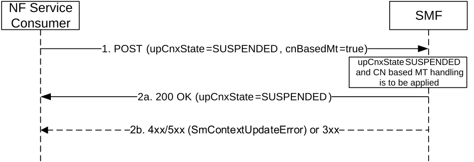

# 5.2.2.3.24 Connection Inactive procedure with CN based MT communication handling

The NF Service Consumer (e.g. AMF) shall request the SMF to apply CN based MT communication handling as specified in clauses 4.8.1.1a and 4.8.2.2b of 3GPP TS 23.502 \[3\] when the AMF is notified by the NG-RAN that the NG-RAN has transited the UE using eDRX to RRC_INACTIVE state and the SMF supports the UPCSMT feature (see clause 6.1.8).

Figure 5.2.2.3.24-1: NG-RAN initiated Connection Inactive procedure

1\. The NF Service Consumer shall request the SMF to suspend the user plane connection of the PDU session by sending a POST request, as specified in clause 5.2.2.3.1, with the following information:

\- cnBasedMt is set to "true"

\- upCnxState attribute set to SUSPENDED;

\- user location and user location timestamp;

\- other information, if necessary.

NOTE: As an implementation option, the AMF can force the UE to enter CM Idle if the SMF does not support the UPCSMT feature.

2a. Upon receipt of such a request, the SMF shall keep the NG-RAN N3 DL F-TEID and set the upCnxState attribute to SUSPENDED and return a 200 OK response including the upCnxState attribute set to SUSPENDED. The SMF will request the UPF to buffer any subsequent downlink data and report the receiving DL data to the SMF. Upon receiving DL data report, the SMF will invoke the Namf_MT_EnableUEReachability service operation when the upCnxState of the PDU session is set to SUSPENDED, to trigger a NG-RAN paging.

2b. Same as step 2b of figure 5.2.2.3.1-1.
