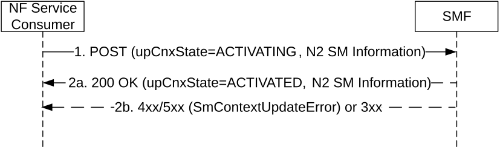

# 5.2.2.3.25 UE Triggered Connection Resume in RRC Inactive procedure

Upon receiving a notification from NG-RAN that the UE is in RRC_CONNECTED mode or when receiving from NG-RAN a MT Communication Handling request indicating the UE is now reachable for downlink data and/or signalling as specified in clause 4.8.2.2 of 3GPP TS 23.502 \[3\], the NF Service Consumer (e.g. AMF) shall request the SMF to resume the User Plane connection of an existing PDU session, i.e. establish the N3 tunnel between the 5G-AN and UPF, as follows.

Figure 5.2.2.3.25-1: UE Triggered Connection Resume in RRC Inactive

1\. The NF Service Consumer shall request the SMF to resume the user plane connection of the PDU session by sending a POST request, as specified in clause 5.2.2.3.1, with the following information:

\- the upCnxState attribute set to ACTIVATING;

\- user location and user location timestamp;

\- cause attribute set to "PDU_SESSION_RESUMED";

\- N2 SM information received from the 5G-AN if the accessed 5G-AN is able to retrieve the UE Context and the accessed 5G-AN node initiates N2 Path Switch procedure, i.e. the Path Switch Request Transfer including the new transport layer address and tunnel endpoint of the downlink termination point for the user data for this PDU session (i.e. 5G-AN's GTP-U F-TEID for downlink traffic);

\- additional N2 SM information received from the 5G-AN, if any;

\- other information, if necessary.

2a. If the SMF can proceed with resuming the user plane connection of the PDU session, i.e. request the UPF to forward any received DL data to the NG-RAN DL F-TEID which is stored in the SMF when the SMF is requested to apply CN based MT handling, the SMF shall return a 200 OK response including the following information:

\- the upCnxState attribute set to ACTIVATED;

\- N2 SM information to 5G-AN if N2 SM information with Path Switch Request Transfer is received in the request, i.e. Path Switch Response Transfer including the transport layer address and tunnel endpoint of the uplink termination point for the user data for this PDU session (i.e. UPF's GTP-U F-TEID for uplink traffic).

2b. If the SMF cannot proceed with resuming the user plane connection of the PDU session, the SMF shall return an error response, as specified for step 2b of figure 5.2.2.3.1-1, including:

\- the upCnxState attribute representing the final state of the user plane connection (e.g. DEACTIVATED);

\- N2 SM information, including the cause of the failure.
