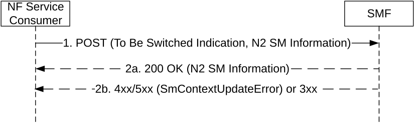
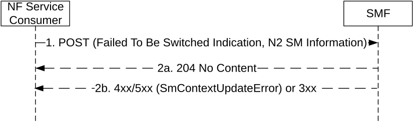

# 5.2.2.3.3 Xn Handover

The NF Service Consumer (e.g. AMF) shall request the SMF to switch the downlink N3 tunnel of the PDU session towards a new GTP tunnel endpoint as follows.

Figure 5.2.2.3.3-1: Xn handover

1\. The NF Service Consumer shall request the SMF to switch the downlink N3 tunnel of the PDU session towards a new GTP tunnel endpoint by sending a POST request, as specified in clause 5.2.2.3.1, with the following information:

\- the indication that the PDU session is to be switched;

\- N2 SM information received from the target 5G-AN (see Path Switch Request Transfer IE in clause 9.3.4.8 of 3GPP TS 38.413 \[9\]), including the new transport layer address and tunnel endpoint of the downlink termination point for the user data for this PDU session (i.e. 5G-AN's GTP-U F-TEID for downlink traffic);

\- additional N2 SM information received from the source 5G-AN (see Secondary RAT Data Usage Report Transfer IE in clause 9.3.4.23 of 3GPP TS 38.413 \[9\]), if any;

\- the user location associated to the PDU session;

\- the indication that the UE is inside or outside of the LADN service area, if the DNN of the established PDU session corresponds to a LADN;

> \- other information, if necessary.

2a. If the SMF can proceed with switching the user plane connection of the PDU session, the SMF shall return a 200 OK response including the following information:

\- N2 SM information (see Path Switch Request Acknowledge Transfer IE in clause 9.3.4.9 of 3GPP TS 38.413 \[9\]), including the transport layer address and tunnel endpoint of the uplink termination point for the user data for this PDU session (i.e. UPF's GTP-U F-TEID for uplink traffic).

> If the request does not include the "UE presence in LADN service area" indication and the SMF determines that the DNN corresponds to a LADN, then the SMF shall consider that the UE is outside of the LADN service area. The SMF shall proceed as specified in clause 5.6.5 of 3GPP TS 23.501 \[2\].

2b. If the SMF cannot proceed with switching the user plane connection of the PDU session, the SMF shall return an error response, as specified for step 2b of figure 5.2.2.3.1-1, including:

\- N2 SM information (see Path Switch Request Unsuccessul Transfer IE in clause 9.3.4.20 of 3GPP TS 38.413 \[9\]), including the cause of the failure.

For a PDU session that is rejected by the target RAN (i.e. a PDU session indicated as failed to setup in the PATH SWITCH REQUEST), the NF Service Consumer (e.g. AMF) shall indicate the failure to setup the PDU session in the target RAN as follows.

Figure 5.2.2.3.3-2: Xn handover – PDU session rejected by the target RAN

1\. The NF Service Consumer shall indicate to the SMF that the PDU session could not be setup in the target RAN by sending a POST request, as specified in clause 5.2.2.3.1, with the following information:

\- the indication that the PDU session failed to be switched;

\- N2 SM information received from the target 5G-AN (see Path Switch Request Setup Failed Transfer IE in clause 9.3.4.15 of 3GPP TS 38.413 \[9\]), including the cause why the session could not be setup;

\- additional N2 SM information received from the source 5G-AN (see Secondary RAT Data Usage Report Transfer IE in clause 9.3.4.23 of 3GPP TS 38.413 \[9\]), if any;

> \- other information, if necessary.

2a. Upon receipt of such a request, the SMF shall return a "204 No Content" response. The SMF shall decide whether to release the PDU session or deactivate the user plane connection of the PDU session, as specified in clause 4.9.1.2 of 3GPP TS 23.502 \[3\].

2b. Same as step 2b of figure 5.2.2.3.1-1.
