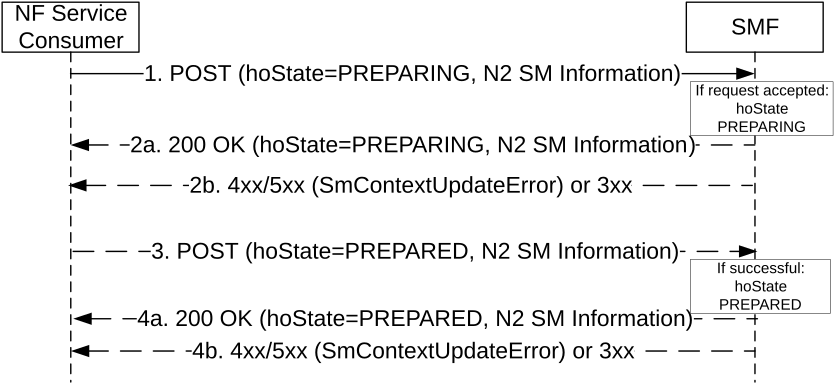
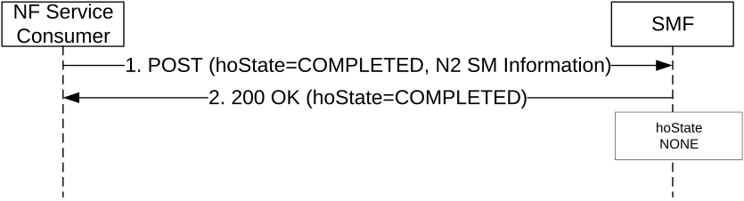
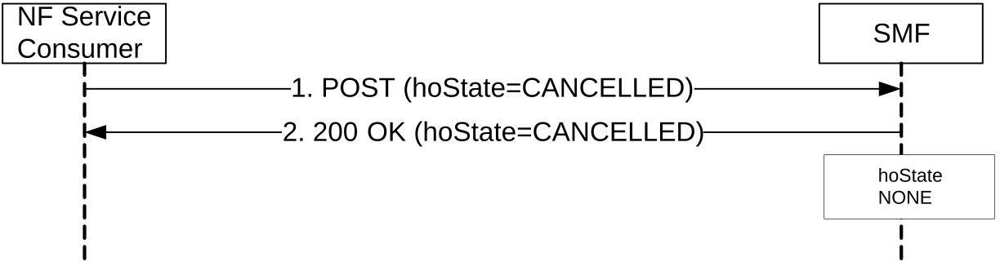

# 5.2.2.3.4 N2 Handover

## 5.2.2.3.4.1 General

The hoState attribute of an SM context represents the handover state of the PDU session. The hoState attribute may take the following values:

\- NONE: no handover is in progress for the PDU session;

\- PREPARING: a handover is in preparation for the PDU session; SMF is preparing the N3 tunnel between the target 5G-AN and UPF, i.e. the UPF's F-TEID is assigned for uplink traffic;

\- PREPARED: a handover is prepared for the PDU session; SMF is updated for the N3 tunnel between the target 5G-AN and UPF, with the target 5G-AN's F-TEID to be assigned for downlink traffic upon handover execution;

\- COMPLETED: the handover is completed (successfully);

\- CANCELLED: the handover is cancelled.

## 5.2.2.3.4.2 N2 Handover Preparation

The NF Service Consumer (e.g. T-AMF) shall request the SMF to prepare the handover of an existing PDU session, i.e. prepare the N3 tunnel between the target 5G-AN and UPF, as follows.

Figure 5.2.2.3.4.2-1: N2 Handover Preparation

1\. The NF Service Consumer shall request the SMF to prepare the handover of the PDU session by sending a POST request, as specified in clause 5.2.2.3.1, with the following information:

\- updating the hoState attribute of the individual SM Context resource in the SMF to PREPARING;

\- targetId identifying the target RAN Node ID and TAI received in the Handover Required from the source NG-RAN;

\- targetServingNfId set to the target AMF Id, for a N2 handover with AMF change;

\- N2 SM information received from the source NG-RAN (see Handover Required Transfer IE in clause 9.3.4.14 of 3GPP TS 38.413 \[9\]), indicating whether a direct path is available;

\- the supportedFeatures IE indicating the features it supports, if at least one feature defined in clause 6.1.8 is supported;

\- other information, if necessary.

2a. Upon receipt of such a request, if the SMF can proceed with preparing the handover of the PDU session (see clause 4.9.1.3 of 3GPP TS 23.502 \[3\]), the SMF shall set the hoState attribute to PREPARING and shall return a 200 OK response including the following information:

\- hoState attribute set to PREPARING;

\- N2 SM information to request the target 5G-AN to assign resources to the PDU session (see PDU Session Resource Setup Request Transfer IE in clause 9.3.4.1 of 3GPP TS 38.413 \[9\]), including (among others) the transport layer address and tunnel endpoint of the uplink termination point for the user plane data for this PDU session (i.e. UPF's GTP-U F-TEID for uplink traffic);

\- the supportedFeatures IE in the response, if the supportedFeatures IE was received in the request and at least one feature defined in clause 6.1.8 is supported by the updated SM context resource.

> The SMF shall store the targetServingNfId, if received in the request, but the SMF shall still consider the AMF (previously) received in the servingNfId IE as the serving AMF for the UE.

2b. If the SMF cannot proceed with preparing the handover of the PDU session (e.g. the UE moves into a non-allowed service area, the SMF cannot select a suitable I-UPF, or the UE is only reachable for regulatory prioritized services), the SMF shall set the hoState to NONE and return an error response, as specified in step 2b of figure 5.2.2.3.1-1. For a 4xx/5xx response, the SmContextUpdateError structure shall include the following additional information:

\- N2 SM information (see Handover Preparation Unsuccessful Transfer IE in clause 9.3.4.18 of 3GPP TS 38.413 \[9\]) indicating the cause of the failure;

\- the cause in the error attribute set to one of the application errors listed in Table 6.1.3.3.4.2.2-2.

When receiving a 4xx/5xx response from the SMF, the NF service consumer (e.g. the AMF) shall regard the hoState of the SM Context to be NONE.

3\. If the SMF returned a 200 OK response in step 2a, the NF Service Consumer (e.g. AMF) shall subsequently update the SM context in the SMF by sending POST request, as specified in clause 5.2.2.3.1, with the following information:

\- hoState attribute set to PREPARED;

\- N2 SM information received from the target 5G-AN (see Handover Request Acknowledge Transfer IE in clause 9.3.4.11 of 3GPP TS 38.413 \[9\]), including (among others) the transport layer address and tunnel endpoint of the downlink termination point for the user data for this PDU session (i.e. target 5G-AN's GTP-U F-TEID for downlink traffic), if the target 5G-AN succeeded in establishing resources for the PDU session;

\- N2 SM information received from the target 5G-AN (see Handover Resource Allocation Unsuccessful Transfer IE in clause 9.3.4.19 of 3GPP TS 38.413 \[9\]), including the Cause of the failure, if resources failed to be established for the PDU sessions.

4a. If the target 5G-AN succeeded in establishing resources for the PDU sessions, the SMF shall set the hoState attribute to PREPARED and return a 200 OK response including the following information:

\- hoState attribute to PREPARED;

\- N2 SM information (see Handover Command Transfer IE in clause 9.3.4.10 of 3GPP TS 38.413 \[9\]) containing DL forwarding tunnel information to be sent to the source 5G-AN by the AMF if direct or indirect data forwarding applies (see step 11f of clause 4.9.1.3.2 of 3GPP TS 23.502 \[3\]).

4b. If the SMF cannot proceed with preparing the handover of the PDU session (e.g. the target 5G-AN failed to establish resources for the PDU session), the SMF shall set the hoState to NONE, release resources reserved for the handover to the target 5G-AN, and return an error response as specified in step 2b of figure 5.2.2.3.1-1. For a 4xx/5xx response, the SmContextUpdateError structure shall include the following additional information:

\- N2 SM information (see Handover Preparation Unsuccessful Transfer IE in clause 9.3.4.18 of 3GPP TS 38.413 \[9\]) indicating the cause of the failure;

\- the cause in the error attribute set to HANDOVER_RESOURCE_ALLOCATION_FAILURE, if the target 5G-AN failed to establish resources for the PDU session.

When receiving a 4xx/5xx response from the SMF, the NF service consumer (e.g. the AMF) shall regard the hoState of the SM Context to be NONE.

If the handover preparation fails completely on the target 5G-AN (i.e. target 5G-AN returns a NGAP HANDOVER_FAILURE), the (T-)AMF shall request the SMF to cancel the handover of the PDU session as described in clause 5.2.2.3.4.4.

## 5.2.2.3.4.3 N2 Handover Execution

The NF Service Consumer (e.g. T-AMF) shall request the SMF to complete the execution the handover of an existing PDU session, upon being notified by the target 5G-AN that the handover to the target 5G-AN has been successful, as follows.

Figure 5.2.2.3.4.3-1: N2 Handover Execution

1\. The NF Service Consumer shall request the SMF to complete the execution of the handover of the PDU session by sending a POST request, as specified in clause 5.2.2.3.1, with the following information:

\- updating the hoState attribute of the individual SM Context resource in the SMF to COMPLETED;

\- servingNfId set to the new serving AMF Id, for a N2 handover with AMF change;

\- the indication that the UE is inside or outside of the LADN service area, if the DNN of the established PDU session corresponds to a LADN;

\- N2 SM information received from the source 5G-AN (see Secondary RAT Data Usage Report Transfer IE in clause 9.3.4.23 of 3GPP TS 38.413 \[9\]), if any;

\- other information, if necessary.

2\. Upon receipt of such a request, the SMF shall return a 200 OK response including the following information:

\- hoState attribute set to COMPLETED.

> The SMF shall complete the execution of the handover, e.g. switch the PDU session towards the downlink termination point for the user data received from the target 5G-AN (i.e. target 5G-AN's GTP-U F-TEID for downlink traffic), set the hoState to NONE and delete any stored targetServingNfId. For PDU session with I-SMF insertion, the I-SMF shall complete the execution of the handover by initiating an Update service operation towards the anchor SMF in order to switch the PDU session towards the I-UPF controlled by I-SMF (see clause 5.2.2.8.2.12).
>
> If the request does not include the "UE presence in LADN service area" indication and the SMF determines that the DNN corresponds to a LADN, then the SMF shall consider that the UE is outside of the LADN service area. The SMF shall proceed as specified in clause 5.6.5 of 3GPP TS 23.501 \[2\].

The (T-)AMF shall request the SMF to complete the execution of the handover of the PDU session only for those PDU sessions that successfully completed the handover procedure.

If there are PDU sessions that failed to handover due to timeout of SMF responses in any step of the handover preparation phase (e.g. if the Update SM Context Response arrived too late or not at all during the handover preparation phase, see step 7 of clause 4.9.1.3.3 of 3GPP TS 23.502 \[3\]), then the (T-)AMF shall inform the SMF about this failure, by sending a POST request with the cause attribute set to "HO_FAILURE" for every such PDU session, upon receipt of the NGAP HANDOVER NOTIFY. The SMF shall then consider that the PDU session is deactivated and that the handover attempt is terminated for the PDU session. The SMF may subsequently release the PDU session, or the SMF may keep the PDU session with the User Plane deactived by setting the hoState to NONE and deleting any stored targetServingNfId. If the SMF decided to keep the PDU session, the SMF shall forward DL traffic towards the target 5G-AN, i.e. activate the User Plane via the target AMF upon reception of DL traffic. For PDU session with I-SMF insertion, the I-SMF shall handle the HO Failure following the procedure described in clause 5.2.2.8.2.12.

If the handover fails completely on the target 5G-AN due to the execution phase not completed successfully (i.e. missing NGAP HANDOVER NOTIFY), the (T-)AMF shall request the SMF to cancel the handover of the PDU session as described in clause 5.2.2.3.4.4.

## 5.2.2.3.4.4 N2 Handover Cancellation

The NF Service Consumer (e.g. T-AMF) shall request the SMF to cancel the handover of an existing PDU session, e.g. upon receipt of such a request from the source 5G-AN, as follows.

Figure 5.2.2.3.4.3-1: N2 Handover Cancellation

1\. The NF Service Consumer shall request the SMF to cancel the execution of the handover of the PDU session by sending a POST request, as specified in clause 5.2.2.3.1, with the following information:

\- updating the hoState attribute of the individual SM Context resource in the SMF to CANCELLED;

\- cause information;

\- other information, if necessary.

2\. Upon receipt of such a request, the SMF return a 200 OK response including the following information:

\- hoState attribute set to CANCELLED.

> The SMF shall cancel the execution of the handover, e.g. release resources reserved for the handover to the target 5G-AN, set the hoState to NONE and delete any stored targetServingNfId. For PDU Session with I-SMF insertion, the I-SMF shall cancel the handover by initiating an Update service operation towards the anchor SMF in order to release resources at the SMF and PSA UPF reserved during handover preparation (see clause 5.2.2.8.2.13).
