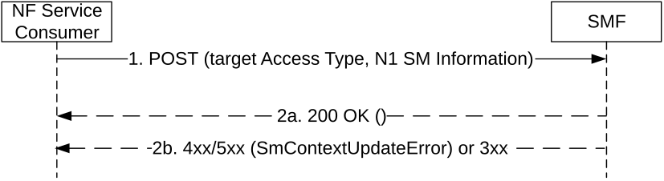

# 5.2.2.3.5 Handover between 3GPP and untrusted non-3GPP access procedures

## 5.2.2.3.5.1 General

The handover of a PDU session between 3GPP and untrusted non-3GPP access shall be supported as specified in clause 4.9.2 of 3GPP TS 23.502 \[3\]. Such a handover may involve:

\- the same AMF, or a target AMF in the same PLMN as the source AMF (see clauses 4.9.2.1, 4.9.2.2, 4.9.2.3.1 and 4.9.2.4.1 of 3GPP TS 23.502 \[3\]). The Update SM Context service operation is used in these cases; or

\- a target AMF in a different PLMN than the source AMF (see clauses 4.9.2.3.2 and 4.9.2.4.2 of 3GPP TS 23.502 \[3\]). The Create SM Context service operation is used in this case (see clause 5.2.2.2).

For a Home-Routed PDU session, the target AMF may be located in the VPLMN, or in the HPLMN when the N3IWF is in the HPLMN.

## 5.2.2.3.5.2 Handover of a PDU session without AMF change or with target AMF in same PLMN

In these scenarios, the same V-SMF is used before and after the handover.

The NF Service Consumer (e.g. AMF) shall request the SMF to handover an existing PDU session from 3GPP access to untrusted non-3GPP access, or vice-versa, as follows.

Figure 5.2.2.3.5.2-1: Handover between 3GPP and untrusted non-3GPP access

1\. The NF Service Consumer shall request the SMF to handover an existing PDU session from 3GPP access to untrusted non-3GPP access, or vice-versa, by sending a POST request, as specified in clause 5.2.2.3.1, with the following information:

\- updating the anType attribute of the individual SM Context resource in the SMF to the target access type, i.e. to 3GPP_ACCESS or NON_3GPP_ACCESS;

\- other information, if necessary.

2a. Same as step 2a of Figure 5.2.2.3.1-1.

2b. If the SMF cannot proceed with handing over the PDU session to the target access type, the SMF shall return an error response, as specified for step 2b of figure 5.2.2.3.1-1. For a 4xx/5xx response, the SmContextUpdateError structure shall include the following additional information:

\- N1 SM Information to reject the UE request.

The anchor SMF may perform Network Slice Admission Control before the PDU Session is moved to the target access (i.e., before the N3 tunnel for the PDU Session is established).
