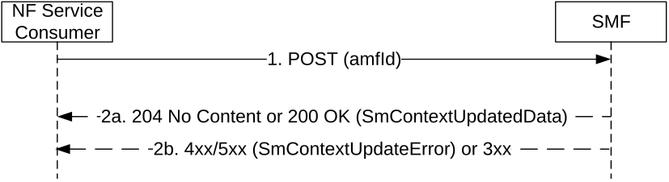

# 5.2.2.3.6 Inter-AMF change or mobility

The NF Service Consumer (e.g. new AMF) shall inform the SMF that it has taken over the role of serving the UE (e.g. it has taken the responsibility of the signalling towards the UE), when so required by 3GPP TS 23.501 \[2\] and 3GPP TS 23.502 \[3\], as follows.

Figure 5.2.2.3.6-1: Inter-AMF change or mobility

1\. The NF Service Consumer shall update the SMF with the new serving AMF, by sending a POST request, as specified in clause 5.2.2.3.1, with the following information:

\- servingNfId set to the new serving AMF Id;

\- the supportedFeatures IE indicating the features it supports, if at least one feature defined in clause 6.1.8 is supported;

\- other information, if necessary, e.g. to activate the user plane connection of the PDU session (see clause 5.2.2.3.2.2).

2a. Same as step 2a of Figure 5.2.2.3.1-1. In addition, the SMF shall include the supportedFeatures IE in the response, if the supportedFeatures IE was received in the request and at least one feature defined in clause 6.1.8 is supported by the updated SM context resource. If the AMF has indicated to activate the user plane connection of the PDU session by setting upCnxState to ACTIVATING in the request message and if the SMF accepts the update of the SmContext of the serving AMF:

\- the SMF shall include the upCnxState IE and set it to "DEACTIVATED", and the cause IE indicating the reason of failure to establish the user plane connection, e.g. INSUFFICIENT_UP_RESOURCES, in the SmContextUpdatedData if it fails to setup the user plane connection; otherwise,

\- the SMF shall include the upCnxState IE and set it to "ACTIVATING" and N2 SM information to request the 5G-AN to assign resources to the PDU session in the SmContextUpdatedData as specified in clause 5.2.2.3.2.2 if the SMF can proceed with activating the user plane connection of the PDU session.

2b. Same as step 2b of figure 5.2.2.3.1-1.
