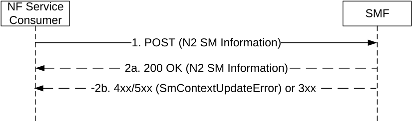

# 5.2.2.3.7 RAN Initiated QoS Flow Mobility

The NF Service Consumer (e.g. AMF) shall request the SMF to transfer QoS flows to and from Secondary RAN node, or more generally, handle a NG-RAN PDU Session Resource Modify Indication, as follows.

Figure 5.2.2.3.7-1: RAN Initiated QoS Flow Mobility

1\. The NF Service Consumer shall request the SMF to modify the PDU session, as requested by the NG-RAN, by sending a POST request, as specified in clause 5.2.2.3.1, with the following information:

\- N2 SM information received from the 5G-AN (see PDU Session Resource Modify Indication Transfer IE in clause 9.3.4.6 of 3GPP TS 38.413 \[9\]), including the transport layer information for the QoS flows of this PDU session (i.e. 5G-AN's GTP-U F-TEIDs for downlink traffic);

> \- other information, if necessary.

2a. Upon receipt of such a request, if the SMF can proceed with switching the QoS flows of the PDU session, the SMF shall return a 200 OK response including the following information:

\- N2 SM information (see PDU Session Resource Modify Confirm Transfer IE in clause 9.3.4.7 of 3GPP TS 38.413 \[9\]), including the list of QoS flows which were modified successfully and the list of QoS flows which failed to be modified if available.

2b. If the SMF cannot proceed with switching the QoS flows of the PDU session, the SMF shall return an error response, as specified for step 2b of figure 5.2.2.3.1-1, including:

\- N2 SM information (see PDU Session Resource Modify Indication Unsuccessful Transfer IE in clause 9.3.4.22 of 3GPP TS 38.413 \[9\]).
