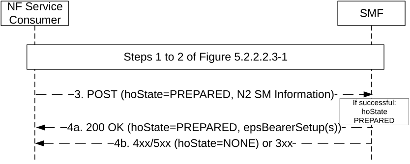

# 5.2.2.3.8 EPS to 5GS Handover using N26 interface

## 5.2.2.3.8.1 General

The NF Service Consumer (e.g. AMF) shall request the SMF to handover a UE EPS PDN connection to 5GS using N26 interface, following the same requirements as specified for N2 handover in clause 5.2.2.3.4 with the modifications specified in this clause.

## 5.2.2.3.8.2 EPS to 5GS Handover Preparation

The requirements specified in clause 5.2.2.3.4.2 shall apply with the following modifications.

Figure 5.2.2.3.8.2-1: EPS to 5GS Handover Preparation

1\. Same as step 1 of Figure 5.2.2.2.3-1.

2a. Same as step 2 of Figure 5.2.2.2.3-1.

2b. Same as step 2b of figure 5.2.2.3.1-1.

3\. Same as step 3 of Figure 5.2.2.3.4.2-1.

4a. Same as step 4 of Figure 5.2.2.3.4.2-1, with the following modifications:  
  
The 200 OK response shall not include N2 SM information for DL forwarding tunnel setup, but shall additionally contain:

\- the epsBearerSetup IE(s), containing the list of EPS bearer context(s) successfully handed over to the 5GS and DL data forwarding information, containing either:

\- CN tunnel information generated based on the list of accepted QFI(s) received from the 5G-RAN, if indirect data forwarding applies; or

\- NG-RAN F-TEID per E-RAB accepted for direct data forwarding, as received from the target NG-RAN, if direct data forwarding applies.

4b. Same as step 2b of figure 5.2.2.3.4.2-1.

## 5.2.2.3.8.3 EPS to 5GS Handover Execution

The requirements specified in clause 5.2.2.3.4.3 shall apply, with the following modifications.

In step 1 of Figure 5.2.2.3.4.3-1, the NF Service Consumer, i.e. the target AMF, shall include one or more SecondaryRatUsageDataReportContainer(s) in the SmContextUpdateData for the POST request if it received one or more Secondary RAT Usage Data Report(s) applicable for the PDU session from the source MME.

In step 2 of Figure 5.2.2.3.4.3-1, for a Home Routed PDU session, the SMF shall complete the execution of the handover by initiating an Update service operation towards the H-SMF in order to switch the PDU session towards the V-UPF (see clause 5.2.2.8.2.3).

If there are PDU sessions that failed to handover due to timeout of SMF responses in any step of the handover preparation phase (e.g. if the Update SM Context Response arrived too late or not at all during the handover preparation phase), then the AMF shall consider that the PDU session will be released by the MME and remove the PDU session context from the UE context. For a HR PDU session or a PDU session with I-SMF, the AMF shall also release the SM Context in the V-SMF or the I-SMF only.

## 5.2.2.3.8.4 EPS to 5GS Handover Cancellation

The requirements specified in clause 5.2.2.3.4.4 shall apply, with the following modifications.

In step 2 of Figure 5.2.2.3.4.4-1, for a Home Routed PDU session, the V-SMF shall cancel the handover by initiating an Update service operation towards the H-SMF in order to release resources at H-SMF and H-UPF reserved for handover (see clause 5.2.2.8.2.14).

## 5.2.2.3.8.5 EPS to 5GS Handover Failure

If the handover to 5GS failed, e.g. rejected by the target NG-RAN, the requirements specified in clause 5.2.2.3.4.4 shall apply, with the following modifications:

\- the hoState attribute set to "CANCELLED", to indicate the handover is cancelled;

\- the cause attribute set to "HO_FAILURE".

In step 2 of Figure 5.2.2.3.4.4-1, for a Home Routed PDU session, the V-SMF shall cancel the handover by initiating an Update service operation towards the H-SMF in order to release resources at H-SMF and H-UPF reserved for handover (see clause 5.2.2.8.2.17).
