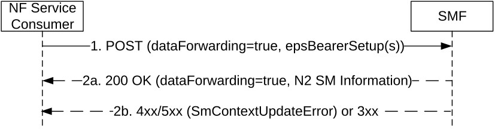

# 5.2.2.3.9 5GS to EPS Handover using N26 interface

## 5.2.2.3.9.1 General

The NF Service Consumer (e.g. AMF) shall request the SMF to setup data forwarding tunnels if direct or indirect data forwarding applies to the 5GS to EPS handover using N26 interface, and to remove the indirect data forwarding tunnels previously established when the handover is cancelled or failed.

The AMF should initiate this procedure only if data forwarding is enabled and the MME returns data forwarding F-TEIDs for the related PDN connection context in the Forward Relocation response.

## 5.2.2.3.9.2 Data forwarding tunnels setup during 5GS to EPS handover

If direct or indirect data forwarding applies to the 5GS to EPS handover, the NF Service Consumer (e.g. AMF) shall provide the SMF with the data forwarding information received from the MME, as specified in clause 4.11.1.2.1 of 3GPP TS 23.502 \[3\]), as follows.

Figure 5.2.2.3.9-1: 5GS to EPS Handover using N26 interface (data forwarding tunnels setup)

1\. The NF Service Consumer shall send a POST request, as specified in clause 5.2.2.3.1, with the following information:

\- dataForwarding IE set to true;

\- EPS bearer contexts received from the MME in the Forward Relocation Response, including F-TEID(s) for DL data forwarding tunnel(s) towards the target eNB (for direct data forwarding) or towards the forwarding SGW (for indirect data forwarding).

2a. If indirect data forwarding applies, the SMF shall map the EPS bearers for Data Forwarding to the 5G QoS flows based on the association between the EPS bearer ID(s) and QFI(s) for the QoS flow(s).  
  
The SMF shall return a 200 OK response including the following information:

\- N2 SM information (see Handover Command Transfer IE in clause 9.3.4.10 of 3GPP TS 38.413 \[9\]) containing DL forwarding tunnel information to be sent to the source 5G-AN by the AMF if direct or indirect data forwarding applies (see step 11f of clause 4.9.1.3.2 of 3GPP TS 23.502 \[3\]).

If direct data forwarding applies, the DL forwarding tunnel information shall contain the E-UTRAN tunnel info for data forwarding per EPS bearer received from the MME.  
  
If indirect data forwarding applies, the DL forwarding tunnel information shall contain the CN transport layer address and tunnel endpoint (i.e. UPF's GTP-U F-TEID) for Data Forwarding and the QoS flows for Data Forwarding for this PDU session.

2b. If the SMF cannot proceed with the request, the SMF shall return an error response, as specified for step 2b of figure 5.2.2.3.1-1.  
If none of the EPS bearer contexts received in the POST request body includes an F-TEID for DL data forwarding, the SMF shall return a 403 Forbidden response including a ProblemDetails structure with the "cause" attribute set to "NO_DATA_FORWARDING". Upon receipt of this response, the AMF shall proceed with the handover procedure (as if data forwarding was disabled).

NOTE: The above use case can occur if an AMF initiates this procedure without checking whether the MME returns data forwarding F-TEIDs for the related PDN connection context in the Forward Relocation response (e.g. pre-Rel-17 or Rel-17 AMF that does not support such checking).

## 5.2.2.3.9.3 Indirect data forwarding tunnels removal for 5GS to EPS handover cancellation or failure

During 5GS to EPS handover, if indirect data forwarding tunnel(s) have been previously established during the preparation phase and the handover is cancelled, the AMF shall update the SMF of handover cancellation by sending a POST request with the cause attribute set to "HO_CANCEL" and dataForwarding IE set to false with an empty list of EPS bearer contexts. The SMF shall then release the resources prepared for the handover and proceed with the PDU session as if no handover procedure had taken place.

If no resources for EPS bearer(s) can be assigned for any PDU session attempted to be handed over, the AMF shall update the SMF with the information that the handover preparation failed by sending a POST request with the cause attribute set to "HO_FAILURE" and with an empty list of EPS bearer contexts (and without the dataForwarding IE). The SMF shall then release the resources prepared for the handover and proceed with the PDU session as if no handover procedure had taken place.
