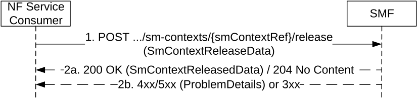

# 5.2.2.4 Release SM Context service operation

## 5.2.2.4.1 General

The Release SM Context service operation shall be used to release the SM Context of a given PDU session, in the SMF, in the V-SMF for HR roaming scenarios, or in the I-SMF for a PDU session with an I-SMF, in the following procedures:

\- Registration procedure with I-SMF/V-SMF change and removal (see clause 4.23.3 of 3GPP TS 23.502 \[3\]);

\- UE Triggered Service Request with I-SMF change and removal or V-SMF change (see clause 4.23.4.3 of 3GPP TS 23.502 \[3\]);

\- UE initiated Deregistration (see clause 4.2.2.3.2 of 3GPP TS 23.502 \[3\]);

\- Network initiated Deregistration, e.g. AMF initiated deregistration (see clause 4.2.2.3.3 of 3GPP TS 23.502 \[3\]), UDM triggered deregistration by sending Deregistration notification with initial Registration indication (see clause 4.2.2.2.2 of 3GPP TS 23.502 \[3\]);

\- Network requested PDU session release (see clause 4.3.4.2 of 3GPP TS 23.502 \[3\]), e.g. AMF initiated release:

\- when there is a mismatch of the PDU session status between the UE and the;

\- when there is a change of the set of network slices for a UE where a network slice instance is no longer available (as described in clause 5.15.5.2.2 of 3GPP TS 23.501 \[2\] and in clause 4.2.2.2 of 3GPP TS 23.502 \[3\]) and the PDU session is not activated;

\- when there is a PDU session rejected by the new AMF to the old AMF during Registration procedure (as described in clause 4.2.2.2.2 of 3GPP TS 23.502 \[3\]); or

\- due to Mobility or Access Restrictions (see clause 5.16.4.3 of 3GPP TS 23.501 \[2\]).

\- 5GS to EPS Idle mode mobility or handover, to release the SM context in the V-SMF only for a Home Routed PDU session or in the I-SMF only for a PDU session with an I-SMF (see clauses 4.23.12.2 and 4.23.12.6 of 3GPP TS 23.502 \[3\]), for the PDU sessions that are transferred to EPC;

\- 5GS to EPS handover using N26 interface and 5GS to EPS Idle mode mobility using N26, to release the PDU session not transferred to EPC (see clauses 4.11.1.2.1 and 4.11.1.3.2 of 3GPP TS 23.502 \[3\]);

\- Inter NG-RAN node Xn based handover and N2 based handover with I-SMF change and removal;

\- 5G-SRVCC from NG-RAN to 3GPP UTRAN procedure (see clause 6.5.4 of 3GPP TS 23.216 \[35\]);

\- 5G-RG Deregistration via W-5GAN (see clause 7.2.1.2 of 3GPP TS 23.316 \[36\]);

\- FN-RG Deregistration via W-5GAN (see clause 7.2.1.4 of 3GPP TS 23.316 \[36\]);

\- Non-5G capable device behind 5G-CRG and FN-CRG Deregistration via W-5GAN (see clause 4.10a of 3GPP TS 23.316 \[36\]);

\- 5G-RG or Network requested PDU Session Release via W-5GAN (see clause 7.3.3 of 3GPP TS 23.316 \[36\]);

\- FN-RG or Network Requested PDU Session Release via W-5GAN (see clause 7.3.7 of 3GPP TS 23.316 \[36\]);

\- Non-5G capable device behind 5G-CRG and FN-CRG or Network Requested PDU Session Release via W-5GAN (see clause 4.10a of 3GPP TS 23.316 \[36\]);

\- Mobility procedures with AMF changes (e.g. Registration / N2 based handover with AMF changes), to release the MA-PDU session if target AMF does not support MA-PDU session (see clause 4.22.9 of 3GPP TS 23.502 \[3\]);

\- Inter V-SMF mobility registration update or N2-based handover with V-SMF change/removal in HR-SBO case (see clauses 6.7.2.6 and 6.7.2.7 of 3GPP TS 23.548 \[39\]);

\- Xn Handover with V-SMF change in HR-SBO case (see clause 6.7.2.9 of 3GPP TS 23.548 \[39\]).

The SMF shall release the SM context without sending any signalling towards the 5G-AN and the UE.

The NF Service Consumer (e.g. AMF) shall release the SM Context of a given PDU session by using the HTTP "release" custom operation as shown in Figure 5.2.2.4.1-1.

Figure 5.2.2.4.1-1: SM context release

1\. The NF Service Consumer shall send a POST request to the resource representing the individual SM context to be deleted. The content of the POST request shall contain any data that needs to be passed to the SMF and/or N2 SM information (if Secondary RAT usage data needs to be reported).  
  
For a 5GS to EPS Idle mode mobility or handover, for a Home Routed PDU session associated with 3GPP access and with assigned EBI(s), the POST request shall contain the vsmfReleaseOnly indication; for a PDU session with an I-SMF and assigned EBI(s), the POST request shall contain the ismfReleaseOnly indication.

For a 5GS to EPS Idle mode mobility or handover, for a Home Routed PDU session associated with 3GPP access and with no assigned EBI(s), the POST request shall not contain the vsmfReleaseOnly indication to release the PDU session in the V-SMF and H-SMF; for a PDU session with an I-SMF and with no assigned EBI(s), the POST request shall not contain the ismfReleaseOnly indication to release the PDU session in the I-SMF and SMF.

For Registration, UE Triggered Service Request, Inter NG-RAN node Xn based handover and N2 based handover procedures with I-SMF change or removal, the POST request shall contain the ismfReleaseOnly indication; if with V-SMF change or removal, the POST request shall contain the vsmfReleaseOnly indication.

For 5G-SRVCC from NG-RAN to 3GPP UTRAN, the POST request body shall contain the "cause" attribute with the value "REL_DUE_TO_PS_TO_CS_HO".

For PDU Session release due to S-NSSAI is removed from Allowed NSSAI and no N2 interaction is needed (i.e. UP connection of the PDU Session is not active) as specified in clause 4.2.2.2.2 of 3GPP TS 23.502 \[3\], the POST request body shall contain the "cause" attribute with the value "REL_DUE_TO_SLICE_NOT_AVAILABLE".

2a. On success, the SMF shall return a "200 OK" with message body containing the representation of the SmContextReleasedData when information needs to be returned to the NF Service Consumer, or a "204 No Content" response with an empty content in the POST response.

> If the POST request contains a vsmfReleaseOnly indication (i.e. for a 5GS to EPS Idle mode mobility or handover, for a Home Routed PDU session with assigned EBI(s)), the V-SMF shall release its SM context and corresponding PDU session resource locally, i.e. without signalling towards the H-SMF.
>
> If the POST request contains an ismfReleaseOnly indication (i.e. for a 5GS to EPS Idle mode mobility or handover, for a PDU session with an I-SMF and assigned EBI(s)), the I-SMF shall release its SM context and corresponding PDU session resource locally, i.e. without signalling towards the SMF.
>
> If the POST request body contains the "cause" attribute with the value "REL_DUE_TO_PS_TO_CS_HO", the SMF shall indicate to the PCF within SM Policy Association termination that the PDU session is released due to 5G-SRVCC, or the cause value shall be passed from the V-SMF to the H-SMF (for a HR PDU session) or from the I-SMF to the SMF (for a PDU session with an I-SMF) within the Release service operation.

2b. On failure or redirection, one of the HTTP status code listed in Table 6.1.3.3.4.3.2-2 shall be returned. For a 4xx/5xx response, the message body shall include a ProblemDetails structure with the "cause" attribute set to one of the application error listed in Table 6.1.3.3.4.3.2-2.
