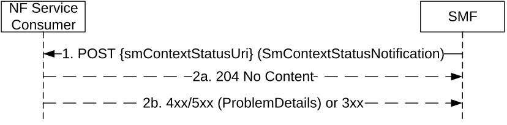

# 5.2.2.5 Notify SM Context Status service operation

## 5.2.2.5.1 General

The Notify SM Context Status service operation shall be used by the SMF to notify the NF Service Consumer about the status of an SM context related to a PDU session (e.g. when the SM context is released and the release is not triggered by a Release SM Context Request, or when the SM context is moved to another system, or when the control of the PDU session is taken over by another I-SMF/V-SMF/SMF in the same SMF set) in the SMF, or in the V-SMF for HR roaming scenarios, or in the I-SMF for a PDU session with an I-SMF.

The Notify SM Context Status service operation may also be used by the SMF to provide the SMF derived CN assisted RAN parameters tuning to the NF Service Consumer (e.g. AMF), if the NF Service Consumer has indicated support of the CARPT (CN Assisted RAN Parameters Tuning) feature.

The Notify SM Context Status service operation may also be used by the SMF to notify the DDN failure status.

The Notify SM Context Status service operation may also be used to inform the NF service consumer (e.g. AMF) that the V-SMF has created the PDU session towards an alternative H-SMF for a HR PDU session or the I-SMF has created the PDU session towards an alternative SMF for a PDU session with I-SMF, during the PDU session establishment procedure.

It is used in the following procedures:

\- UE requested PDU Session Establishment procedure, when the PDU session establishment fails after the Create SM Context response or to provide the SMF derived CN assisted RAN parameters tuning, or when an alternative H-SMF is used by the V-SMF for a HR PDU session (see clause 4.3.2.2 of 3GPP TS 23.502 \[3\]), or when an alternative SMF is used by the I-SMF for a PDU session with an I-SMF (see clause 4.23.5.1 of 3GPP TS 23.502 \[3\]);

\- UE or Network requested PDU session Modification (see clause 4.3.3.2 of 3GPP TS 23.502 \[3\]) to provide the SMF derived CN assisted RAN parameters tuning;

\- UE or Network requested PDU session release (see clause 4.3.4.2 of 3GPP TS 23.502 \[3\]), e.g. SMF initiated release;

\- Handover of a PDU Session procedure between untrusted non-3GPP to 3GPP access (see clauses 4.9.2.3.2, 4.9.2.4.2 and 4.23.16.2 of 3GPP TS 23.502 \[3\]);

\- Interworking procedures without N26 interface, e.g. 5GS to EPS Mobility (see clause 4.11.2.2 of 3GPP TS 23.502 \[3\]);

\- Handover from 5GC-N3IWF to EPS (see clause 4.11.3.2 of 3GPP TS 23.502 \[3\]);

\- Handover from 5GS to EPC/ePDG (see clause 4.11.4.2 of 3GPP TS 23.502 \[3\]);

\- I-SMF Context Transfer (see clause 4.26.5.2 of 3GPP TS 23.502 \[3\]);

\- SMF Context Transfer procedure, LBO or no Roaming, no I-SMF (see clause 4.26.5.3 of 3GPP TS 23.502 \[3\]);

\- Handover from W-5GAN/5GC to 3GPP access/EPS (see clause 7.6.4.2 of 3GPP TS 23.316 \[36\]);

\- 5G-RG requested PDU Session Establishment via W-5GAN (see clause 7.3.1 of 3GPP TS 23.316 \[36\]);

\- 5G-RG or Network requested PDU Session Modification via W-5GAN (see clause 7.3.2 of 3GPP TS 23.316 \[36\]);

\- 5G-RG or Network requested PDU Session Release via W-5GAN (see clause 7.3.3 of 3GPP TS 23.316 \[36\])

\- FN-RG related PDU Session Establishment via W-5GAN (see clause 7.3.4 of 3GPP TS 23.316 \[36\]);

\- FN-RG or Network Requested PDU Session Modification via W-5GAN (see clause 7.3.6 of 3GPP TS 23.316 \[36\]);

\- FN-RG or Network Requested PDU Session Release via W-5GAN (see clause 7.3.7 of 3GPP TS 23.316 \[36\]);

\- Non-5G capable device behind 5G-CRG and FN-CRG requested PDU Session Establishment via W-5GAN (see clause 4.10a of 3GPP TS 23.316 \[36\]);

\- Non-5G capable device behind 5G-CRG and FN-CRG or Network requested PDU Session Modification via W-5GAN (see clause 4.10a of 3GPP TS 23.316 \[36\]);

\- Non-5G capable device behind 5G-CRG and FN-CRG or Network requested PDU Session Release via W-5GAN (see clause 4.10a of 3GPP TS 23.316 \[36\]);

\- Handover between 3GPP access/5GC and W-5GAN access (see clause 7.6.3 of 3GPP TS 23.316 \[36\]);

\- Handover from 3GPP access/EPS to W-5GAN/5GC (see clause 7.6.4.1 of 3GPP TS 23.316 \[36\]);

\- Information flow for Availability after DDN Failure with SMF buffering (see clause 4.15.3.2.7 of 3GPP TS 23.502 \[3\]);

\- Information flow for Availability after DDN Failure with UPF buffering (see clause 4.15.3.2.9 of 3GPP TS 23.502 \[3\]);

\- The control of the PDU session is taken over by a new anchor SMF within the same SMF set (see clause 5.22 of 3GPP TS 29.244 \[29\]) or taken over by a new intermediate SMF (e.g. I-SMF or V-SMF) within the same SMF set, and the new SMF instance decides to notify the change of SMF;

\- SMF triggered I-SMF selection or removal (see clause 4.23.5.4 of 3GPP TS 23.502 \[3\]);

\- Change of SSC mode 2 PDU Session Anchor with different PDU Sessions (see clause 4.3.5.1 of 3GPP TS 23.502 \[3\]);

\- Change of SSC mode 3 PDU Session Anchor with multiple PDU Sessions (see clause 4.3.5.2 of 3GPP TS 23.502 \[3\]);

\- Network triggered EAS change in HR-SBO context (see clause 6.7.3.2 of 3GPP TS 23.548 \[74\]);

\- Network slice usage behaviour control, i.e. SMF initiated PDU session release due to slice inactivity, see clause 5.15.15.3 of 3GPP TS 23.501 \[2\].

The SMF shall notify the NF Service Consumer by using the HTTP POST method as shown in Figure 5.2.2.5.1-1.

Figure 5.2.2.5.1-1: SM context status notification

1\. The SMF shall send a POST request to the SM Context Status callback reference provided by the NF Service Consumer during the subscription to this notification. The content of the POST request shall contain the notification content.

If the notification is triggered by PDU session handover to release resources of the PDU session in the source access, the notification content shall contain the resourceStatus IE with the value "RELEASED" and the Cause IE with the value "PDU_SESSION_HANDED_OVER" as specified in clause 4.9.2.3.2 of 3GPP TS 23.502 \[3\].

If the notification is triggered by PDU session handover to release only the SM Context with the I-SMF in the source access but without releasing the PDU session in the AMF, the notification content shall contain the resourceStatus IE with the value "UPDATED" and the Cause IE with the value "PDU_SESSION_HANDED_OVER" as specified in clause 4.23.16.2 of 3GPP TS 23.502 \[3\]. If the notification is triggered by PDU session handover to release resources of the PDU session in the target access due to handover failure between 3GPP access and non-3GPP access, the notification content shall contain the resourceStatus IE with the value "RELEASED" and the Cause IE with the value "PDU_SESSION_HAND_OVER_FAILURE".

If the NF Service Consumer indicated support of the HOFAIL feature (see clause 6.1.8) and if the notification is triggered by PDU session handover to update the access type of the PDU session due to a handover failure between 3GPP access and non-3GPP access, the notification content shall contain the resourceStatus IE with the value "UPDATED", the anType IE with the value "3GPP" or "NON_3GPP" indicating the access type of the PDU session after the handover failure scenario and the Cause IE with the value "PDU_SESSION_HAND_OVER_FAILURE".

If the notification is triggered by the SMF derived CN assisted RAN parameters tuning, the notification content shall contain the resourceStatus IE with the value "UNCHANGED" and the Cause IE with the value "CN_ASSISTED_RAN_PARAMETER_TUNING".

If the notification is triggered by SMF Context Transfer procedure, the notification content shall contain the Cause IE with the value "ISMF_CONTEXT_TRANSFER" or "SMF_CONTEXT_TRANSFER".

If the notification is triggered by the report of the DDN failure, the notification content shall contain the resourceStatus IE with the value "UNCHANGED" and the Cause IE with the value "DDN_FAILURE_STATUS".

If the notification is triggered to report that an alternative (H-)SMF has been used during a HR PDU session establishment or the establishment of a PDU session with an I-SMF, the notification content shall contain the resourceStatus IE with the value "ALT_ANCHOR_SMF". The notification content shall also include the altAnchorSmfUri IE containing the API URI of the alternative (H-)SMF used for the PDU session and if available the altAnchorSmfId IE containing the NF Instance Id of the alternative (H-)SMF. The Notification shall only be sent to the NF service consumer (e.g. AMF) supporting the AASN feature.

For a PDU session without an I-SMF or V-SMF, if upon a change of anchor SMF, the new anchor SMF instance decides to notify the change of anchor SMF, then the notification content shall contain the resourceStatus IE with the value "UPDATED" and the Cause IE with the value "CHANGED_ANCHOR_SMF". In addition, the new anchor SMF shall include its SMF Instance ID in the notification content, and/or carry an updated binding indication in the HTTP headers to indicate the change of anchor SMF (as per step 6 of clause 6.5.3.3 of 3GPP TS 29.500 \[4\]).

For a PDU session with an I-SMF or V-SMF, if upon a change of intermediate SMF (e.g. I-SMF or V-SMF), the new intermediate SMF instance decides to notify the change of intermediate SMF, then the notification content shall contain the resourceStatus IE with the value "UPDATED" and the Cause IE with the value "CHANGED_INTERMEDIATE_SMF". In addition, the new intermediate SMF shall include its SMF Instance ID in the notificationcontent, and/or carry an updated binding indication in the HTTP headers to indicate the change of intermediate SMF (as per step 6 of clause 6.5.3.3 of 3GPP TS 29.500 \[4\]).

For a PDU session with an I-SMF or V-SMF, if the notification is triggered by the change of the anchor SMF (e.g. the PDU session is taken over by a new SMF within the same SMF Set selected by the UPF), the notification content shall contain the resourceStatus IE with the value "UPDATED", the Cause IE with the value "CHANGED_ANCHOR_SMF" and the SMF Instance ID of the new anchor SMF.

If the notification is triggered by SMF for I-SMF selection or removal or V-SMF selection for the current PDU session, or SMF selection during PDU Session re-establishment for SSC mode 2/3, the notification content shall contain the resourceStatus IE with the value "UNCHANGED", the Cause IE with the value "TARGET_DNAI_NOTIFICATION" and the targetDnaiInfo IE. The targetDnai IE in the targetDnaiInfo IE shall be absent if the I-SMF removal is triggered due to the DNAI currently served by the I-SMF being no longer used for the PDU Session. If the notification is triggered for SMF selection during PDU Session re-establishment for SSC mode 3, the notification content may also contain the oldPduSessionRef IE received from the SMF or the oldSmContextRef IE as specified in clause 4.3.5.2 of 3GPP TS 23.502 \[3\].

> If the notification is triggered by a PDU session release due to slice inactivity as specified in clause 5.15.15.3 of 3GPP TS 23.501 \[2\] and clause 5.11.2 of 3GPP TS 29.244 \[29\], the notification content shall contain the resourceStatus IE with the value "RELEASED" and the Cause IE with the value "REL_DUE_TO_SLICE_INACTIVITY".

2a. On success, "204 No Content" shall be returned and the content of the POST response shall be empty.

If the SMF indicated in the request that the SM context resource is released, the NF Service Consumer shall release its association with the SMF for the PDU session and release the EBI(s) that were assigned to the PDU session.

If the SMF indicated in the request that the SM context resource is updated with the anType IE, the NF Service Consumer shall change the access type of the PDU session with the value of anType IE.

If the notification request was triggered by PDU session handover to release only the SM Context with the I-SMF in the source access but without releasing the PDU session in the AMF, the AMF shall remove its resources associated to the SM context with the I-SMF, but the AMF shall not release the PDU session in the AMF, and the I-SMF shall remove its resources associated to the PDU session.

2b. On failure or redirection, one of the HTTP status code listed in Table 6.1.3.7.3.1-2 shall be returned. For a 4xx/5xx response, the message body shall contain a ProblemDetails structure with the "cause" attribute set to one of the application error listed in Table 6.1.3.7.3.1-2.

If the NF Service Consumer (e.g. AMF) is not able to handle the notification but knows by implementation specific means that another NF Service Consumer (e.g. AMF) is able to handle the notification (e.g. AMF deployment with Backup AMF), it shall reply with an HTTP "307 temporary redirect" response pointing to the URI of the new NF Service Consumer. If the NF Service Consumer is not able to handle the notification but another unknown NF Service Consumer could possibly handle the notification (e.g. AMF deployment with UDSF), it shall reply with an HTTP "404 Not found" error response.

If the SMF receives a "307 temporary redirect" response, the SMF shall use this URI as Notification URI in subsequent communication and shall resend the notification to that URI.

If the SMF becomes aware that a new NF Service Consumer (e.g. AMF) is requiring notifications (e.g. via the "404 Not found" response or via Namf_Communication service AMFStatusChange Notifications, or via link level failures, see clause 6.5.2 of 3GPP TS 29.500 \[4\]), and the SMF knows alternate or backup Address(es) where to send Notifications (e.g. via the GUAMI and/or backupAmfInfo received when the SM context was established or via AMFStatusChange Notifications, or via the Nnrf_NFDiscovery service specified in 3GPP TS 29.510 \[19\] using the service name and GUAMI or backupAMFInfo obtained during the creation of the SM context, see clause 6.5.2.2 of 3GPP TS 29.500 \[4\]), the SMF shall exchange the authority part of the corresponding Notification URI with one of those addresses and shall use that URI in subsequent communication; the SMF shall resend the notification to that URI.
