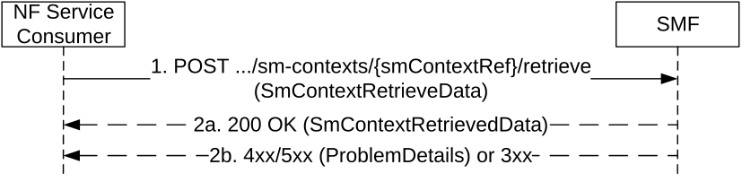

# 5.2.2.6 Retrieve SM Context service operation

## 5.2.2.6.1 General

The Retrieve SM Context service operation shall be used to retrieve an individual SM context, for a given PDU session, from the (H-)SMF, from the V-SMF during change or removal of V-SMF, or from the I-SMF during change or removal of I-SMF.

It is used in the following procedures:

\- 5GS to EPS handover using N26 interface (see clause 4.11.1.2.1 of 3GPP TS 23.502 \[3\]), for PDU sessions associated with 3GPP access;

\- 5GS to EPS Idle mode mobility using N26 interface (see clause 4.11.1.3.2 of 3GPP TS 23.502 \[3\]), for PDU sessions associated with 3GPP access;

\- UE Triggered Service Request with I-SMF insertion/change/removal or with V-SMF insertion/change/removal (see clause 4.23.4.3 of of 3GPP TS 23.502 \[3\]);

\- Xn based inter NG-RAN handover with insertion of intermediate SMF (see clause 4.23.11 of 3GPP TS 23.502 \[3\]), for PDU sessions associated with 3GPP access;

\- Inter NG-RAN node N2 based handover, preparation phase, with I-SMF or V-SMF insertion/change (see clause 4.23.7.3.2 of 3GPP TS 23.502 \[3\]), for PDU sessions associated with 3GPP access;

\- SMF Context Transfer procedure, LBO or no Roaming, no I-SMF (see clause 4.26.5.3 of 3GPP TS 23.502 \[3\]), for PDU sessions associated with 3GPP access;

\- I-SMF selection per DNAI (see clause 4.23.5.4 of 3GPP TS 23.502 \[3\]);

\- Change of SSC mode 3 PDU Session Anchor with multiple PDU Sessions (see clause 4.3.5.2 of 3GPP TS 23.502 \[3\]);

\- Network triggered EAS change in HR-SBO context (see clause 6.7.3.2 of 3GPP TS 23.548 \[74\]);

\- N2 Handover with V-SMF insertion/change/removal in HR-SBO case (see clause 6.7.2.6 of 3GPP TS 23.548 \[39\]);

\- Inter V-SMF mobility registration update procedure in HR-SBO case (see clause 6.7.2.7 of 3GPP TS 23.548 \[39\]);

\- Xn Handover with V-SMF change in HR-SBO case (see clause 6.7.2.9 of 3GPP TS 23.548 \[39\]).

The NF Service Consumer (e.g. AMF or SMF) shall retrieve an SM context by using the HTTP POST method (retrieve custom operation) as shown in Figure 5.2.2.6.1-1.

Figure 5.2.2.6.1-1: SM context retrieval

1\. The NF Service Consumer shall send a POST request to the resource representing the individual SM context to be retrieved. The POST request may contain a content with the following parameters:

\- target MME capabilities, if available, to allow the SMF to determine whether to include EPS bearer contexts for Ethernet PDN Type, non-IP PDN type, or requiring UP integrity protection or not;

\- SM context type:

\- indicating that this is a request to retrieve the complete SM context (i.e. 5G SM context including EPS context information as defined in clause 6.1.6.2.39), during scenarios with an I-SMF or V-SMF insertion/change/removal or SMF Context Transfer procedure; or

\- indicating that this is a request to retrieve the AF Coordination Information as defined in clause 6.1.6.2.69, during the change of SSC mode 3 PDU Session Anchor with multiple PDU Sessions, if the runtime coordination between old SMF and AF is enabled.

\- serving core network operator PLMN ID of the new V-SMF, when the procedure is triggered by a new V-SMF, if the new V-SMF supports inter-PLMN V-SMF change or insertion. Or the serving core network operator PLMN ID of the new I-SMF during the procedure with an I-SMF insertion;

\- notToTransferEbiList IE, if the SM context type IE is absent or indicate a request to retrieve the EPS PDN connection, to request the SMF to not transfer EPS bearer context(s) corresponding to EBIs in the list, during an 5GS to EPS mobility when the target MME does not support 15 EPS bearers;

\- ranUnchangedInd IE, if the NG-RAN Tunnel info is required in scenario of I-SMF/V-SMF change/insertion during registration procedure after EPS to 5GS handover, I-SMF selection/removal per DNAI or V-SMF selection per DNAI, when the UE is in CM-CONNECTED state as specified in clauses 5.2.2.2.7 and 5.2.2.2.12;

\- hrsboSupportInd IE, if the procedure is triggered by a target V-SMF supporting the HR-SBO feature;

\- storedOffloadIds IE, if the target V-SMF has a list of stored offload identifiers from the previous procedures for the HPLMN of the PDU session.

2a. On success, "200 OK" shall be returned; the content of the POST response shall contain the mapped EPS bearer contexts if this is a request for the UE EPS PDN connection, or the complete SM context if this is a request for retrieving the complete SM context, or the AF Coordination Information if this is a request for retrieving the AF Coordination Information.  
  
If this is a request for the UE EPS PDN connection and the target MME capabilities were provided in the request parameters:

\- if the target MME supports the non-IP PDN type, the SMF shall return, for a PDU session with PDU session type "Unstructured", an EPS bearer context with the "non-IP" PDN type;

\- if the target MME supports the Ethernet PDN type, the SMF shall return, for a PDU session with PDU session type "Ethernet", an EPS bearer context with the "Ethernet" PDN type;

\- if the target MME does not support the Ethernet PDN type but supports the non-IP PDN type, the SMF shall return, for a PDU session with PDU session type "Ethernet", an EPS bearer context with the "non-IP" PDN type.

If the notToTransferEbiList IE was included in the request, the SMF shall not provide EPS bearer context(s) corresponding to EBIs in the list.

If this is a request for retrieving the complete SM context and there are downlink data packets buffered at I-UPF, the SMF shall include the "forwardingInd" attribute with value "true" in the response body to indicate downlink data packets are buffered at the I-UPF. The NF Service Consumer receiving the "forwardingInd" attribute with the value "true" shall setup a forwarding tunnel for receiving the buffered downlink data packets.

If this is a request for retrieving the complete SM context for an inter-PLMN V-SMF change, i.e. if the request contains the serving core network operator PLMN ID indicating a different PLMN than the PLMN of the SMF (acting as the old V-SMF), the latter shall not include the chargingInfo IE and the roamingChargingProfile IE in the SM context returned in the response.

During a procedure with an I-SMF or V-SMF insertion, the anchor SMF should use the servingNetwork IE received in the Retrieve SM Context Request to determine whether the inserted entity is an I-SMF or V-SMF, and if so, encode in the SM Context returned in the response the applicable set of attributes (e.g. hsmfUri, hSmfInstanceId, hSmfServiceInstanceId to a V-SMF, or smfUri, smfInstanceId, smfServiceInstanceId to an I-SMF) and the applicable URI in the pduSessionRef if different URIs are used for intra-PLMN and inter-PLMN signaling requests targeting the PDU session context.

NOTE 1: During an inter-PLMN procedure with an I-SMF or V-SMF change, the old V-SMF or I-SMF returns the attributes of the SM context as were received from the anchor SMF.

If the UE, target MME and AMF support User Plane integrity protection with EPS, the SMF shall include the UP Security Policy IE in the UE EPS PDN connection context if User Plane integrity protection has been enabled by the SMF as specified in clauses 4.11.1.2.1 and 4.11.1.3.2 of 3GPP TS 23.502 \[3\].

NOTE 2: During a 5GS to EPS handover, if User Plane Integrity Protection is used in 5GS and QoS flows are associated with EPS bearer IDs, the I-SMF/V-SMF considers that the UE supports User Plane Integrity Protection in EPS.

If this is a request for retrieving the complete SM context for an I-SMF or V-SMF insertion, and the smfUri IE or hSmfUri IE is provided by the AMF in the Create SM Context request and is different from the smfUri IE or hSmfUri IE in the SM context returned in the Retrieve SM Context response, the latter (i.e. the IEs received in the Retrieve SM Context response) shall prevail and be used by the I-SMF or V-SMF to trigger the create service operation to the (H-)SMF.

> If the target V-SMF supports the HR-SBO feature, for a HR-SBO session, the content of the POST response message may also contain the HR-SBO related information, e.g., hrsboAuthResult, hDnsAddr, hPlmnAddr, vplmnOffloadingInfoList.
>
> The source V-SMF shall determine if the target V-SMF has already received the corresponding VPLMN Offloading Information for an offload identifier based on the storedOffloadIds for the HPLMN of the PDU session provided by the target V-SMF in the Retrieve SM context request message for an intra PLMN V-SMF change, the source V-SMF shall include:

\- the Offload Identifier(s) only, if the Offload Identifier(s) are known by the target V-SMF, i.e., the Offload Identifier(s) are part of the storedOffloadIds; otherwise

\- a list of vplmnOffloadingInfo attributes where each vplmnOffloadingInfo contains an offload identifier and the corresponding VPLMN Offloading Information.

If this is a request for retrieving the complete SM context during an I/V-SMF insertion or change procedures, and if the qosMonitoringInd is set to true, the target I/V-SMF shall:

\- select an I/V-UPF supporting QoS Monitoring for packet delay for a QoS flow using GTP-U based solution, i.e. the selected I/V-UPF shall support the UP function feature for GPQM as specified in clause 5.24.5.1 of 3GPP TS 29.244 \[29\], if possible;

\- instruct the selected I/V-UPF to activate GTP-U path monitoring as specified in clause 5.24.5.2 of 3GPP TS 29.244 \[29\] if the GTP-U path QoS monitoring towards the target NG-RAN has not been activated yet;

\- instruct the selected I/V-UPF to activate GTP-U path based QoS monitoring for the QoS flow(s) of the PDU session indicated in the QosFlowSetupItem as specified in clause 5.24.5.3 of 3GPP TS 29.244 \[29\].

2b. On failure or redirection, one of the HTTP status code listed in Table 6.1.3.3.4.4.2-2 shall be returned. For a 4xx/5xx response, the message body shall contain a ProblemDetails structure with the "cause" attribute set to one of the application error listed in Table 6.1.3.3.4.4.2-2.

If the EBI value of the QoS Flow associated with the default QoS Rule is included in the notToTransferEbiList IE, the SMF shall set the "cause" attribute in the ProblemDetails structure to "DEFAULT_EBI_NOT_TRANSFERRED".

If a request for the UE EPS PDN connection is rejected due to the target MME not being capable to support the PDU session, e.g. if the PDU session requires UP integrity protection but the target MME does not support User Plane Integrity Protection with EPS, the SMF shall return a 403 Forbidden response with the "cause" attribute in the ProblemDetails structure set to " TARGET_MME_CAPABILITY".
