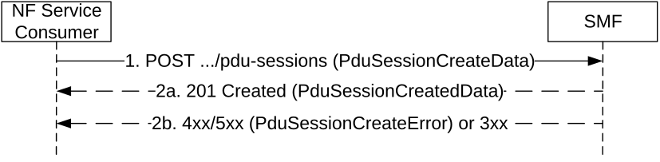

# 5.2.2.7 Create service operation

## 5.2.2.7.1 General

The Create service operation shall be used to create an individual PDU session in the H-SMF for HR roaming scenarios, or in the SMF for PDU sessions involving an I-SMF.

It is used in the following procedures:

\- UE requested PDU Session Establishment for home-routed roaming or with an I-SMF (see clauses 4.3.2.2.2 and 4.23.5.1 of 3GPP TS 23.502 \[3\]);

\- when an I-SMF is inserted during the Registration, Service Request, Inter NG-RAN node N2 based handover, Xn based handover and Handover from non-3GPP to 3GPP access procedures (see clauses 4.23.3, 4.23.4, 4.23.7.3, 4.23.11.2 and 4.23.16 of 3GPP TS 23.502 \[3\]);

\- when a V-SMF is inserted during the Registration and Inter NG-RAN node N2 based handover (see clauses 4.23.3 and 4.23.7.3 of 3GPP TS 23.502 \[3\]);

\- EPS to 5GS Idle mode mobility or handover using N26 interface (see clauses 4.11, 4.23.12.3, 4.23.12.5 and 4.23.12.7 of 3GPP TS 23.502 \[3\]);

\- EPS to 5GS mobility without N26 interface (see clause 4.11.2.3 of 3GPP TS 23.502 \[3\]);

\- Handover of a PDU session between 3GPP access and non-3GPP access, when the target AMF does not know the SMF resource identifier of the SM context used by the source AMF, e.g. when the target AMF is not in the PLMN of the N3IWF (see clause 4.9.2.3.2 of 3GPP TS 23.502 \[3\]);

\- Handover from EPS to 5GC-N3IWF (see clause 4.11.3.1 of 3GPP TS 23.502 \[3\]);

\- Handover from EPC/ePDG to 5GS (see clause 4.11.4.1 of 3GPP TS 23.502 \[3\]);

> \- Support of Network Slice Replacement (see clause 5.15.19 of 3GPP TS 23.501 \[2\]);

\- PDU Session establishment for supporting HR-SBO in VPLMN (see clause 6.7.2.2 of 3GPP TS 23.548 \[39\]).

The NF Service Consumer (e.g. V-SMF or I-SMF) shall create a PDU session in the SMF (i.e. H-SMF for a HR PDU session, or SMF for a PDU session involving an I-SMF) by using the HTTP POST method as shown in Figure 5.2.2.7.1-1.

Figure 5.2.2.7.1-1: PDU session creation

1\. The NF Service Consumer shall send a POST request to the resource representing the PDU sessions collection resource of the SMF. The content of the POST request shall contain:

\- a representation of the individual PDU session resource to be created;

\- the requestType IE, if the Request type IE is received from the UE for a single access PDU session and if the request refers to an existing PDU session or an existing Emergency PDU session; the requestType IE shall not be included for a MA-PDU session establishment request; it may be included otherwise;

\- the indication that a MA-PDU session is requested if a MA-PDU session is requested to be established by the UE, or the indication that the PDU session is allowed to be upgraded to a MA PDU session if the UE indicated so;

\- the vsmfId IE or ismfId IE identifying the V-SMF or I-SMF respectively;

\- the cpCiotEnabled IE with the value "True", if Control Plane CIoT 5GS Optimisation is enabled for this PDU session;

\- the cpOnlyInd IE with the value "True", if the PDU session shall only use Control Plane CIoT 5GS Optimisation;

\- the Invoke NEF indication with the value "True", if the cpCiotEnabled IE is set to "True" and data delivery via NEF is selected for the PDU session;

\- the vcnTunnelInfo IE or icnTunnelInfo IE with the DL N9 tunnel CN information of the UPF controlled by the V-SMF or I-SMF respectively, except for EPS to 5GS handover using N26 interface and when Control Plane CIoT 5GS Optimisation is enabled and data delivery via NEF is selected for this PDU session;

\- the additionalCnTunnelInfo IE with additional DL N9 tunnel CN information, if a MA PDU session is requested or if the PDU session is allowed to be upgraded to a MA PDU session, and if the UE is registered over both 3GPP and Non-3GPP accesses;

> \- the alternative S-NSSAI, if the NF service consumer and UE support the network slice replacement and it is requested to replace the S-NSSAI with the alternative S-NSSAI (see clause 5.15.19 of 3GPP TS 23.501 \[2\]);

NOTE 1: The alternative S-NSSAI is provided to the SMF together with the original S-NSSAI to be replaced. The SMF uses the original (H-PLMN) S-NSSAI to retrieve the session management subscription data from the UDM.

\- the anType IE, indicating the access network type (3GPP or non-3GPP access) associated to the PDU session;

\- the additionalAnType IE indicating an additional access network type associated to the PDU session, for a MA PDU session, if the UE is registered over both 3GPP and Non-3GPP accesses;

\- the n9ForwardingTunnelInfo IE indicating the allocated N9 tunnel endpoints information for receiving the buffered downlink data packets, when downlink data packets are buffered at I-UPF controlled by the SMF during I-SMF insertion;

\- a callback URI ({vsmfPduSessionUri} or {ismfPduSessionUri}) representing the PDU session resource in the V-SMF or I-SMF. The SMF shall construct the callback URIs based on the received {vsmfPduSessionUri} or {ismfPduSessionUri} as defined in clause 6.1, e.g. the callback URI "{vsmfPduSessionUri}/modify" to modify a PDU session in the V-SMF;

\- the list of DNAIs supported by the I-SMF, for a PDU session with an I-SMF;

\- the QoS constraints from the VPLMN for the QoS Flow associated with the default QoS rule and/or for the Session-AMBR if any, for the HR PDU session, if the VQOS feature is supported by the V-SMF;

\- the upipSupported IE set to "true", if the UE supports User Plane Integrity Protection with EPS and if the AMF supports the related functionality.

The content of the POST request may further contain:

\- the satelliteBackhaulCat IE indicating the category of the satellite backhaul used towards the 5G AN serving the UE, if the V-SMF/I-SMF received this information from the AMF;

\- the disasterRoamingInd IE set to true during the PDU session establishment or a V-SMF insertion procedure when the V-SMF is indicated by the AMF that the UE is registered for Disaster Roaming service;

\- the hrsboInfo IE including the HR-SBO information sent from the VPLMN when the V-SMF requests HR SBO authorization;

\- the ecsAddrConfigInfos IE including the ECS Address Configuration information Parameters received from the NEF.

> As specified in clause 4.3.2.2.2 of 3GPP TS 23.502 \[3\], the NF Service Consumer shall be able to receive an Update request before receiving the Create Response, e.g. for EPS bearer ID allocation (see clause 4.11.1.4.1 of 3GPP TS 23.502 \[3\]) or Secondary authorization/authentication (see clause 4.3.2.3 of 3GPP TS 23.502 \[3\]).

NOTE 2: If the H-SMF supports the VQOS feature, when QoS constraints are received from the VPLMN and PCF is deployed, the H-SMF provides the QoS constraints from the VPLMN to the PCF; otherwise, in case dynamic PCC is not deployed, the SMF takes them into account when generating the default QoS rule.

2a. On success, "201 Created" shall be returned, the content of the POST response shall contain:

\- the representation describing the status of the request;

\- the QoS flow(s) to establish for the PDU session, except when Control Plane CIoT 5GS Optimisation is enabled for this PDU session;

\- the epsPdnCnxInfo IE and, for each EPS bearer, an epsBearerInfo IE, if the PDU session is associated to (or handed over to) the 3GPP access type and may be moved to EPS during its lifetime;

\- a MA PDU Session Accepted indication, if a MA PDU session is established;

\- the smallDataRateControlEnabled indication set to "true" if small data rate control is applicable on the PDU session;

> \- the "Location" header containing the URI of the created resource;
>
> \- the hcnTunnelInfo IE or cnTunnelInfo IE with the UL N9 Tunnel CN information of the UPF controlled by the H-SMF or SMF respectively, expect for when Control Plane CIoT 5GS Optimisation is enabled and data delivery via NEF is selected for this PDU session.

\- the additionalCnTunnelInfo IE with additional UL N9 tunnel CN information of the UPF controlled by the H-SMF or SMF if a MA-PDU session is established for a UE registered over both 3GPP access and Non-3GPP access.

> The content of the POST response may further contain:

\- the pending update information list, indicating the information elements whose change(s) are not required to be updated in real-time to the (H-)SMF, i.e. the change(s) of the indicated information elements may be piggybacked in a subsequent update to the (H-)SMF together with other information elements.

> The content of the POST response may also contain the upSecurity, maxIntegrityProtectedDataRate and maxIntegrityProtectedDataRateDl IEs, if the PDU session is associated to (or handed over to) the 3GPP access type.
>
> The SMF may provide alternative QoS profiles for each GBR QoS flow with Notification control enabled, to allow the NG-RAN to accept the setup of the QoS flow if the requested QoS parameters or at least one of the alternative QoS parameters sets can be fulfilled at the time of setup.
>
> The authority and/or deployment-specific string of the apiRoot of the created resource URI may differ from the authority and/or deployment-specific string of the apiRoot of the request URI received in the POST request.
>
> If an Update Request was sent to the NF Service Consumer before the Create Response, the URI in the "Location" header and in the hsmfPduSessionUri IE (carrying the PDU session resource URI of a HR PDU session or a PDU session with an I-SMF) of the SMF initiated Update Request shall be the same. If the requestType IE was received in the request and set to EXISTING_PDU_SESSION or EXISTING_EMERGENCY_PDU_SESSION (i.e. indicating that this is a UE request for an existing PDU session or an existing emergency PDU session), the SMF shall identify the existing PDU session or emergency PDU session based on the PDU Session ID; in this case, the SMF shall not create a new PDU session or emergency PDU session but instead update the existing PDU session or emergency PDU session and provide the representation of the updated PDU session or emergency PDU session in the response to the NF Service Consumer.
>
> The POST request shall be considered as colliding with an existing PDU session context if:

\- this is a request to establish a new PDU session, i.e.:

\- the RequestType IE is present in the request and set to INITIAL_REQUEST or INITIAL_EMERGENCY_REQUEST (e.g. single access PDU session establishment request);

\- the RequestType IE and the maRequestInd IE are both absent in the request (e.g. EPS to 5GS mobility); or

\- the maRequestInd IE is present in the request (i.e. MA-PDU session establishment request) and the access type indicated in the request corresponds to the access type of the existing PDU session context.

and either of the following conditions is met:

\- this is a request to establish a non-emergency PDU session and the request includes the same SUPI and the same PDU Session ID as for an existing PDU session context; or

\- this is a request to establish an emergency PDU session and the request includes the same SUPI, or PEI for an emergency registered UE without a UICC or without an authenticated SUPI, as for an existing PDU session context for an emergency PDU session.

A POST request that collides with an existing PDU session context shall be treated as a request for a new PDU session context. The SMF shall assign a new PDU session reference, i.e. {pduSessionRef} (see clause 6.1.3.6.2), which is different from the existing PDU session context. Before creating the new PDU session context, the SMF should delete the existing PDU session context locally and any associated resources in the UPF, PCF, CHF and UDM. See also clause 5.2.3.3.1 for the handling of requests which collide with an existing PDU session context. If the vsmfPduSessionUri or ismfPduSessionUri of the existing PDU session context differs from the vsmfPduSessionUri or ismfPduSessionUri received in the POST request, the SMF shall also send a status notification (see clause 5.2.2.10) targeting the vsmfPduSessionUri or ismfPduSessionUri of the existing PDU session context to notify the release of the existing PDU session context. The SMF should include a cause IE with value "REL_DUE_TO_DUPLICATE_SESSION_ID" in such a status notification. Upon receipt of such a status notification, the V-SMF or I-SMF shall not send SM context status notification to the AMF.

If the requestType IE was received in the request and indicates this is a request for a new PDU session (i.e. INITIAL_REQUEST) and if the Old PDU Session ID was also included in the request, the SMF shall identify the existing PDU session to be released and to which the new PDU session establishment relates, based on the Old PDU Session ID.

> The NF Service Consumer shall store any epsPdnCnxInfo and EPS bearer information received from the SMF.
>
> If the response received from the SMF contains the alwaysOnGranted attribute set to true, the NF Service Consumer shall check and determine whether the PDU session can be established as an always-on PDU session based on local policy.

If no GPSI IE is provided in the request, e.g. for a PDU session moved from another access or another system, and the SMF knows that a GPSI is already associated with the PDU session, the SMF shall include the GPSI in the response.

If one or more requested QoS flow(s) fail to be established, the V-SMF or I-SMF shall send an Update Request including the qosFlowsRelNotifyList attribute to report the failure to the H-SMF or SMF (see clause 5.2.2.8.2.2), or a Release Request to release the PDU session if no QoS flow can be established (see clause 5.2.2.9).

For UE mobility with I-SMF/V-SMF insertion procedure, if a requested functionality is not supported for a PDU session with an I-SMF/V-SMF, the SMF shall accept the POST request and release the PDU Session after the mobility procedure, as specified in clause 4.23.1 of 3GPP TS 23.502 \[3\].

> For a HR-SBO session, the content of the POST response may also contain the hrsboInfo IE including the HR-SBO information sent from the HPLMN, e.g., hrsboAuthResult.

2b. On failure, or redirection during a UE requested PDU Session Establishment, one of the HTTP status code listed in Table 6.1.3.5.3.1-3 shall be returned. For a 4xx/5xx response, the message body shall contain a PduSessionCreateError structure, including:

\- a ProblemDetails structure with the "cause" attribute set to one of the application error listed in Table 6.1.3.5.3.1-3. The application error shall be set to "NOT_SUPPORTED_WITH_ISMF" during a UE requested PDU Session Establishment, if a requested functionality is not supported for a PDU session with an I-SMF/V-SMF.

\- the n1SmCause IE with the 5GSM cause that the SMF proposes the NF Service Consumer to return to the UE, if the request included n1SmInfoFromUe;

\- n1SmInfoToUe with any information to be sent to the UE (in the PDU Session Establishment Reject).

## 5.2.2.7.2 EPS to 5GS Idle mode mobility

The requirements specified in clause 5.2.2.7.1 shall apply with the following modifications.

1\. Same as step 1 of Figure 5.2.2.7.1-1, with the following additions.

> The POST request shall contain:

\- the list of EPS Bearer Ids received from the MME;

\- the PGW S8-C F-TEID received from the MME;

\- the epsBearerCtxStatus attribute, indicating the status of all the EPS bearer contexts in the UE, if corresponding information has been received in the Create SM Context request (see clause 5.2.2.2.2).

2a. Same as step 2 of Figure 5.2.2.7.1-1, with the following modifications.  
  
If:

\- the SMF finds a corresponding PDU session based on the EPS Bearer Ids and PGW S8-C F-TEID received in the request;

\- the default EPS bearer context of the corresponding PDU session is not reported as inactive by the UE in the epsBearerCtxStatus attribute, if received; and

\- the SMF can proceed with moving the PDN connection to 5GS,

then the SMF shall return a 201 Created response including the following additional information:

\- PDU Session ID corresponding to the EPS PDN connection;

\- other PDU session parameters, such as PDU Session Type, Session AMBR, QoS flows information.

> If the epsBearerCtxStatus attribute is received in the request, the SMF shall check whether some EPS bearer(s) of the corresponding PDU session have been deleted by the UE but not notified to the EPS, and if so, the SMF shall release these EPS bearers, corresponding QoS rules and QoS flow level parameters locally, as specified in clause 4.11.1.3.3 of 3GPP TS 23.502 \[3\].

NOTE: The behaviour specified in this step also applies if the POST request collides with an existing PDU session context, i.e. if the POST request includes the same SUPI, or PEI for an emergency registered UE without a UICC or without an authenticated SUPI, and the received EPS bearer ID is the same as in the existing PDU session context.

2b. Same as step 2b of Figure 5.2.2.7.1-1, with the following additions.

> If the SMF determines that seamless session continuity from EPS to 5GS is not supported for the PDU session, the SMF shall set the "cause" attribute in the ProblemDetails structure to "NO_EPS_5GS_CONTINUITY".
>
> If the default EPS bearer context of the PDU session is reported as inactive by the UE in the epsBearerCtxStatus attribute, the SMF shall set the "cause" attribute in the ProblemDetails structure to "DEFAULT_EPS_BEARER_INACTIVE".

## 5.2.2.7.3 EPS to 5GS Handover Preparation

The requirements specified in clause 5.2.2.7.1 shall apply with the following modifications.

1\. Same as step 1 of Figure 5.2.2.7.1-1, with the following modifications.

> The POST request shall contain:
>
> \- the list of EPS Bearer Ids received from the MME;
>
> \- the PGW S8-C F-TEID received from the MME;

\- the hoPreparationIndication IE set to "true", to indicate that a handover preparation is in progress and the PGW-C/SMF shall not switch the DL user plane of the PDU session yet.

2a. Same as step 2 of Figure 5.2.2.7.1-1, with the following modifications.

> If the SMF finds a corresponding PDU session based on the EPS Bearer Ids and PGW S8-C F-TEID received in the request, and if it can proceed with the procedure, the SMF shall return a 201 Created response including the following information:

\- PDU Session ID corresponding to the EPS PDN connection;

\- other PDU session parameters, such as PDU Session Type, Session AMBR, QoS flows information;

\- optional udmGroupId, containing the identity of the UDM group serving the UE, to facilitate the UDM selection at the target AMF. The V/I-SMF shall forward this IE in the SmContextCreatedData to the target AMF.

\- optional pcfGroupId, containing the identity of the PCF group for Session Management Policy for the PDU session, to facilitate the PCF selection at the target AMF. The V/I-SMF shall forward this IE in the SmContextCreatedData to the target AMF.

> The SMF shall not switch the DL user plane of the PDU session, if the hoPreparationIndication IE was set to "true" in the request.

NOTE: The behaviour specified in this step also applies if the POST request collides with an existing PDU session context, i.e. if the POST request includes the same SUPI, or PEI for an emergency registered UE without a UICC or without an authenticated SUPI, and the received EPS bearer ID is the same as in the existing PDU session context.

2b. Same as step 2b of Figure 5.2.2.7.1-1, with the following additions.

> If the H-SMF determines that seamless session continuity from EPS to 5GS is not supported for the PDU session, the H-SMF shall set the "cause" attribute in the ProblemDetails structure to "NO_EPS_5GS_CONTINUITY".

## 5.2.2.7.4 N2 Handover Preparation with I-SMF Insertion

The requirements specified in clause 5.2.2.7.1 shall apply with the following modifications.

1\. Same as step 1 of Figure 5.2.2.7.1-1, with the following modifications.

> The POST request shall contain:

\- the hoPreparationIndication IE set to "true", to indicate that a handover preparation is in progress and the SMF shall not switch the DL user plane of the PDU session yet.

2a. Same as step 2 of Figure 5.2.2.7.1-1, with the following modifications:

> The SMF shall not switch the DL user plane of the PDU session, if the hoPreparationIndication IE was set to "true" in the request.

## 5.2.2.7.5 Xn Handover with I-SMF Insertion

The requirements specified in clause 5.2.2.7.1 shall apply with the following modifications.

1\. Same as step 1 of Figure 5.2.2.7.1-1, with the following modifications.

> The POST request shall contain:

\- the upSecurityInfo IE, if received from the AMF.

2a. Same as step 2 of Figure 5.2.2.7.1-1, with the following modifications:

> The SMF shall verify that the upSecurity IE included in the received upSecurityInfo IE is same as the security policy for integrity protection and encryption that the SMF has locally stored. If there is a mismatch, the SMF shall send its locally stored security policy for integrity protection and encryption in upSecurity IE to NG-RAN as specified in clause 6.6.1 of 3GPP TS 33.501 \[17\].

## 5.2.2.7.6 UE Triggered Service Request with I-SMF Insertion

The requirements specified in clause 5.2.2.7.1 shall apply with the following modifications.

1\. Same as step 1 of Figure 5.2.2.7.1-1, with the following modifications.

> The POST request shall additionally contain:

\- the upCnxState IE set to ACTIVATING to indicate that User Plane resource for the PDU Session is going to be established by the I-SMF.

2a. Same as step 2 of Figure 5.2.2.7.1-1, with the following modifications:

> The SMF shall behave as specified in clause 4.23.4.3 (step 8a) of 3GPP TS 23.502 \[3\].
>
> The SMF handling of a subsequent Update request with the upCnxState IE set to ACTIVATED is specified in step 3 of clause 5.2.2.8.2.23.

NOTE: The upCnxState IE set to ACTIVATING implements the "Operation Type" parameter set to "UP Activate" specified in clause 4.23.4.3 (step 8a) in 3GPP TS 23.502 \[3\].
