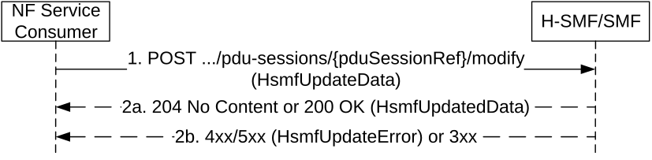

# 5.2.2.8.2.1 General

The NF Service Consumer (i.e. the V-SMF for a HR PDU session, or the I-SMF for a PDU session with an I-SMF) shall update a PDU session in the H-SMF or SMF and/or provide the H-SMF or SMF with information received by the NF Service Consumer in N1 SM signalling from the UE, by using the HTTP POST method (modify custom operation) as shown in Figure 5.2.2.8.2-1.

Figure 5.2.2.8.2-1: PDU session update towards H-SMF or SMF

1\. The NF Service Consumer shall send a POST request to the resource representing the individual PDU session resource in the H-SMF or SMF. The content of the POST request shall contain:

\- the requestIndication IE indicating the request type. Unless specified otherwise in clause 5.2.2.8.2, the value of the requestIndication IE shall be set to NW_REQ_PDU_SES_MOD;

\- the modification instructions and/or the information received by the NF Service Consumer in N1 signalling from the UE.

> The NF service consumer shall not include the hoPreparationIndication IE with the value "false" in procedures other than handover execution, cancel and failure procedures.
>
> If the pending update information list was previously received from the (H-)SMF, the NF service consumer should not send a request to the (H-)SMF including only the information elements indicated by the pending update information list. The change(s) of the indicated information elements may be piggybacked in a subsequent update to the (H-)SMF together with other information elements.

For a HR-SBO session, the content of the POST request may further contain:

\- the hrsboInfo IE including the HR-SRO information sent from the VPLMN when the V-SMF requests HR SBO authorization.

\- the ecsAddrConfigInfos IE including the ECS Address Configuration information if the information is modified by the NEF.

2a. On success, "204 No Content" or "200 OK" shall be returned; in the latter case, the content of the POST response shall contain the representation describing the status of the request and/or information necessary for the NF Service Consumer to send N1 SM signalling to the UE. If the PDU session may be moved to EPS with N26 and the EPS PDN Connection Context information of the PDU session is changed, e.g. due to a new anchor SMF is reselected, the content shall include the "epsPdnCnxInfo" IE including the updated EPS PDN Connection Context information. The NF Service consumer shall overwrite the locally stored EPS PDN Connection Context information with the new one if received.

> For a HR-SBO session, the content of the POST response may also contain the hrsboInfo IE including the HR-SBO information sent from the HPLMN, e.g., hrsboAuthResult.

2b. On failure or redirection, one of the HTTP status codes listed in Table 6.1.3.6.4.2.2-2 shall be returned. For a 4xx/5xx response, the message body shall contain an HsmfUpdateError structure, including:

\- a ProblemDetails structure with the "cause" attribute set to one of the application errors listed in Table 6.1.3.6.4.2.2-2;

\- the n1SmCause IE with the 5GSM cause the H-SMF or SMF proposes the NF Service Consumer to return to the UE, if the request included n1SmInfoFromUe;

\- n1SmInfoToUe binary data, if the H-SMF or SMF needs to return NAS SM information which the NF Service Consumer does not need to interpret;

\- the procedure transaction id that was received in the request, if this is a response sent to a UE requested PDU session modification.

> If the H-SMF or SMF receives the hoPreparationIndciation IE set to "false" value in step 1, while it did not receive the hoPreparationIndication IE set to "true" value in previous steps (see clauses 5.2.2.7.3 and 5.2.2.7.4), the H-SMF or SMF shall ignore the hoPreparationIndication IE with "false" value and proceed with the processing of the request.
