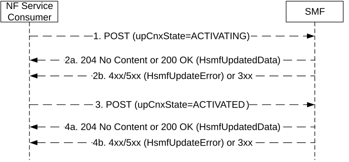

# 5.2.2.8.2.23 Service Request without I-SMF/V-SMF Change or with I-SMF/V-SMF Change or with I-SMF Insertion

During a Service Request without I-SMF/V-SMF Change or with I-SMF/V-SMF Change or with I-SMF Insertion, the NF Service Consumer (i.e. the V-SMF for a HR PDU session, or the I-SMF for a PDU session with an I-SMF) shall update the PDU session in the H-SMF or SMF as follows:

Figure 5.2.2.8.2.23-1: PDU session update towards H-SMF or SMF during Service Request

The requirements specified in clause 5.2.2.8.2.1 shall apply with the following modifications.

1\. Same as step 1 of Figure 5.2.2.8.2-1, with the following modifications.

> The POST request shall additionally contain:

\- the upCnxState IE set to ACTIVATING if the User Plane resource for the PDU Session is going to be established by the I-SMF/V-SMF.

2a. Same as step 2a of Figure 5.2.2.8.2-1, with the following modifications.

The SMF shall behave as specified in clause as specified in clause 4.23.4.2 (step 7a) and clause 4.23.4.3 (step 8a) of 3GPP TS 23.502 \[3\].

2b. Same as step 2b of Figure 5.2.2.8.2-1.

3\. Same as step 1 of Figure 5.2.2.8.2-1, with the following modifications.

> The POST request shall additionally contain:

\- the upCnxState IE set to ACTIVATED when User Plane resource has been established, if the upCnxState IE with the value ACTIVATING was previously provided to the SMF in the procedure, via a previous Update operation (step 1) or via Create operation for I-SMF/V-SMF insertion (see clause 5.2.2.7.6).

4a. Same as step 2a of Figure 5.2.2.8.2-1, with the following modifications.

The SMF shall behave as specified in clause as specified in clause 4.23.4.2 (step 16) and clause 4.23.4.3 (step 20a) of 3GPP TS 23.502 \[3\].

4b. Same as step 2b of Figure 5.2.2.8.2-1.

NOTE: The upCnxState IE set to ACTIVATING or ACTIVATED implements the "Operation Type" parameter set to "UP Activate" or "UP Activated" (respectively) specified in clause 4.23.4.2 (step 7a, 16) and clause 4.23.4.3 (step 8a, 20a) in 3GPP TS 23.502 \[3\].
