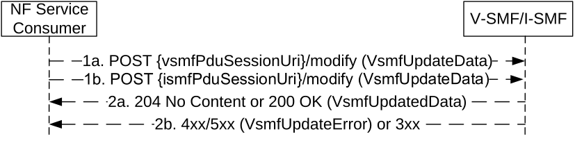

# 5.2.2.8.3 Update service operation towards V-SMF or I-SMF

## 5.2.2.8.3.1 General

The NF Service Consumer (i.e. the H-SMF for a HR PDU session, or the SMF for a PDU session with an I-SMF) shall update a PDU session in the V-SMF or I-SMF and/or provide information necessary for the V-SMF or I-SMF to send N1 SM signalling to the UE, or request to allocate or revoke EPS Bearer ID(s) for the PDU session, by using the HTTP "modify" custom operation as shown in Figure 5.2.2.8.3.1-1.

Figure 5.2.2.8.3.1-1: PDU session update towards V-SMF or I-SMF

1\. The NF Service Consumer shall send a POST request to the resource representing the individual PDU session resource in the V-SMF or I-SMF. The content of the POST request shall contain:

\- the requestIndication IE indicating the request type, which is set to NW_REQ_PDU_SES_MOD;

\- the modification instructions and/or the information necessary for the V-SMF or I-SMF to send N1 SM signalling to the UE;

\- the hsmfPduSessionUri IE if the Update Request is sent to the V-SMF or I-SMF before the Create Response, and the H-SMF or SMF PDU session resource URI has not been previously provided to the V-SMF or I-SMF; in this case, the supportedFeatures IE shall also be included if at least one feature defined in clause 6.1.8 is supported.

The content of the POST request may further contain:

\- the (updated) pending update information list.

> If the PDU session may be moved to EPS with N26 and the EPS PDN Connection Context information of the PDU session is changed, e.g. due to a new anchor SMF is reselected, the content shall include the "epsPdnCnxInfo" IE including the updated EPS PDN Connection Context information. The NF Service consumer shall overwrite the locally stored EPS PDN Connection Context information with the new one if received.
>
> If the service operation is invoked after the reselection of the anchor SMF and the change of anchor SMF has not been signalled to the V-SMF or I-SMF previously, the request may carry the SMF Instance ID of the new anchor SMF and the updated PDU session resource URI in the HTTP content, and/or carry an updated binding indication in the HTTP headers to indicate the change of anchor SMF (as per step 6 of clause 6.5.3.3 of 3GPP TS 29.500 \[4\]).
>
> For a HR-SBO session, the content of the POST request may also contain the hrsboInfo IE including the HR-SBO information sent from the HPLMN, e.g., due to a change of the user subscription data or policy information. If the VPLMN Specific Offloading Information for a given Offload Identifier is changed, for each V-SMF service instance using the Offload Identifier, the H-SMF shall choose one existing HR-SBO PDU Session served by the V-SMF service instance and using the Offload Identifier to update VPLMN Specific Offloading Information and corresponding Offload Identifier to the V-SMF service instance.

2a. On success, "204 No Content" or "200 OK" shall be returned; in the latter case, the content of the POST response shall contain the representation describing the status of the request and/or information received by the V-SMF or I-SMF in N1 signalling from the UE.

2b. On failure or redirection, one of the HTTP status code listed in Table 6.1.3.7.4.2.2-1 shall be returned. For a 4xx/5xx response, the message body shall contain a VsmfUpdateError structure, including:

\- a ProblemDetails structure with the "cause" attribute set to one of the application error listed in Table 6.1.3.7.4.2.2-1;

\- the n1SmCause IE with the 5GSM cause returned by the UE, if available;

\- n1SmInfoFromUe and/or unknownN1SmInfo binary data, if NAS SM information has been received from the UE that needs to be transferred to the H-SMF or SMF, or that the V-SMF or I-SMF does not comprehend;

\- the procedure transaction id received from the UE, if available.

## 5.2.2.8.3.2 Network (e.g. H-SMF, SMF) requested PDU session modification

The requirements specified in clause 5.2.2.8.3.1 shall apply with the following modifications.

1\. Same as step 1 of Figure 5.2.2.8.3.1-1, with the following modifications.

The requestIndication shall be set to NW_REQ_PDU_SES_MOD.

> As part of the modification instructions, the NF Service Consumer may request to modify QoS parameters applicable at the PDU session level (e.g. modify the authorized Session AMBR values) or at the QoS flow level (e.g. modify the MFBR of a particular QoS flow).  
>   
> The NF Service Consumer may request to establish, modify and/or release QoS flows by including the qosFlowsAddModRequestList IE and/or the qosFlowsRelRequestList IE in the content.
>
> The H-SMF or SMF may provide alternative QoS profiles for each GBR QoS flow with Notification control enabled, to allow the NG-RAN to accept the setup of the QoS flow if the requested QoS parameters or at least one of the alternative QoS parameters sets can be fulfilled at the time of setup. If the H-SMF or SMF provides a new list of alternative QoS profile(s) for a given GBR Qos flow, the V-SMF or I-SMF shall replace any previously stored list for this Qos flow with it.
>
> The NF Service Consumer may include epsBearerInfo IE(s), if the PDU session may be moved to EPS during its lifetime and the EPS Bearer(s) information has changed (e.g. a new EBI has been assigned or the mapped EPS bearer QoS for an existing EBI has changed).
>
> The NF Service Consumer may include the modifiedEbiList IE if the PDU session modification procedure resulted in the change of ARP for a QoS flow that has already been allocated an EBI.
>
> The NF Service Consumer may include the revokeEbiList IE to request the V-SMF or I-SMF to release some EBI(s) and delete any corresponding EPS bearer context stored in the V-SMF or I-SMF. The V-SMF or I-SMF shall disassociate the EBI(s) with the QFI(s) with which they are associated.
>
> The H-SMF may include the hrsboInfo IE if the V-SMF supports the HR-SBO feature and if the H-SMF needs to update the HR-SBO information towards the V-SMF, e.g. due to a change of the user subscription data or policy information. When doing so, H-SMF shall include the complete information for HR-SBO and the V-SMF shall replace any earlier received HR-SBO information by the new HR-SBO information.

2\. Same as step 2 of Figure 5.2.2.8.3.1-1, with the following modifications.

> The V-SMF or I-SMF may accept all or only a subset of the QoS flows requested to be created or modified within the request.  
>   
> The list of QoS flows which have been successfully setup or modified, and those which failed to be so, if any, shall be included in the qosFlowsAddModList IE and/or the qosFlowsFailedtoAddModList IE respectively. If any QoS flow(s) are failed to be setup or modified due to rejection by the V-SMF, the V-SMF may also include the qosFlowsVsmfRejectedAddModList IE with the QoS flow(s) that are rejected by the V-SMF.
>
> The V-SMF or I-SMF may report an alternative QoS profile which the NG-RAN currently fulfils in the currentQosProfileIndex IE of the corresponding Qos flow in the qosFlowsAddModList IE, or report that the NG-RAN cannot even fulfil the lowest alternative QoS profile by setting the nullQoSProfileIndex IE to "true" for the corresponding Qos flow in the qosFlowsAddModList IE.
>
> If the NG-RAN rejects the establishment of a voice QoS flow due to EPS Fallback for IMS voice (see clause 4.13 of 3GPP TS 23.502 \[3\]), the V-SMF or I-SMF shall return the cause indicating that "mobility due to EPS fallback for IMS voice is on-going" for the corresponding flow in the qosFlowsFailedtoAddModList IE.
>
> The list of QoS flows which have been successfully released, and those which failed to be so, if any, shall be included in the qosFlowsRelList and/or qosFlowsFailedtoRelList IE respectively.  
>   
> For a QoS flow which failed to be modified, the V-SMF or I-SMF shall fall back to the configuration of the QoS flow as it was configured prior to the reception of the PDU session update request from the NF Service Consumer.
>
> The V-SMF or I-SMF shall store any EPS bearer information received from the H-SMF or SMF. If the revokeEbiList IE is present in the request, the V-SMF or I-SMF shall request delete the corresponding EPS bearer contexts and request the AMF to release the EBIs listed in this IE. If the modifiedEbiList IE is present in the request, the V-SMF or I-SMF shall request the AMF to update the mapping of EBI and ARP if the EAEA feature is supported by both the AMF and the V-SMF (or I-SMF), otherwise the V-SMF (or I-SMF) should indicate in the response that the modifiedEbiList was not delivered to the AMF.
>
> If the request received from the H-SMF or SMF contains the alwaysOnGranted attribute set to true, the V-SMF or I-SMF shall check and determine whether the PDU session can be established as an always-on PDU session based on local policy.

## 5.2.2.8.3.3 Network (e.g. H-SMF, SMF) or UE requested PDU session release

The requirements specified in clause 5.2.2.8.3.1 shall apply with the following modifications.

1\. Same as step 1 of Figure 5.2.2.8.3.1-1, with the following modifications.

The requestIndication shall be set to NW_REQ_PDU_SES_REL or UE_REQ_PDU_SES_REL for a Network requested PDU session release or UE requested PDU session release respectively.

2\. Same as step 2 of Figure 5.2.2.8.3.1-1, with the following modifications.

> If the requestIndication in the request is set to NW_REQ_PDU_SES_REL or UE_REQ_PDU_SES_REL, the V-SMF or I-SMF shall initiate the release of RAN resources allocated for the PDU session if any and shall send a PDU session release command to the UE.
>
> The V-SMF or I-SMF shall not release the SM context for the PDU session.

NOTE: The SM context will be released when receiving Status notification from the H-SMF or SMF indicating the PDU session is released in the H-SMF or SMF.

## 5.2.2.8.3.4 Handover between 3GPP and untrusted non-3GPP access, from 5GC-N3IWF to EPS or from 5GS to EPC/ePDG

The requirements specified in clause 5.2.2.8.3.1 shall apply with the following modifications.

1\. Same as step 1 of Figure 5.2.2.8.3.1-1, with the following modifications.

> The NF Service Consumer shall request the source V-SMF or I-SMF to release the resources in the VPLMN without sending a PDU session release command to the UE, by setting the requestIndication IE to NW_REQ_PDU_SES_REL and the Cause IE indicating "Release due to Handover", in the following scenarios:

\- Handover of a PDU session between 3GPP and untrusted non-3GPP access, when the UE is roaming and the selected N3IWF is in the HPLMN (see clause 4.9.2.4.2 of 3GPP TS 23.502 \[3\]);

\- Handover from 5GC-N3IWF to EPS (see clause 4.11.3.2 of 3GPP TS 23.502 \[3\]);

\- Handover from 5GS to EPC/ePDG (see clause 4.11.4.2 of 3GPP TS 23.502 \[3\]).

2\. Same as step 2 of Figure 5.2.2.8.3.1-1, with the following modifications.

> If the requestIndication in the request is set to NW_REQ_PDU_SES_REL and if the Cause IE indicates "Release due to Handover", the V-SMF or I-SMF shall initiate the release of RAN resources reserved for the PDU session if any but shall not send a PDU session release command to the UE.
>
> The V-SMF or I-SMF shall not release the SM context for the PDU session.

NOTE: The SM context will be released when receiving Status notification from the H-SMF or SMF indicating the PDU session is released in the H-SMF or SMF.

## 5.2.2.8.3.5 EPS Bearer ID assignment

The requirements specified in clause 5.2.2.8.3.1 shall apply with the following modifications.

1\. Same as step 1 of Figure 5.2.2.8.3.1-1, with the following modifications.

The requestIndication shall be set to EBI_ASSIGNMENT_REQ.

> The NF Service Consumer may include the assignEbiList IE to request the allocation of EBI(s). The NF Service Consumer may include the revokeEbiList IE to request the V-SMF or I-SMF to release some EBI(s) and delete any corresponding EPS bearer context stored in the V-SMF or I-SMF. The V-SMF or I-SMF shall disassociate the EBI(s) with the QFI(s) with which they are associated.

NOTE: The SMF does not request EBI allocation when MA PDU Session is established only over non-3GPP access. For MA PDU Session with both 3GPP and non-3GPP accesses, the SMF does not allocate EBI(s) for GBR QoS Flow(s) that are only allowed over non-3GPP access.

> Upon receipt of this request, the V-SMF or I-SMF shall request the AMF to assign (and release if required) EBIs (see clause 5.2.2.6 of 3GPP TS 29.518 \[20\].

2a. Same as step 2a of Figure 5.2.2.8.3.1-1, with the following modifications.

> If the AMF has successfully assigned all or part of the requested EBIs, the V-SMF or I-SMF shall respond with the status code 200 OK, and include the list of EBIs successfully allocated, those which failed to be so if any, and the list of EBIs released for this PDU session at AMF if any, in the assignedEbiList IE, the failedtoAssignEbiList IE and/or the releasedEbiList IE respectively.

2b. Same as step 2b of Figure 5.2.2.8.3.1-1, with the following modifications.

> For a 4xx/5xx response, the message body shall contain a VsmfUpdateError structure, including the list of EBIs which failed to be allocated in the failedtoAssignEbiList IE.

## 5.2.2.8.3.6 Addition of PSA and BP or UL CL controlled by I-SMF

The requirements specified in clause 5.2.2.8.3.1 shall apply with the following modifications.

1\. Same as step 1 of Figure 5.2.2.8.3.1-1, with the following modifications.

The requestIndication shall be set to NW_REQ_PDU_SES_MOD.

The content of the POST request shall contain:

\- N4 information for the handling of the local traffic that is offloaded at the PSA (see Annex D of 3GPP TS 29.244 \[29\]);

\- N4 information for the local offload rules at the UL CL/BP (see Annex D of 3GPP TS 29.244 \[29\]);

\- the DNAI related to N4 information targeting the local PSA;

\- the indication that the DNAI shall not change, if applicable;

\- the indication that the local PSA shall not change, if applicable.

For the Simultaneous change of Branching Points or UL CLs controlled by different I-SMFs (see clause 4.23.9.5 of 3GPP TS 23.502 \[3\]), the POST request may also contain:

\- n9DataForwardingInd set to true, if the N9 Forwarding Tunnel establishment between Branching Points or UL CLs to support the EAS session continuity is required;

\- n9UlPdrIdList pointing to the UL PDR(s) included in the N4 information for UL N9 forwarding in the target Branching Point or UL CL to support the EAS session continuity;

\- n9InactivityTimer to detect the end of activity on the N9 forwarding tunnel to support the EAS session continuity.

2a. Same as step 2a of Figure 5.2.2.8.3.1-1, with the following modifications.

The content of the POST response shall contain:

\- N4 response information;

\- the DNAI related to the N4 information if the latter relates to a local PSA.

2b. Same as step 2b of Figure 5.2.2.8.3.1-1, with the following modifications.

> For a 4xx/5xx response, the message body shall contain a VsmfUpdateError structure, including N4 response information if available (e.g. PFCP Session Establishment Response with a rejection cause).

## 5.2.2.8.3.7 Removal of PSA and BP or UL CL controlled by I-SMF

The requirements specified in clause 5.2.2.8.3.1 shall apply with the following modifications.

1\. Same as step 1 of Figure 5.2.2.8.3.1-1, with the following modifications.

The requestIndication shall be set to NW_REQ_PDU_SES_MOD.

The content of the POST request shall contain:

\- N4 information for the removal of the local offload rules at the UL CL/BP and PSA (see Annex D of 3GPP TS 29.244 \[29\]);

\- the DNAI related to N4 information targeting the local PSA.

2a. Same as step 2a of Figure 5.2.2.8.3.1-1, with the following modifications.

The content of the POST response shall contain:

\- N4 response information;

\- the DNAI related to the N4 information if the latter relates to a local PSA.

2b. Same as step 2b of Figure 5.2.2.8.3.1-1, with the following modifications.

For a 4xx/5xx response, the message body shall contain a VsmfUpdateError structure, including N4 response information if available (e.g. PFCP Session Deletion Response with a rejection cause).

## 5.2.2.8.3.8 Change of PSA for IPv6 multi-homing or UL CL controlled by I-SMF

The requirements specified in clause 5.2.2.8.3.1 shall apply with the following modifications.

1\. Same as step 1 of Figure 5.2.2.8.3.1-1, with the following modifications.

The requestIndication shall be set to NW_REQ_PDU_SES_MOD.

The content of the POST request shall contain:

\- N4 information for the removal of the local offload rules at the removed PSA (see Annex D of 3GPP TS 29.244 \[29\]);

\- N4 information for the handling of the local traffic that is offloaded at the inserted PSA (see Annex D of 3GPP TS 29.244 \[29\]);

\- N4 information for the updating of the local offload rules at the UL CL/BP (see Annex D of 3GPP TS 29.244 \[29\]);

\- the DNAIs related to N4 information targeting the removed or inserted PSA.

2a. Same as step 2a of Figure 5.2.2.8.3.1-1, with the following modifications.

The content of the POST response shall contain:

\- N4 response information;

\- the DNAI related to the N4 information if the latter relates to a local PSA.

2b. Same as step 2b of Figure 5.2.2.8.3.1-1, with the following modifications.

For a 4xx/5xx response, the message body shall contain a VsmfUpdateError structure, including N4 response information if available (e.g. PFCP Session Establishment Response with a rejection cause).

## 5.2.2.8.3.9 Policy update procedures with an I-SMF

The requirements specified in clause 5.2.2.8.3.1 shall apply with the following modifications.

1\. Same as step 1 of Figure 5.2.2.8.3.1-1, with the following modifications.

The requestIndication shall be set to NW_REQ_PDU_SES_MOD.

The content of the POST request may contain:

\- N4 information updating local offload rules at the I-SMF (see Annex D of 3GPP TS 29.244 \[29\]);

\- the DNAI related to the N4 information if the latter relates to a local PSA;

\- an updated list of DNAI(s) of interest for the PDU Session.

2a. Same as step 2a of Figure 5.2.2.8.3.1-1, with the following modifications.

The content of the POST response shall contain:

\- N4 response information, if N4 information was received in the request;

\- the DNAI related to the N4 information if the latter relates to a local PSA.

2b. Same as step 2b of Figure 5.2.2.8.3.1-1, with the following modifications.

For a 4xx/5xx response, the message body shall contain a VsmfUpdateError structure, including N4 response information if available (e.g. PFCP Session Modification Response with a rejection cause).

## 5.2.2.8.3.10 Simultaneous change of PSA and BP or UL CL controlled by I-SMF

The requirements specified in clause 5.2.2.8.3.1 shall apply with the following modifications.

1\. Same as step 1 of Figure 5.2.2.8.3.1-1, with the following modifications.

The requestIndication shall be set to NW_REQ_PDU_SES_MOD.

The content of the POST request shall contain:

\- N4 information for the removal of the local offload rules at the removed PSA (see Annex D of 3GPP TS 29.244 \[29\]);

\- N4 information for the handling of the local traffic that is offloaded at the inserted PSA (see Annex D of 3GPP TS 29.244 \[29\]);

\- N4 information for the removal of the local offload rules at the removed UL CL/BP (see Annex D of 3GPP TS 29.244 \[29\]);

\- N4 information for the creation of the local offload rules at the inserted UL CL/BP (see Annex D of 3GPP TS 29.244 \[29\]);

\- the DNAIs related to N4 information targeting the removed or inserted PSA.

The content of the POST request may contain:

\- n9DataForwardingInd set to true, if the N9 Forwarding Tunnel establishment between Branching Points or UL CLs to support the EAS session continuity is required;

\- n9UlPdrIdList pointing to the UL PDR(s) included in the N4 information for UL N9 forwarding in the target Branching Point or UL CL to support the EAS session continuity;

\- n9InactivityTimer to detect the end of activity on the N9 forwarding tunnel to support the EAS session continuity.

The SMF may only include the N4 information for the inserted PSA and the inserted UL CL/BP as specified in clause D.2.7 of 3GPP TS 29.244 \[29\], if the I-SMF only includes the PsaInformation corresponding to the new PSA and the UlclBpInformation corresponding to the new UL CL or BP during simultaneous change of PSA and BP or UL CL and data forwarding between the new and old UL CL/BPs for EAS session continuity is required.

2a. Same as step 2a of Figure 5.2.2.8.3.1-1, with the following modifications.

The content of the POST response shall contain:

\- N4 response information;

\- the DNAI related to the N4 information if the latter relates to a local PSA.

2b. Same as step 2b of Figure 5.2.2.8.3.1-1, with the following modifications.

For a 4xx/5xx response, the message body shall contain a VsmfUpdateError structure, including N4 response information if available (e.g. PFCP Session Establishment Response with a rejection cause).

## 5.2.2.8.3.11 Network (e.g. AMF) triggered network slice replacement with PDU session retained

During network slice replacement procedure, for HR PDU session, if the H-SMF determines to retain the PDU session for the alternative HPLMN S-NSSAI, the H-SMF shall use this procedure to instruct the V-SMF that the PDU session is retained for the alternative HPLMN S-NSSAI (see clause 4.3.3.3 of 3GPP TS 23.502 \[3\]).

The requirements specified in clause 5.2.2.8.3.1 shall apply with the following modifications.

1\. Same as step 1 of Figure 5.2.2.8.3.1-1, with the following modifications.

The requestIndication shall be set to NW_REQ_PDU_SES_MOD.

The content of the POST request shall contain:

\- an altHplmnSnssai IE to indicate the alternative HPLMN S-NSSAI applied to the PDU session;

\- a pduSessionRetainInd IE to indicate the PDU session is retained;

2a. Same as step 2a of Figure 5.2.2.8.3.1-1.
