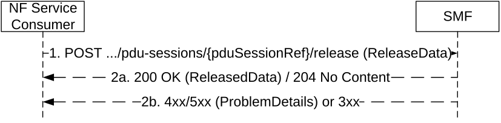

# 5.2.2.9 Release service operation

## 5.2.2.9.1 General

The Release service operation shall be used to request an immediate and unconditional deletion of an invidual PDU session resource in the SMF (i.e. in the H-SMF for a HR PDU session, or in the SMF for a PDU session with an I-SMF).

It is invoked by the NF Service Consumer (i.e. V-SMF or I-SMF) in the following procedures:

\- UE initiated Deregistration (see clause 4.2.2.3.2 of 3GPP TS 23.502 \[3\]);

\- Network initiated Deregistration (see clause 4.2.2.3.2 of 3GPP TS 23.502 \[3\]), e.g. AMF initiated deregistration;

\- visited network requested PDU Session release (see clause 4.3.4.3 of 3GPP TS 23.502 \[3\]), e.g. AMF initiated release in the following cases:

\- when there is a mismatch of the PDU session status between the UE and the AMF;

\- when a network slice is no longer available;

\- when the PDU session is rejected by the new AMF to the old AMF during Registration procedure (as described in clause 4.2.2.2.2 of 3GPP TS 23.502 \[3\]); or

\- due to Mobility or Access Restrictions (see clause 5.16.4.3 of 3GPP TS 23.501 \[2\]).

\- 5GS to EPS handover using N26 interface and 5GS to EPS Idle mode mobility using N26, to release the PDU session not transferred to EPC (see clauses 4.11.1.2.1 and 4.11.1.3.2 of 3GPP TS 23.502 \[3\]);

\- PDU session release procedure, for a PDU session with an I-SMF (see clause 4.23.5.2 of 3GPP TS 23.502 \[3\]);

\- 5G-SRVCC from NG-RAN to 3GPP UTRAN procedure (see clause 6.5.4 of 3GPP TS 23.216 \[35\]).

The SMF shall release the PDU session context without triggering any signalling towards the 5G-AN and the UE.

The NF Service Consumer shall release a PDU session in the SMF by using the HTTP "release" custom operation as shown in Figure 5.2.2.9.1-1.

Figure 5.2.2.9.1-1: Pdu session release

1\. The NF Service Consumer shall send a POST request to the resource representing the individual PDU session resource in the SMF. The content of the POST request shall contain any data that needs to be passed to the SMF.

If an UL CL/BP was inserted in the data path of the PDU session and traffic usage measurements need to be reported to the SMF, the POST request shall contain:

\- N4 information related with traffic usage reporting (i.e. PFCP Session Report Request, see Annex D of 3GPP TS 29.244 \[29\]);

\- the DNAI related to the N4 information if the latter relates to a local PSA.

If VPLMN QoS constraints are required for the PDU session and the H-SMF provides QoS parameters not complying with VPLMN QoS required by the V-SMF, the V-SMF may release the PDU session with the "cause" attribute set to "REL_DUE_TO_VPLMN_QOS_FAILURE".

2a. On success, the SMF shall return a "200 OK" with message body containing the representation of the ReleasedData when information needs to be returned to the NF Service Consumer, or a "204 No Content" response with an empty content in the POST response.

If N4 information was received in the request, the POST response shall contain:

\- N4 response information (i.e. PFCP Session Report Response);

\- the DNAI related to the N4 information if the latter relates to a local PSA.

> If the request body contains the "cause" attribute with the value "REL_DUE_TO_PS_TO_CS_HO", the (H-) SMF shall indicate to the PCF within SM Policy Association termination that the PDU session is released due to 5G-SRVCC.

2b. On failure or redirection, one of the HTTP status code listed in Table 6.1.3.6.4.3.2-2 shall be returned. For a 4xx/5xx response, the message body shall contain a ProblemDetails structure with the "cause" attribute set to one of the application errors listed in Table 6.1.3.6.4.3.2-2.
