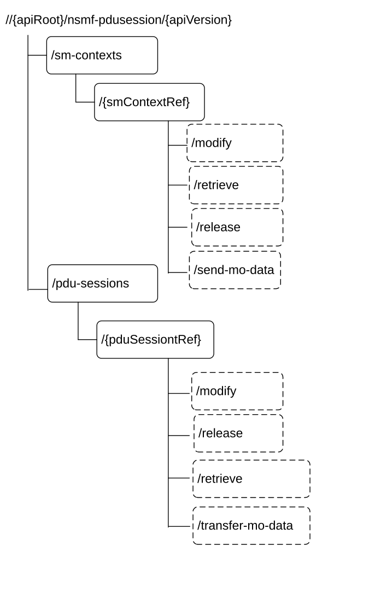

# 6.1.3.1 Overview

This clause describes the structure for the Resource URIs and the resources and methods used for the service.

Figure 6.1.3.1-1 describes the resource URI structure of the Nsmf_PDUSession API.

Figure 6.1.3.1-1: Resource URI structure of the Nsmf_PDUSession API

NOTE: The sm-contexts and pdu-sessions collection resources can be distributed on different processing instances or hosts. Thus, the authority and/or deployment-specific string of the apiRoot of the created individual sm context and pdu-session resources' URIs can differ from the authority and/or deployment-specific string of the apiRoot of the sm-contexts and pdu-sessions distributed collections' URIs.

Table 6.1.3.1-1 provides an overview of the resources and applicable HTTP methods.

Table 6.1.3.1-1: Resources and methods overview

<table>
<colgroup>
<col style="width: 17%" />
<col style="width: 53%" />
<col style="width: 11%" />
<col style="width: 17%" />
</colgroup>
<thead>
<tr class="header">
<th>Resource name</th>
<th>Resource URI</th>
<th>HTTP method or custom operation</th>
<th>
Description

(service operation)
</th>
</tr>
</thead>
<tbody>
<tr class="odd">
<td>
SM contexts

collection
</td>
<td>/sm-contexts</td>
<td>POST</td>
<td>Create SM Context</td>
</tr>
<tr class="even">
<td rowspan="4">Individual SM context</td>
<td>/sm-contexts/{smContextRef}/retrieve</td>
<td>retrieve (POST)</td>
<td>Retrieve SM Context</td>
</tr>
<tr class="odd">
<td>/sm-contexts/{smContextRef}/modify</td>
<td>
modify

(POST)
</td>
<td>Update SM Context</td>
</tr>
<tr class="even">
<td>/sm-contexts/{smContextRef}/release</td>
<td>
release

(POST)
</td>
<td>Release SM Context</td>
</tr>
<tr class="odd">
<td>/sm-contexts/{smContextRef}/send-mo-data</td>
<td>
send-mo-data

(POST)
</td>
<td>Send MO Data</td>
</tr>
<tr class="even">
<td>
PDU sessions collection

(H-SMF or SMF)
</td>
<td>/pdu-sessions</td>
<td>POST</td>
<td>Create</td>
</tr>
<tr class="odd">
<td rowspan="4">
Individual PDU session

(H-SMF or SMF)
</td>
<td>/pdu-sessions/{pduSessionRef}/modify</td>
<td>
modify

(POST)
</td>
<td>
Update

(initiated by V-SMF or I-SMF)
</td>
</tr>
<tr class="even">
<td>/pdu-sessions/{pduSessionRef}/release</td>
<td>
release

(POST)
</td>
<td>Release</td>
</tr>
<tr class="odd">
<td>/pdu-sessions/{pduSessionRef}/retrieve</td>
<td>
retrieve

(POST)
</td>
<td>Retrieve</td>
</tr>
<tr class="even">
<td>/pdu-sessions/{pduSessionRef}/transfer-mo-data</td>
<td>
transfer-mo-data

(POST)
</td>
<td>Transfer MO Data</td>
</tr>
<tr class="odd">
<td rowspan="3">
Individual PDU session

(V-SMF or I-SMF)
</td>
<td>{vsmfPduSessionUri}/modify or {ismfPduSessionUri}/modify</td>
<td>
modify

(POST)
</td>
<td>
Update

(initiated by H-SMF or SMF)
</td>
</tr>
<tr class="even">
<td>{vsmfPduSessionUri} or {ismfPduSessionUri}</td>
<td>POST</td>
<td>Notify Status</td>
</tr>
<tr class="odd">
<td>{vsmfPduSessionUri}/transfer-mt-data or {ismfPduSessionUri}/ transfer-mt-data</td>
<td>
transfer-mt-data

(POST)
</td>
<td>Transfer MT Data</td>
</tr>
</tbody>
</table>
