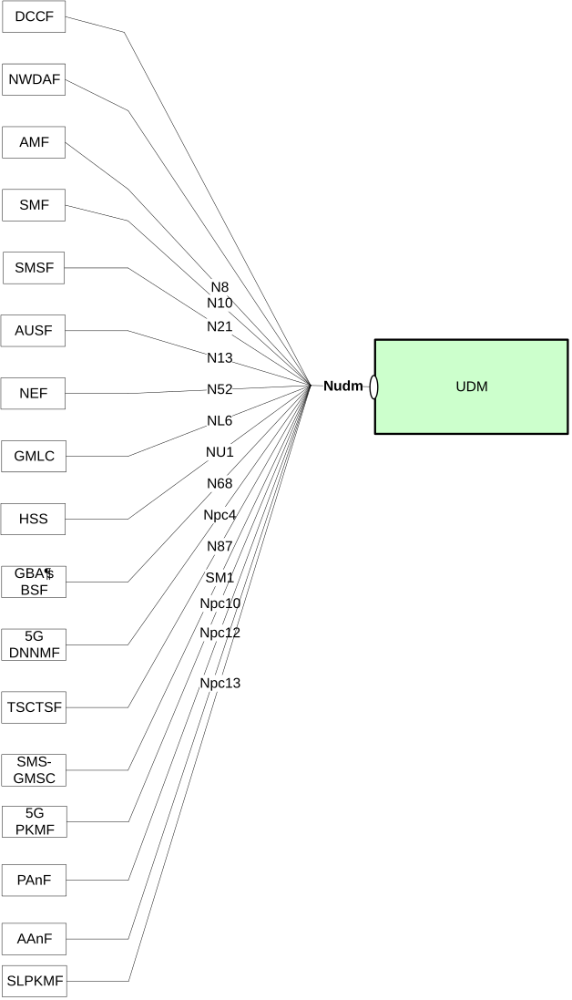

# 4 Overview

## 4.1 Introduction

Within the 5GC, the UDM offers services to the AMF, SMF, SMSF, NEF, GMLC, NWDAF, AUSF, HSS, GBA's BSF, SMS-GMSC, DCCF, 5GDDNMF, PAnF and 5G PKMF via the Nudm service-based interface (see TS 23.501 \[2\], TS 23.502 \[3\], TS 23.288 \[35\], GPP TS 23.304 \[57\], TS 23.540 \[66\], and TS 33.503\[64\]).

Figure 4.1-1 provides the reference model (in service-based interface representation and in reference point representation), with focus on the UDM.

Figure 4.1-1: Reference model – UDM

The functionalities supported by the UDM are listed in clause 6.2.7 of TS 23.501 \[2\].
