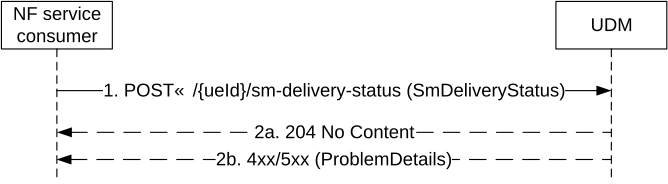

# 5.10 Nudm_ReportSMDeliveryStatus Service

## 5.10.1 Service Description

See TS 23.540 \[66\].

## 5.10.2 Service Operations

### 5.10.2.1 Introduction

For the Nudm_ReportSMDeliveryStatus service the following service operations are defined:

\- Request

The N Nudm_ReportSMDeliveryStatus Service is used by Consumer NFs (SMS-GMSC, IP-SM-GW) to report the SM-Delivery Status to UDM by means of the Request service operation.

### 5.10.2.2 Request

#### 5.10.2.2.1 General

The following procedures using the Request service operation are supported:

\- Report the SM-Delivery Status

#### 5.10.2.2.2 Report the SM-Delivery Status

Figure 5.10.2.2.2-1 shows a scenario where the NF service consumer (e.g. SMS-GMSC, IP-SM-GW) sends a request to the UDM to report the SM-Delivery Status (see also TS 23.540 \[66\]). The request contains the UE's identity which shall be an GPSI.

Figure 5.10.2.2.2-1: Report the SM-Delivery Status

1\. The NF service consumer sends a POST request to the resource representing the SM-Delivery status.

2a. On success, "204 No Content" shall be returned.

2b. On failure, the appropriate HTTP status code indicating the error shall be returned and appropriate additional error information should be returned.
