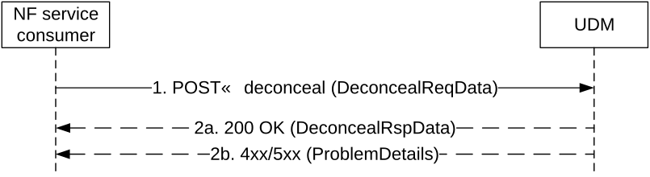

# 5.11 Nudm_UEIdentifier Service

## 5.11.1 Service Description

See TS 33.503 \[64\].

## 5.11.2 Service Operations

### 5.11.2.1 Introduction

For the Nudm_UEIdentifier service the following service operations are defined:

\- Deconceal

The N Nudm_UEIdentifier Service is used by Consumer NF (i.e. the 5G PKMF) to de-conceal the SUCI of the 5G ProSe Remote UE to the SUPI.

### 5.11.2.2 Deconceal

Figure 5.11.2.2-1 shows a scenario where the NF service consumer (i.e., the 5G PKMF) sends a request to the UDM to de-conceal the SUCI of the 5G ProSe Remote UE to the SUPI (see also TS 33.503 \[64\]).

Figure 5.11.2.2-1: Deconceal SUCI to SUPI

1\. The NF service consumer sends a POST request to the resource representing the deconceal custom operation. The request body shall contain the SUCI to be de-concealed.

2a. On success, "200 OK" shall be returned. The response body shall contain the SUPI de-concealed from the input SUCI.

2b. On failure, the appropriate HTTP status code indicating the error shall be returned and appropriate additional error information should be returned.
