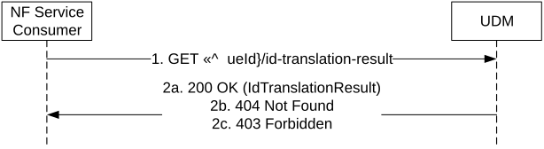

# 5.2.2.2.10 Identifier Translation

Figure 5.2.2.2.10-1 shows a scenario where the NF service consumer (e.g. NEF, AAnF) sends a request to the UDM to receive the SUPI/GPSI that corresponds to the provided GPSI/SUPI (see also TS 23.502 \[3\] clause 4.13.2.2, clause 4.13.7.2 and clause 4.15.6). The request contains the UE's identity (/{ueId}) which shall be a SUPI or GPSI and the type of the requested information (/id-translation-result).

NOTE: This service operation can be used by a Rel-15 GMLC during 5GS-MT-LR procedure to get the SUPI of a UE from GPSI, as an authorized NF service consumer of Nudm_SubscriberDataManagement service.

Figure 5.2.2.2.10-1: Identifier Translation

1\. The NF Service Consumer (e.g. NEF, AAnF) shall send a GET request to the resource representing the IdTranslationResult, with query parameters indicating the supported-features and/or necessary information used for identifier translation (e.g. af-id, app-port-id, etc.).

2a. On success, the UDM shall respond with "200 OK" with the message body containing the UE's requested identity (GPSI or SUPI).

If the expected result of identifier translation is GPSI and the AF specific query parameters (e.g. af-id, app-port-id, af-service-id, mtc-provider-info, etc) are provided, the UDM shall take the provided AF specific information into account to determine the GPSI to be returned for the UE. The AF specific GPSI may be an MSISDN or an External Identifier.

2b. If there is no valid subscription data for the UE, HTTP status code "404 Not Found" shall be returned including additional error information in the response body (in the "ProblemDetails" element).

2c. If the AF included in the request is not allowed to perform this operation for the UE, HTTP status code "403 Forbidden" shall be returned including additional error information in the response body (in the "ProblemDetails" element).

On failure, the appropriate HTTP status code indicating the error shall be returned and appropriate additional error information should be returned in the GET response body.
