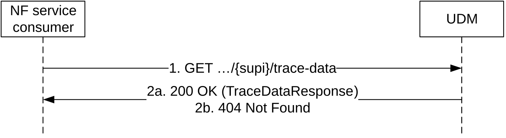

# 5.2.2.2.13 Trace data Retrieval

Figure 5.2.2.2.13-1 shows a scenario where the NF service consumer (e.g. AMF, SMF) sends a request to the UDM to receive the UE's trace data. The request contains the UE's identity (/{supi}), the type of the requested information (/trace-data) and query parameters.

Figure 5.2.2.2.13-1: Requesting a UE's trace Data

1\. The NF service consumer (e.g. AMF, SMF) shall send a GET request to the resource representing the UE's trace Data, with query parameters.

2a. On Success, the UDM shall respond with "200 OK" with the message body containing the UE's trace data response as relevant for the requesting NF service consumer.

2b. If there is no valid subscription data for the UE, HTTP status code "404 Not Found" shall be returned including additional error information in the response body (in the "ProblemDetails" element).

On failure, the appropriate HTTP status code indicating the error shall be returned and appropriate additional error information should be returned in the GET response body.

NOTE: The Trace data Retrieval procedure allows consumers of the UDM (e.g. AMF, SMF, SMSF) to retrieve trace data that are actually part of AccessAndMobilitySubscriptionData (see clause 5.2.2.2.3), SessionManagementSubscriptionData (see clause 5.2.2.2.5 and SmsManagementSubscriptionData (see clause 5.2.2.2.7). UDM/UDR provisioning ensures consistency of trace data retrieved stand alone or as part of other subscription data, i.e. the representations of traceData within TraceDataResponse, AccessAndMobilitySubscriptionData, SessionManagementSubscriptionData and SmsManagementSubscriptionData are identically provisioned at the UDM/UDR,
