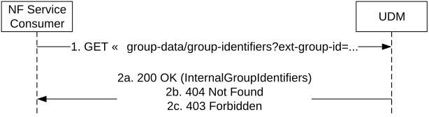
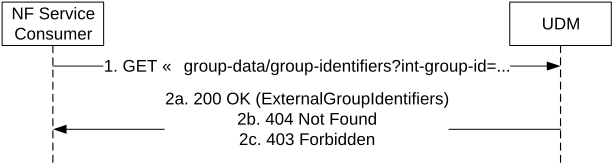

# 5.2.2.2.14 Group Identifier Translation

Figure 5.2.2.2.14-1 shows a scenario where the NF service consumer (e.g NEF, GMLC) sends a request to the UDM to receive the Internal Group Identifier that corresponds to the provided External Group Identifier and / or the list of the UE identifiers (e.g. SUPIs, GPSIs) that belong to the provided External Group Identifier.

The NF service consumer (e.g TSCTSF) may also send a request to the UDM to receive the list of the UE identifiers (e.g. SUPIs) that corresponds to the provided External Group Identifier (see TS 23.502 \[3\] clause 4.15.6.14, clause 4.15.9.2 and clause 4.15.9.4)

Figure 5.2.2.2.14-1: External Group Identifier Translation

1\. The NF Service Consumer (e.g. NEF, GMLC, TSCTSF) shall send a GET request to the resource representing the group identifiers handled by UDM; the External Group Identifier is passed in a query parameter of the request URI, and an indication is also passed if the list of UE identifiers that belong to the provided External Group Identifier are required.

2a. On success, the UDM shall respond with "200 OK" with the message body containing the Internal Group Identifier and / or the list of UE identifiers that belong to the provided External Group Identifier.

2b. If there is no valid data for this group, HTTP status code "404 Not Found" shall be returned including additional error information in the response body (in the "ProblemDetails" element).

2c. If the AF included in the request is not allowed to perform this operation for the group, HTTP status code "403 Forbidden" shall be returned including additional error information in the response body (in the "ProblemDetails" element).

On failure, the appropriate HTTP status code indicating the error shall be returned and appropriate additional error information should be returned in the GET response body.

Figure 5.2.2.2.14-2 shows another scenario where the NF service consumer (e.g NEF, GMLC) sends a request to the to receive the External Group Identifier that corresponds to the provided Internal Group Identifier and optionally, the list of the UE identifiers (e.g. SUPIs , GPSIs) pertaining to such group or the NF service consumer (e.g TSCTSF) sends a request to the UDM to receive the list of the UE identifiers (e.g. SUPIs) that corresponds to the provided Internal Group Identifier (see TS 23.502 \[3\] clause 4.15.6.14, clause 4.15.9.2 and clause 4.15.9.4).

Figure 5.2.2.2.14-2: Internal Group Identifier Translation

1\. The NF Service Consumer (e.g. NEF, GMLC, TSCTSF) shall send a GET request to the resource representing the Internal Group Identifiers handled by UDM; the Internal Group Identifier is passed in a query parameter of the request URI, and an indication is also passed if the list of UE identifiers that belong to the provided Internal Group Identifier are required.

2a. On success, the UDM shall respond with "200 OK" with the message body containing the corresponding External Group Identifier and / or the list of UE identifiers that belong to the provided Internal Group Identifier.

2b. If there is no valid data for this group, HTTP status code "404 Not Found" shall be returned including additional error information in the response body (in the "ProblemDetails" element).

2c. If the AF included in the request is not allowed to perform this operation for the group, HTTP status code "403 Forbidden" shall be returned including additional error information in the response body (in the "ProblemDetails" element).

On failure, the appropriate HTTP status code indicating the error shall be returned and appropriate additional error information should be returned in the GET response body.
