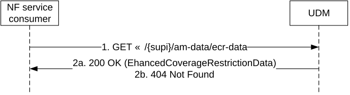

# 5.2.2.2.17 Enhanced Coverage Restriction Data Retrieval

Figure 5.2.2.2.17-1 shows a scenario where the NF service consumer (e.g. NEF) sends a request to the UDM to retrieve a UE's subscribed Enhanced Coverage Restriction data (see also TS 23.502 \[3\] figure 4.27.1-1 step 3 and 7). The request contains the identifier of the UE (/{supi}), the type of the requested information (/am-data/ecr-data) and query parameters (supported-features).

Figure 5.2.2.2.17-1: NF service consumer retrieves Enhance Coverage Restriction Data

1\. The NF service consumer (e.g. NEF) sends a GET request to the resource that represents a UE's subscribed Enhanced Coverage Restriction data, with query parameters indicating the supported-features.

2a. On success, the UDM responds with "200 OK", the message body containing the UE's subscribed Enhanced Coverage Restriction data as relevant for the requesting NF service consumer.

2b. If there is no valid subscribed Enhanced Coverage Restriction data for the UE, HTTP status code "404 Not Found" shall be returned including additional error information in the response body (in the "ProblemDetails" element).

On failure, the appropriate HTTP status code indicating the error shall be returned and appropriate additional error information should be returned in the GET response body.
