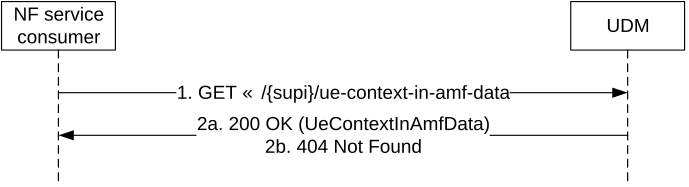

# 5.2.2.2.20 UE Context In AMF Data Retrieval

Figure 5.2.2.2.20-1 shows a scenario where the NF service consumer (e.g. HSS, NWDAF, DCCF) sends a request to the UDM to receive the UE's Context In AMF data (see TS 23.632 \[32\] figure 5.3.4-1 step 2 and 3 and also TS  23.288\[35\]). The request contains the UE's identity (/{supi}), the type of the requested information (/ue-context-in-amf-data) and query parameters (supported-features).

Figure 5.2.2.2.20-1: Requesting a UE's Context in AMF Data

1\. The NF service consumer (e.g. HSS) shall send a GET request to the resource representing the UE's Context In AMF Data, with query parameters indicating the supported-features.

2a. On Success, the UDM shall respond with "200 OK" with the message body containing the UE's Context In AMF Data as relevant for the requesting NF service consumer.

2b. If there is no valid subscription data for the UE, HTTP status code "404 Not Found" shall be returned including additional error information in the response body (in the "ProblemDetails" element).

On failure, the appropriate HTTP status code indicating the error shall be returned and appropriate additional error information should be returned in the GET response body.
