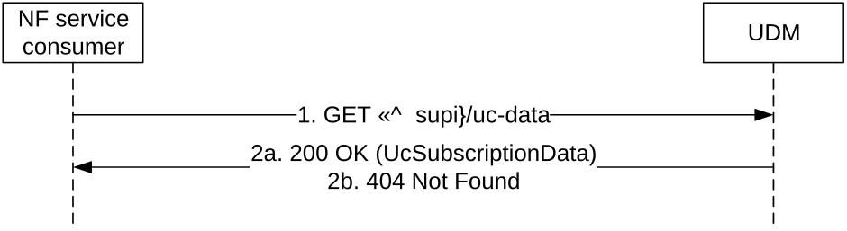

# 5.2.2.2.24 User Consent Subscription Data Retrieval

Figure 5.2.2.2.24-1 shows a scenario where the NF service consumer (e.g. NWDAF, DCCF, NEF, trusted AF) sends a request to the UDM to receive the UE's User Consent Subscription Data. The request contains the UE's identity (/{supi}), the type of the requested information (/uc-data) and query parameters (uc-purpose and/or supported-features).

Figure 5.2.2.2.24-1: Requesting a UE's User Consent Subscription Data

1\. The NF service consumer (e.g. NWDAF, DCCF, NEF, trusted AF) sends a GET request to the resource representing the UE's User Consent Subscription Data, with query parameters indicating the uc-purpose and/or supported-features.

2a. On Success, the UDM responds with "200 OK" with the message body containing the UE's User Consent Subscription Data as relevant for the requesting NF service consumer.

On failure, the appropriate HTTP status code indicating the error shall be returned and appropriate additional error information should be returned in the GET response body.
