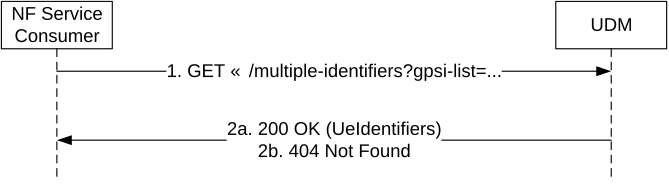

# 5.2.2.2.25 Multiple Identifiers Translation

Figure 5.2.2.2.25-1 shows a scenario where the NF service consumer (e.g TSCTSF) sends a request to the UDM to receive the list of the UE identifiers (i.e. SUPIs) that corresponds to the provided UE identifiers (i.e. GPSIs) (see TS 23.502 \[3\] clause 4.15.6.14, clause 4.15.9.2 and clause 4.15.9.4).

Figure 5.2.2.2.25: GPSIs Translation

1\. The NF Service Consumer (e.g. TSCTSF) shall send a GET request to the resource representing the list of GPSIs handled by UDM; the list of GPSIs are passed in a query parameter of the request URI.

2a. On success, the UDM shall respond with "200 OK" with the message body containing the list of UE Identifiers with list of SUPIs that belong to each provided GPSI.

2b. If there is no valid data for this list of GPSIs, HTTP status code "404 Not Found" shall be returned including additional error information in the response body (in the "ProblemDetails" element).

On failure, the appropriate HTTP status code indicating the error shall be returned and appropriate additional error information should be returned in the GET response body.
