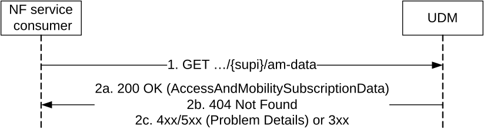

# 5.2.2.2.3 Access and Mobility Subscription Data Retrieval

Figure 5.2.2.2.3-1 shows a scenario where the NF service consumer (e.g. AMF) sends a request to the UDM to receive the UE's Access and Mobility Subscription data (see also TS 23.502 \[3\] figure 4.2.2.2.2-1 step 14). The request contains the UE's identity (/{supi}), the type of the requested information (/am-data) and query parameters (supported-features, plmn-id, shared-data-ids).

Figure 5.2.2.2.3-1: Requesting a UE's Access and Mobility Subscription Data

1\. The NF service consumer (e.g. AMF) sends a GET request to the resource representing the UE's Access and Mobility Subscription Data, with query parameters indicating the supported-features and/or plmn-id and/or shared-data-ids.
The optional query parameter shared-data-ids may be included by the NF service consumer to indicate to the UDM that shared AccessAndMobilitySubscriptionData identified by the shared-data-ids are already available at the NF service consumer.

2a. On Success, the UDM responds with "200 OK" with the message body containing the UE's Access and Mobility Subscription Data as relevant for the requesting NF service consumer. If the UE's Access and Mobility Subscription Data contains the attribute sharedAmDataIDs identifying shared AccessAndMobilitySubscriptionData, and those are not already available at the NF consumer (i.e. the shared data IDs are not included in the shared-data-ids query parameter in the GET request message), the UE's Access and Mobility Subscription Data sent in the 200 OK message body may also contain a list of shared Access And Mobility Subscription data relevant to the UE but not yet available at the NF service consumer.

NOTE 1: If the UDM initiated a request to obtain SoR information from the SOR-AF, the UDM starts an operator configurable timer up to which the UDM shall wait for a response from the SOR-AF for retrieving the SoR information. The UDM responds back to the NF service consumer for Access and Mobility Subscription Data Retrieval service operation before the timer expires. If the SOR-AF has not provided a response with the SoR information before the timer expires, the UDM shall behave as specified in clause C.2 of 3GPP°TS°23.122 \[20\] (step 3d). As described in clause C.2 of 3GPP°TS°23.122 \[20\] (step 4), if UDM supports SOR-CMCI, then UDM indicates in the response to NF service consumer (i.e. AMF) to send acknowledgement that will include the "ME support of SOR-CMCI". UDM will also delete the "ME support of SOR-CMCI" updating AuthenticationSoR of Nudr_DataRepository service as specified in TS 29.505 \[10\] clause 5.2.25, if the UE is performing initial registration or emergency registration. UDM will decide whether to provide SOR-CMCI based on "usimSupportOfSorCmci" retrieved via AuthenticationSoR of Nudr_DataRepository service as specified in TS 29.505 \[10\] clause 5.2.25.

2b. If there is no valid subscription data for the UE, HTTP status code "404 Not Found" shall be returned including additional error information in the response body (in the "ProblemDetails" element).

NOTE 2: Upon reception of any Nudm_EventExposure operation or Nudm_PP operation, or when the validity of an event subscription or provisioned parameter with its associated maximum latency, maximum response time or DL Buffering Suggested Packet Count value expires, UDM may need to adjust the values of active time and/or periodic registration timer and/or DL Buffering Suggested Packet Count. The UDM shall notify AMF and/or SMF if the values are updated (see clause 4.15.3.2.3b and 4.15.6.3a of TS 23.502 \[3\]).

NOTE 3: If UPU data have previously been provisioned, but have not yet been acknowledged by the UE, e.g. because no AMF was registered at provisioning time, the UDM needs to convey the UPU data (after AUSF protection) within 200 OK AccessAndMobilitySubscriptionDatato to the AMF.

2c. On failure or redirection, the appropriate HTTP status code indicating the error shall be returned and appropriate additional error information should be returned in the GET response body.
