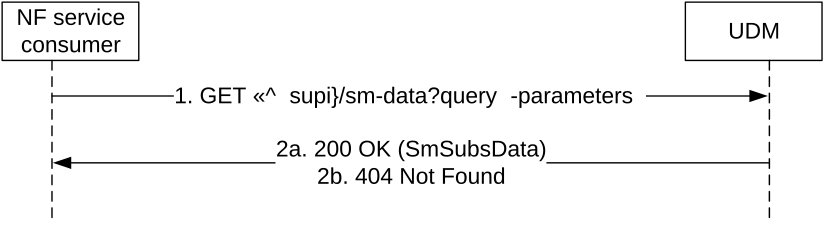

# 5.2.2.2.5 Session Management Subscription Data Retrieval

Figure 5.2.2.2.5-1 shows a scenario where the NF service consumer (e.g. SMF) sends a request to the UDM to receive the UE's session management subscription data (see also TS 23.502 \[3\] figure 4.3.2.2.1-1 step 4a-4b). The request contains the UE's identity (/{supi}), the type of the requested information (/sm-data), and query parameters (single-nssai, dnn, supported-features, plmn-id).

Figure 5.2.2.2.5-1: Requesting a UE's Session Management Subscription Data

1\. The NF service consumer (e.g. SMF) sends a GET request to the resource representing the UE's session management subscription data, with query parameters indicating the selected network slice and/or the DNN and/or supported-features and/or plmn-id.

2a. On success, the UDM responds with "200 OK", the message body containing the UE's session management subscription data (an array of SessionManagementSubscriptionData objects and/or SharedDataIds, one array element per S-NSSAI) as relevant for the requesting NF service consumer.

2b. If there is no valid subscription data for the UE, or if the UE subscription data exists, but the requested session management subscription is not available (e.g. query parameter contains network slice and/or DNN that does not belong to the UE subscription), HTTP status code "404 Not Found" shall be returned including additional error information in the response body (in the "ProblemDetails" element).

On failure, the appropriate HTTP status code indicating the error shall be returned and appropriate additional error information should be returned in the GET response body.
