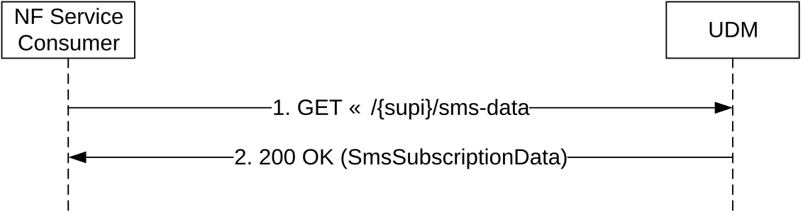

# 5.2.2.2.6 SMS Subscription Data Retrieval

Figure 5.2.2.2.6-1 shows a scenario where the NF service consumer (e.g. AMF) sends a request to the UDM to receive the UE's SMS Subscription Data (see also TS 23.502 \[3\], clause 4.13.3.1). The request contains the UE's identity (/{supi}) and the type of the requested information (/sms-data).

Figure 5.2.2.2.6-1: Requesting UE's SMS Subscription Data

1\. The NF Service Consumer (e.g. AMF) sends a GET request to the resource representing the UE's SMS Subscription Data.

2\. The UDM responds with "200 OK" with the message body containing the UE's SMS Subscription Data.

On failure, the appropriate HTTP status code indicating the error shall be returned and appropriate additional error information should be returned in the GET response body.
