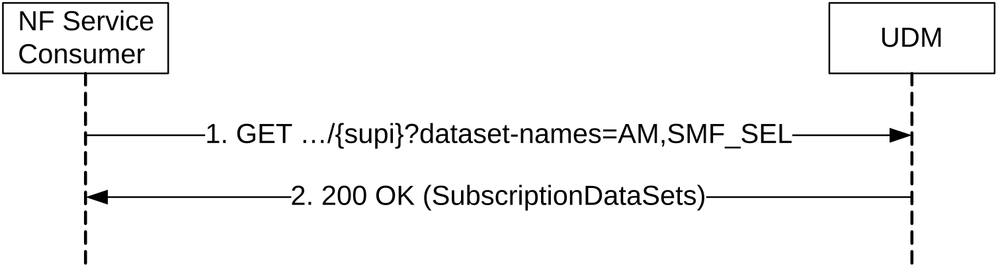

# 5.2.2.2.9 Retrieval Of Multiple Data Sets

Figure 5.2.2.2.9-1 shows a scenario where the NF service consumer (e.g. AMF) sends a request to the UDM to receive multiple data sets. In this example scenario the UE's Access and Mobility Subscription data and the the UE's SMF Selection Subscription data are retrieved with a single request; see clause 6.1.3.11.3.1 for other data sets that can be retrieved with a single request. The request contains the UE's identity (/{supi}) and query parameters identifying the requested data sets (in this example: ?dataset-names=AM, SMF_SEL). The data sets allowed in multiple data sets retrieval are listed in table 6.1.6.3.3-1.

Figure 5.2.2.2.9-1: Retrieval of Multiple Data Sets

1\. The NF Service Consumer (e.g. AMF) sends a GET request to the resource representing the supi. Query parameters indicate the requested data sets.

2\. The UDM responds with "200 OK" with the message body containing the requested and available data sets. When not all requested data sets are available at the UDM (e.g. no Trace Data), only the requested and available data sets are returned in a "200 OK" response.

On failure, the appropriate HTTP status code indicating the error shall be returned and appropriate additional error information should be returned in the GET response body.
