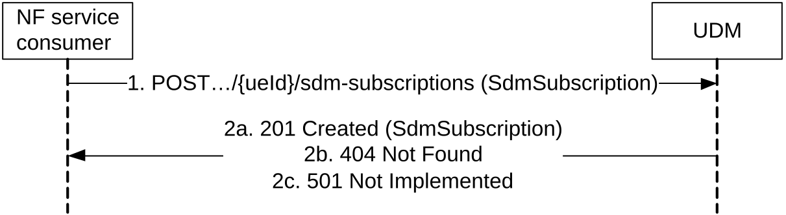
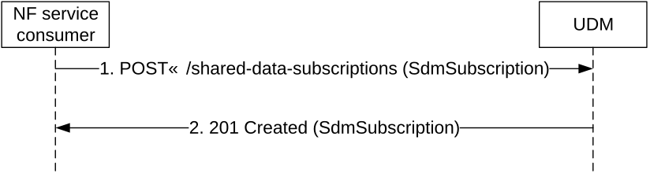

# 5.2.2.3 Subscribe

## 5.2.2.3.1 General

The following procedures using the Subscribe service operation are supported:

\- Subscription to notification of data change (for UE individual data)

\- Subscription to notification of shared data change

## 5.2.2.3.2 Subscription to notifications of data change

Figure 5.2.2.3.2-1 shows a scenario where the NF service consumer sends a request to the UDM to subscribe to notifications of data change (see also TS 23.502 \[3\] figure 4.2.2.2.2-1 step 14). The request contains a callback URI and the URI of the monitored resource.

Figure 5.2.2.3.2-1: NF service consumer subscribes to notifications

1\. The NF service consumer sends a POST request to the parent resource (collection of subscriptions) (.../{ueId}/sdm-subscriptions), to create a subscription as present in message body. The content of the POST request shall contain a representation of the individual subscription resource to be created.

> An NF consumer supporting the "LimitedSubscriptions" feature shall create only one unique subscription per UE (identified by the ueId in URI) without additional filter criteria, or with a specific filter criteria (e.g. dnn and/or singleNssai), and set the "uniqueSubscription" IE with the value "true" in request body.
> For immediate reporting, the optional query parameter shared-data-ids may be included by the NF service consumer to indicate to the UDM that shared AccessAndMobilitySubscriptionData identified by the shared-data-ids are already available at the NF service consumer.
>
> If the NF consumer subscribes to notifications of data change to URIs containing expected UE behaviours (e.g. Access and Mobility Subscription Data, Session Management Subscription Data), the subscription may include a threshold indicating that certain confidence and/or accuracy levels that must be met for the parameter(s) to be notified by UDM.

2a. On success, the UDM responds with "201 Created" with the message body containing a representation of the created subscription. The Location HTTP header shall contain the URI of the created subscription.
If the SdmSubscription received in the POST request contains the immediateReport indication, the SdmSubscription in the "201 Created" response may also contain a report attribute with the current representation of the subscribed data.
In addition, if the received POST request contains the optional query parameter shared-data-ids identifying shared data available at the NF service consumer, and the current representation of the subscribed data contains shared data IDs identifying shared data not yet available at the NF service consumer, the current representation of the subscribed data sent in the "201 Created" response may also contain shared data that are not yet available at the NF service consumer.

In case of partial success, "201 Created" should contain only the monitores resource Uris that are supported by the UDM.

2b. If there is no valid subscription data for the UE, HTTP status code "404 Not Found" shall be returned including additional error information in the response body (in the "ProblemDetails" element).

2c. If the UE subscription data exist, but the requested subscription to data change notification cannot be created (e.g. due to an invalid/unsupported data reference to be monitored, contained in the SdmSubscription parameter), HTTP status code "501 Not Implemented" shall be returned including additional error information in the response body (in the "ProblemDetails" element).

"501 Not Implemented" shall be returned only when none of the montitoredResourceUris are supported by the UDM.

On failure, the appropriate HTTP status code indicating the error shall be returned and appropriate additional error information should be returned in the POST response body.

NOTE: When the subscribe procedure fails (including several retries) for any reason, the NF service consumer (e.g. AMF) runs the risk to operate on stale subscription data (e.g. provide services to the UE that are no longer subscribed based on changed subscription data not notified to the AMF). In order to avoid such risk the AMF can take action based on local operator policy, e.g. decide not to serve the UE.

## 5.2.2.3.3 Subscription to notifications of shared data change

Figure 5.2.2.3.3-1 shows a scenario where the NF service consumer sends a request to the UDM to subscribe to notifications of shared data change. The request contains a callback URI and the URI of the monitored resource.

Figure 5.2.2.3.3-1: NF service consumer subscribes to notifications of shared data change

1\. The NF service consumer sends a POST request to the parent resource (collection of subscriptions) (.../shared-data-subscriptions), to create a subscription as present in message body. The content of the POST request shall contain a representation of the shared data individual subscription resource to be created. An NF consumer supporting the "LimitedSubscriptions" feature shall create only one unique shared data individual subscription and set the "uniqueSubscription" IE with the value "true" in request body.

2\. On success, the UDM responds with "201 Created" with the message body containing a representation of the created subscription. The Location HTTP header shall contain the URI of the created subscription.

On failure, the appropriate HTTP status code indicating the error shall be returned and appropriate additional error information should be returned in the POST response body.
