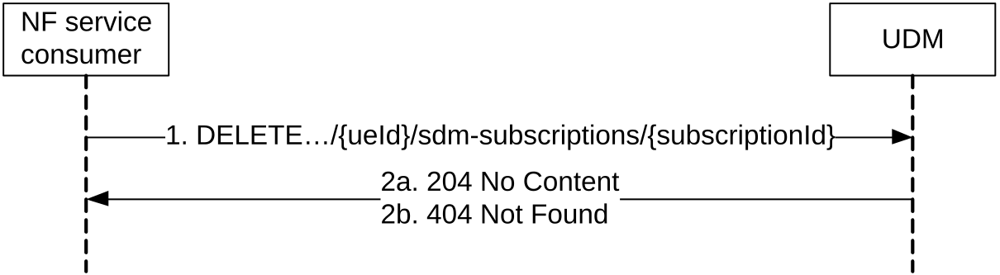
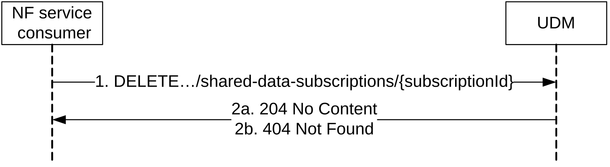

# 5.2.2.4 Unsubscribe

## 5.2.2.4.1 General

The following procedures using the Unsubscribe service operation are supported:

\- Unsubscribe to notification of data change (for UE individual data)

\- Unsubscribe to notifications of shared data change

## 5.2.2.4.2 Unsubscribe to notifications of data change

Figure 5.2.2.4.2-1 shows a scenario where the NF service consumer sends a request to the UDM to unsubscribe from notifications of data changes (see also TS 23.502 \[3\] figure 4.2.2.2.2-1 step 14). The request contains the URI previously received in the Location HTTP header of the response to the subscription.

Figure 5.2.2.4.2-1: NF service consumer unsubscribes to notifications

1\. The NF service consumer sends a DELETE request to the resource identified by the URI previously received during subscription creation.

2a. On success, the UDM responds with "204 No Content".

2b. If there is no valid subscription available (e.g. due to an unknown subscriptionId value), HTTP status code "404 Not Found" should be returned including additional error information in the response body (in the "ProblemDetails" element).

On failure, the appropriate HTTP status code indicating the error shall be returned and appropriate additional error information should be returned in the DELETE response body.

## 5.2.2.4.3 Unsubscribe to notifications of shared data change

Figure 5.2.2.4.3-1 shows a scenario where the NF service consumer sends a request to the UDM to unsubscribe from notifications of shared data changes. The request contains the URI previously received in the Location HTTP header of the response to the subscription.

Figure 5.2.2.4.3-1: NF service consumer unsubscribes to notifications for shared data

1\. The NF service consumer sends a DELETE request to the resource identified by the URI previously received during subscription creation.

2a. On success, the UDM responds with "204 No Content".

2b. If there is no valid subscription available (e.g. due to an unknown subscriptionId value), HTTP status code "404 Not Found" should be returned including additional error information in the response body (in the "ProblemDetails" element).

On failure, the appropriate HTTP status code indicating the error shall be returned and appropriate additional error information should be returned in the DELETE response body.
