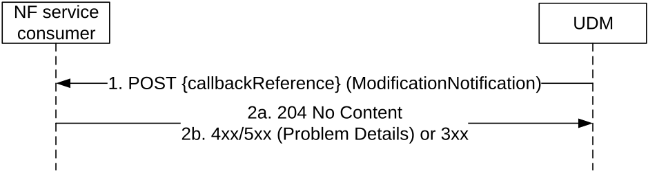
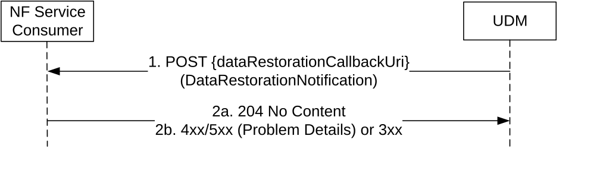

# 5.2.2.5 Notification

## 5.2.2.5.1 General

The following procedures using the Notification service operation are supported:

\- Data change notification to NF, including the updates of UE's Subscriber Data indicated by the "subscription data Type" input and additional UE's UDM-related parameters.

\- Delivery of UE Parameters Update Data to the UE via control plane procedure as defined in TS 23.502 \[3\] clause 4.20.

\- UDR-initiated Data Restoration Notification

## 5.2.2.5.2 Data Change Notification To NF

Figure 5.2.2.5.2-1 shows a scenario where the UDM notifies the NF service consumer (that has subscribed to receive such notification) about subscription data change (see also TS 23.502 \[3\] clause 4.5.1 or TS 23.502 \[3\] clause 4.5.2) or shared data change. The delivery of UE Parameters Update Data to the UE via control plane procedure is also conveyed using this notification, as defined in TS 23.502 \[3\] clause 4.20.The notification request shall be sent to the callbackReference URI as previously received in the SdmSubscription (see clause 6.1.6.2.3).

Figure 5.2.2.5.2-1: Subscription Data Change Notification

1\. The UDM sends a POST request to the callbackReference as provided by the NF service consumer during the subscription.

When the notification in the POST request body includes one or more arrays, the UDM shall use the complete replacement representation of the arrays, see TS 29.501 \[5\], Annex E.

When the notification in the POST request body includes one or more arrays where all the array elements have been removed, the UDM shall include the original array representation, i.e. in the origValue attribute of the ChangeItem.

2a. On success, the NF service consumer responds with "204 No Content".

2b. On failure or redirection, one of the appropriate HTTP status code listed in Table 6.1.5.2-3 shall be returned. For a 4xx/5xx response, the message body may contain appropriate additional error information.

NOTE 1: If the NF service consumer detects that the received Data Change Notification contains an origValue that does not match the currently stored value, it can re-sync by using the Nudm_SDM_Get service operation.

NOTE 2: When the notification is used for the delivery of UE Parameter Update Data to the UE, the trigger for UDM to start this procedure is out of the scope of this specification. This can be based, e.g., on O&M commands or provisioning orders. When a given UE parameter can be updated either in the USIM or in the ME side of the UE (e.g., Routing Indicator, see TS 23.502 \[3\] clause 4.20.1) it is assumed that the trigger for the UE parameter update procedure includes an indication to the UDM of the target for the UE parameters update (i.e., USIM or ME). This indication is used by the UDM to decide which UE parameter update data set type to use and whether the UE parameter update requires secured packet protection via SP-AF.

## 5.2.2.5.3 UDR-initiated Data Restoration Notification

Figure 5.2.2.5.3-1 shows a scenario where the UDM notifies the NF Service Consumer about the need to restore data (e.g., SDM subscriptions) due to a potential data-loss event occurred at the UDR. The request contains identities representing those UEs potentially affected by such event.

Figure 5.2.2.5.3-1: UDR-initiated Data Restoration

1\. The UDM (after receiving a notification from UDR about a potential data-loss event) sends a POST request to the dataRestorationCallbackUri; such callback URI may be provided by the NF service consumer during the creation of an SDM subscription, or dynamically discovered by UDM by querying the NRF for the NF Profile of the NF Service Consumer.

2a. On success, the NF Service Consumer responds with "204 No Content".

2b. On failure or redirection, one of the appropriate HTTP status codes listed in Table 6.1.5.3-3 shall be returned. For a 4xx/5xx response, the message body may contain appropriate additional error information.
