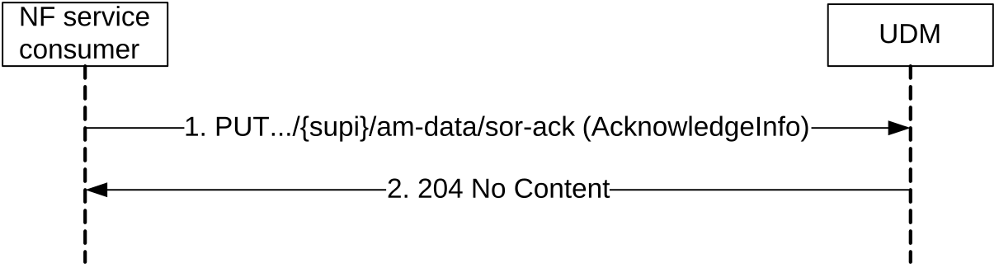
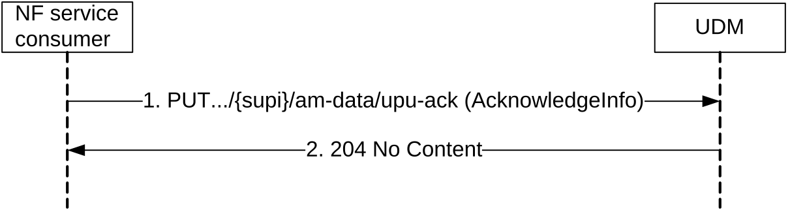
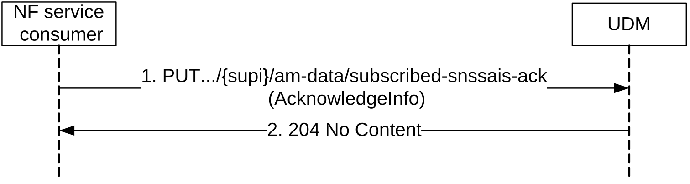
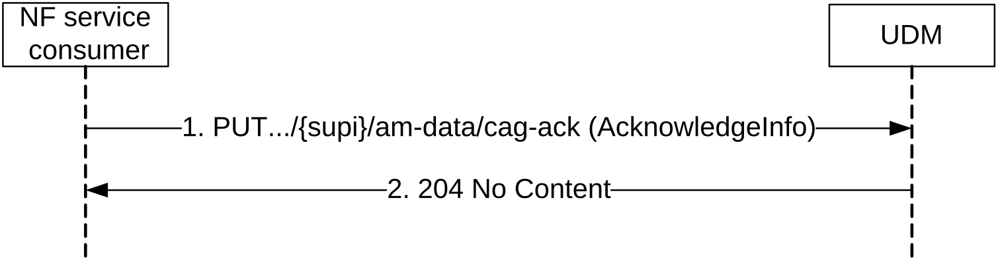
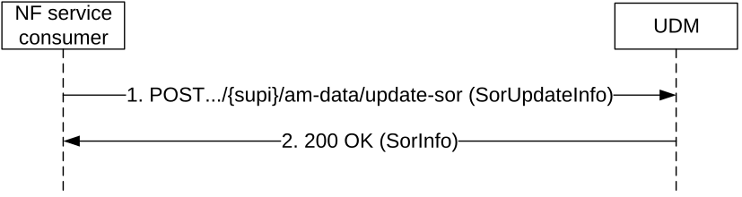

# 5.2.2.6 Info

## 5.2.2.6.1 General

The following procedures using the Info service operation are supported:

\- Providing acknowledgement from the UE to UDM about successful delivery of Steering of Roaming information via the AMF as defined in TS 23.122 \[20\]

\- Providing acknowledgement from the UE to UDM about successful delivery of updated Default Configured NSSAI or UICC data (Secured-Packet, containing e.g. Routing indicator) via the AMF as defined in TS 23.502 \[3\].

\- Providing acknowledgement from the UE to the UDM about successful delivery of the Network Slicing Subscription Change Indication.

\- Providing acknowledgement from the UE to UDM about successful delivery of CAG configuration (see TS 23.501 \[2\] clause 5.30.3.3).

\- Providing indication from AMF to UDM about unsuccessful delivery of Steering of Roaming Information, updated Default Configured NSSAI or UICC data.

\- Triggering update of Steering of Roaming information at the UE due to "initial registration" or "emergency registration" in a VPLMN.

## 5.2.2.6.2 Providing acknowledgement of Steering of Roaming

Figure 5.2.2.6.2-1 shows a scenario where the NF service consumer (e.g. AMF) sends the UE acknowledgement to the UDM (see also TS 23.122 \[20\] Annex C). The request contains the UE's identity (/{supi}), the type of the acknowledgement information (/am-data/sor-ack), and the SOR-MAC-Iue.

Figure 5.2.2.6.2-1: Providing acknowledgement of Steering of Roaming

1\. The NF service consumer (e.g. AMF) sends a PUT request to the resource representing the UE's Access and Mobility Subscription Data, with the AcknowledgeInfo (SOR-MAC-Iue received from the UE, or UE not reachable indication).

2\. The UDM responds with "204 No Content".

On failure, the appropriate HTTP status code indicating the error shall be returned and appropriate additional error information should be returned in the PUT response body.

## 5.2.2.6.3 Providing acknowledgement of UE parameters update

Figure 5.2.2.6.3-1 shows a scenario where the NF service consumer (e.g. AMF) sends the UE acknowledgement to the UDM (see also TS 23.502 \[3\]). The request contains the UE's identity (/{supi}), the type of the acknowledgement information (/am-data/upu-ack), and the UPU-MAC-Iue.

Figure 5.2.2.6.3-1: Providing acknowledgement of UE parameters update

1\. The NF service consumer (e.g. AMF) sends a PUT request to the resource representing the UE's Access and Mobility Subscription Data, with the AcknowledgeInfo(UPU-MAC-IUE received from the UE, or UE not reachable indication).

2\. The UDM responds with "204 No Content".

On failure, the appropriate HTTP status code indicating the error shall be returned and appropriate additional error information should be returned in the PUT response body.

## 5.2.2.6.4 Providing acknowledgement of UE for Network Slicing Subscription Change

Figure 5.2.2.6.4-1 shows a scenario where the NF service consumer (e.g. AMF) sends the UE acknowledgement to the UDM (see also TS 23.502 \[3\]). The request contains the UE's identity (/{supi}) and the type of the acknowledgement information (/am-data/subscribed-snssais-ack).

Figure 5.2.2.6.4-1: Providing acknowledgement of UE for Network Slicing Subscription Change

1\. The NF service consumer (e.g. AMF) sends a PUT request to the resource representing the UE's Access and Mobility Subscription Data, with the AcknowledgeInfo.

2\. The UDM responds with "204 No Content".

On failure, the appropriate HTTP status code indicating the error shall be returned and appropriate additional error information should be returned in the PUT response body.

## 5.2.2.6.5 Providing acknowledgement of UE for CAG configuration change

Figure 5.2.2.6.5-1 shows a scenario where the NF service consumer (e.g. AMF) sends the UE acknowledgement to the UDM (see also TS 23.502 \[3\]). The request contains the UE's identity (/{supi}) and the type of the acknowledgement information (/am-data/cag-ack).

Figure 5.2.2.6.5-1: Providing acknowledgement of UE for CAG configuration change

1\. The NF service consumer (e.g. AMF) sends a PUT request to the resource representing the UE's Access and Mobility Subscription Data, with the AcknowledgeInfo.

2\. The UDM responds with "204 No Content".

On failure, the appropriate HTTP status code indicating the error shall be returned and appropriate additional error information should be returned in the PUT response body.

## 5.2.2.6.6 Triggering Update of Steering Of Roaming information

Figure 5.2.2.6.6-1 shows a scenario where the NF service consumer (e.g. AMF) sends the request to the UDM to trigger the update of Steering of Roaming information at the UE. The request contains the UE's identity (/{supi}), the type of request (/am-data/update-sor) and the VPLMN ID.

Figure 5.2.2.6.6-1: Triggering update of Steering Of Roaming information

1\. The NF service consumer (e.g. AMF) sends a POST request to the resource representing the UE's Access and Mobility Subscription Data, with the request to update the Steering of Roaming information at the UE.

2\. The UDM responds with "200 OK" containing the updated Sor Information.

On failure, the appropriate HTTP status code indicating the error shall be returned and appropriate additional error information should be returned in the POST response body.
