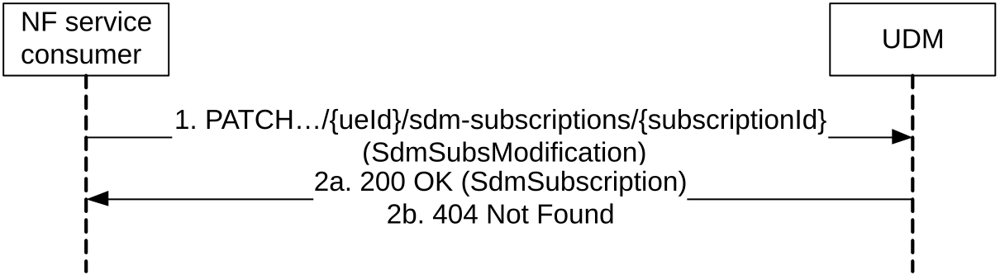
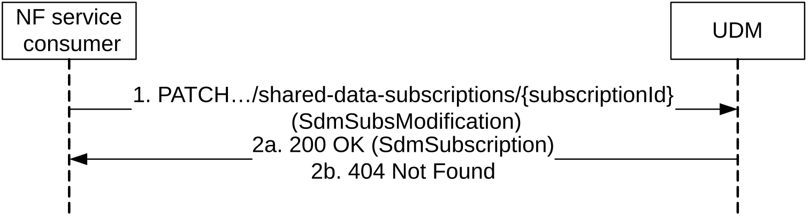

# 5.2.2.7 ModifySubscription

## 5.2.2.7.1 General

The following procedures using the ModifySubscription service operation are supported:

\- Modification of a Subscription to notification of data change (for UE individual data)

\- Modification of a Subscription to notification of shared data change

The ModifySubscription service operation can be used for the following purpose:

\- Extend the expiry time of SdmSubscription;

\- Modify the resource URIs to be monitored, e.g. add/remove resource URIs to/from the monitored resource URI list.

## 5.2.2.7.2 Modification of a subscription to notifications of data change

Figure 5.2.2.7.2-1 shows a scenario where the NF service consumer sends a request to the UDM to modify a subscription to notifications of data changes. The request contains the URI previously received in the Location HTTP header of the response to the subscription.

Figure 5.2.2.7.2-1: NF service consumer modifies a subscription to notifications

1\. The NF service consumer sends a PATCH request to the resource identified by the URI previously received during subscription creation.

The NF service consumer may include "monitoredResourceUris" to replace the existing monitored resource URIs, e.g. to add/remove specific resource URIs from the monitored resource URI list.

2a. On success, the UDM responds with "200 OK".

2b. If there is no valid subscription available (e.g. due to an unknown subscriptionId value), HTTP status code "404 Not Found" should be returned including additional error information in the response body (in the "ProblemDetails" element).

On failure, the appropriate HTTP status code indicating the error shall be returned and appropriate additional error information should be returned in the PATCH response body.

## 5.2.2.7.3 Modification of a subscription to notifications of shared data change

Figure 5.2.2.7.3-1 shows a scenario where the NF service consumer sends a request to the UDM to modifya subscription to notifications of shared data changes. The request contains the URI previously received in the Location HTTP header of the response to the subscription.

Figure 5.2.2.7.3-1: NF service consumer modifies a subscription to notifications for shared data

1\. The NF service consumer sends a PATCH request to the resource identified by the URI previously received during subscription creation.

The NF service consumer may include "monitoredResourceUris" to replace the existing monitored resource URIs, e.g. for the purposes to add/remove specific resource URIs from the monitored resource URI list.

2a. On success, the UDM responds with "200 OK".

2b. If there is no valid subscription available (e.g. due to an unknown subscriptionId value), HTTP status code "404 Not Found" should be returned including additional error information in the response body (in the "ProblemDetails" element).

On failure, the appropriate HTTP status code indicating the error shall be returned and appropriate additional error information should be returned in the PATCH response body.
