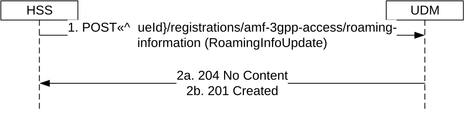

# 5.3.2.11 Roaming Information Update

## 5.3.2.11.1 General

The following procedure using the Roaming-Info-Update service operation is supported:

\- Roaming Information Update

## 5.3.2.11.2 Roaming Information Update

Figure 5.3.2.11.2-1 shows a scenario where the HSS sends a request to the UDM to update the Roaming Information Update in the 3GPP Access Registration context. The request contains the UE's identity which shall be an IMSI.

Figure 5.3.2.11.2-1: Roaming Information Update

1\. The HSS sends a POST request to the resource representing the UE's Roaming information to update or create the Roaming Information.

2a. On success, the UDM updates the RoamingInfoUpdate resource by replacing it with the received resource information, and responds with "204 No Content".

2b. If the resource does not exist (there is no previous Roaming Information Update stored in UDM for the user, UDM stores the received Roaming Information Update and responds with HTTP Status Code "201 created" with the created Roaming Information Update.

On failure, the appropriate HTTP status code indicating the error shall be returned and appropriate additional error information should be returned in the POST response body.
