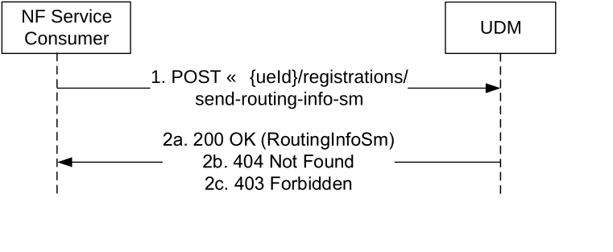

# 5.3.2.13 SendRoutingInfoForSM

## 5.3.2.13.1 General

The following procedure using the SendRoutingInfoForSM service operation is supported:

\- Successful Mobile Terminated short message transfer as defined in TS 23.540 \[66\] clause 5.1.2, clause 5.1.3 and clause 5.1.4.

\- Unsuccessful Mobile Terminated short message transfer as defined in TS 23.540 \[66\] clause 5.1.5, clause 5.1.6 and clause 5.1.9.

\- GPSI-to-Subscription-Network resolution as defined in TS 23.540 \[66\] clause 5.1.7.

## 5.3.2.13.2 Send Routing Information For SM

Figure 5.3.2.13.2-1 shows a scenario where the NF consumer (e.g. SMS-GMSC, HSS…) sends a request to the UDM to retrieve the addressing information for SMS delivery, e.g. addressing of the available SMSF nodes registered in the UDM.

Figure 5.3.2.13.2-1: Send Routing Info For SM

1\. The NF Service Consumer sends a POST request (custom method: send-routing-info-sm) to the UDM. The request URI contains the UE's identity ({ueId}). The request body may contain a list of features of the Nudm_UECM API supported by the NF Service Consumer, if any; otherwise, the request body may contain an empty JSON object.

2a. The UDM responds with "200 OK" with the message body containing a RoutingInfoSm data structure, including the addressing info of the nodes that are currently available to be used for sending SMS to the recipient UE, if any.

2b. If there is no node at UDM currently available to be used for sending SMS to the recipient UE, then the UDM responds with "404 Not Found" with the message body containing a ProblemDetails object, with a cause code indicating "ABSENT_SUBSCRIBER_SM".

2c. If the UE does not have required subscription data for SMS service or SMS service is barred, the UDM responds with HTTP status code "403 Forbidden", with the reponse body including a ProblemDetails object containing an application error indicating "SERVICE_NOT_PROVISIONED" or "SERVICE_NOT_ALLOWED".

On failure, the appropriate HTTP status code indicating the error shall be returned and appropriate additional error information should be returned in the POST response body.
