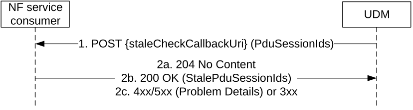

# 5.3.2.14 StaleCheckNotification

## 5.3.2.14.1 General

The following procedure using the StaleCheckNotification service operation is supported:

\- UDM initiated Stale SMF Registration Check

## 5.3.2.14.2 UDM initiated Stale SMF Registration Check

Figure 5.3.2.14.2-1 shows a scenario where the UDM notifies the registered SMF to check whether a SMF registration is still valid. The request contains the deregCallbackUri URI for stale check notification as received by the UDM during SMF registration.

The UDM initiates the Stale Check procedure when the registered SMF is suspected to be stale in the UDM/UDR, e.g. due to a lost Deregistration request.

Figure 5.3.2.14.2-1: UDM initiated Stale Check

1\. The UDM sends a POST request to the staleCheckCallbackUri as provided by the NF service consumer during the registration.

2a. On success, i.e. all PDU sessions are still in use, the NF service consumer responds with "204 No Content"

2b. On partial success, i.e. at least one PDU session ID is unknown, the NF service consumer responds with "200 OK" indicating the unknown PDU session IDs.

2c. On failure or redirection, one of the appropriate HTTP status code listed in Table 6.2.5.2-3 shall be returned. For a 4xx/5xx response, the message body may contain appropriate additional error information.
