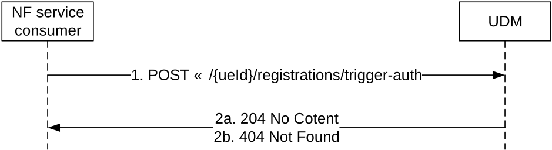

# 5.3.2.16 AuthTrigger

## 5.3.2.16.1 General

The following procedure using the AuthTrigger service operation is supported:

\- Home network triggered primary authentication procedure as defined in TS 33.501 \[6\] clause 6.1.5.

## 5.3.2.16.2 Auth Trigger

Figure 5.3.2.16.2-1 shows a scenario where the NF consumer (e.g. AAnF) sends a request to the UDM to request UDM to trigger a primary (re-)authentication.

Figure 5.3.2.16.2-1: Auth Trigger

1\. The NF Service Consumer sends a POST request (custom method: trigger-auth) to the UDM.

2a. On success, the NF Service Consumer responds with "204 No Content".

2b. If the user does not exist, HTTP status code "404 Not Found" shall be returned including additional error information in the response body (in the "ProblemDetails" element).

On failure, the appropriate HTTP status code indicating the error shall be returned and appropriate additional error information should be returned in the POST response body.
