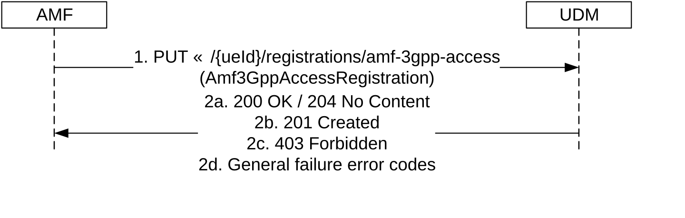
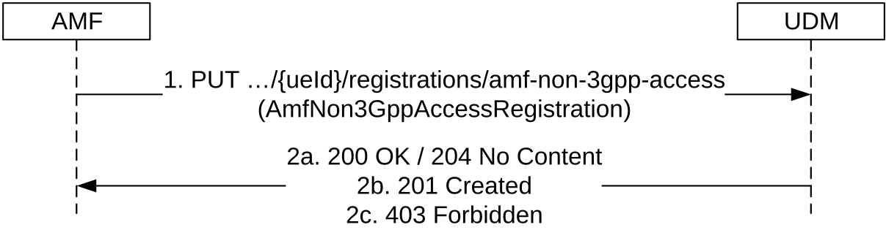
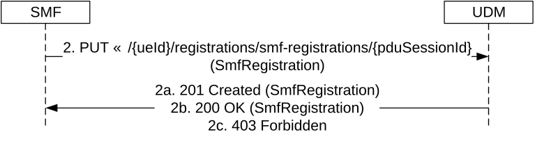
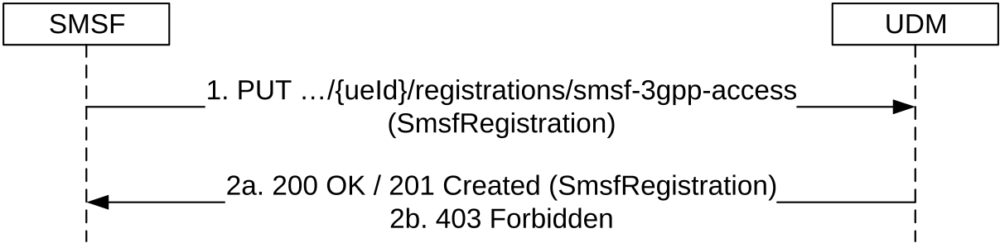
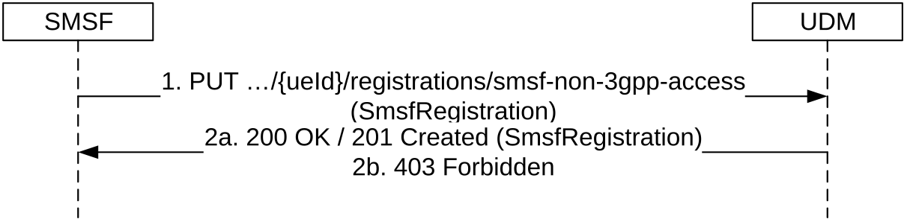
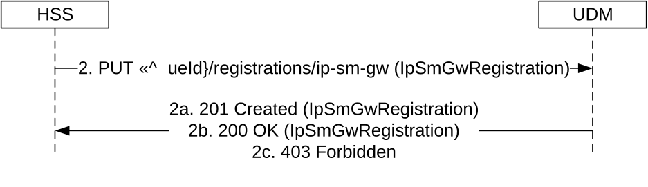
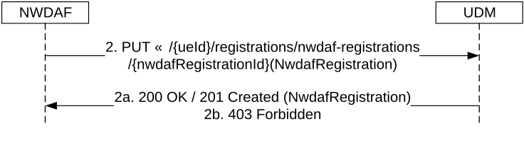

# 5.3.2.2 Registration

## 5.3.2.2.1 General

The Registration service operation is invoked by a NF that has been selected to provide service to the UE to store related UE Context Management information in UDM.

NF Consumers are AMF for access and mobility management service, SMF for session management services, SMSF providing SMS services and HSS for IP-SM-GW registration in SMSoIP scenarios.

As part of this registration procedure, the UDM authorizes or rejects the subscriber to use the service provided by the registered NF, based on subscription data (e.g. roaming restrictions).

The following procedures using the Registration service operation are supported:

\- AMF registration for 3GPP access

\- AMF registration for non-3GPP access

\- SMF registration

\- SMSF registration for 3GPP access

\- SMSF registration for non-3GPP access

\- IP-SM-GW registration

\- NWDAF registration

## 5.3.2.2.2 AMF registration for 3GPP access

Figure 5.3.2.2.2-1 shows a scenario where the AMF sends a request to the UDM to update the AMF registration information for 3GPP access (see also TS 23.502 \[3\] figure 4.2.2.2.2-1 step 14). The request contains the UE's identity (/{ueId}) which shall be a SUPI and the AMF Registration Information for 3GPP access.

Figure 5.3.2.2.2-1: AMF registering for 3GPP access

1\. The AMF sends a PUT request to the resource representing the UE's AMF registration for 3GPP access to update or create AMF registration information.

If EPS interworking with N26 is supported, and the AMF has per DNN selected the PGW-C+SMF for EPS interworking, the AMF shall include the info of selected PGW-C+SMF to the UDM.

If EPS interworking without N26 is supported, and the UE status IE is present with "EMM-REGISTERED" value in UE's initial registration request (as specified in clause 5.5.1.2.2 of TS 24.501 \[27\]), the AMF shall include the "drFlag" IE with "true" value to the UDM (as specified in clause 5.17.2.3.1 of TS 23.501 \[2\]).

If EPS interworking without N26 is supported, and the UE status IE is present with "EMM-REGISTERED" value in UE's mobility registration due to EPC to 5GC mobility (as specified in clause 5.5.1.3.2 of TS 24.501 \[27\]), the AMF shall include the "eps5GsMobilityWoN26" IE with "true" value to the UDM (as specified in clause 4.11.2.3 of TS 23.502 \[3\]).

The AMF shall include ueReachableInd IE if the UE is currently not reachable (e.g. in not allowed areas) or the UE reachability is unknown (e.g. service restriction area of the UE is not received at the AMF during initial registration).

The AMF shall include the "backupAmfInfo" IE containing all of the GUAMI served by the AMF and the related backup AMF name if the AMF supports the AMF management without UDSF as specified in clause 6.5.2 of TS 29.500 \[4\]. The "backupAmfInfo" IE is only applicable to this UE in 3GPP access.

If the UE supports equivalent SNPNs, the ME of the UE does not support SOR-SNPN-SI, and the AMF serving the UE is in an equivalent SNPN of the subscribed SNPN (see TS 23.122 \[20\]) of the UE, then the AMF shall include the "ueSnpnSubscriptionInd" IE.

2a. On success, the UDM updates the Amf3GppAccessRegistration resource by replacing it with the received resource information, and responds with "200 OK" or "204 No Content".

UDM shall invoke the Deregistration Notification service operation towards the old AMF using the callback URI provided by the old AMF.

When AMF indicates there are no ongoing event subscriptions (e.g. during UE initial registration), but UDM has ongoing event exposure subscriptions stored (e.g. in UDR), UDM shall invoke one Namf_EventExposure Subscribe Service operations (see clause 5.3.2.2 of TS 29.518 \[36\]) on behalf of NEF per subscription stored. When the AMF identified that event synchronization is needed but AMF and/or UDM are not supporting event synchronization (see clause 5.3.2.4.2 of TS 29.518 \[36\]), the AMF may also ask the UDM to re-subscribe the stored events by indicating there is no ongoing event subscriptions in the UECM operation.

If ueReachableInd IE is received indicating that the UE is not reachable, the UDM shall not trigger Reachability Report for the UE upon this UECM registration. The AMF shall subsequently generate UE Reachability Report when it detects the UE is reachable. If the If ueReachableInd IE is received indicating that the UE reachability is unknown, the UDM may trigger Reachability Report for the UE when needed based on operator policy.

2b. If the resource does not exist (there is no previous AMF information stored in UDM for that user), UDM stores the received AMF registration data for 3GPP access and responds with HTTP Status Code "201 created". A response body may be included to convey additional information to the NF consumer (e.g., features supported by UDM).

2c. If the operation cannot be authorized due to e.g UE does not have required subcription data, the AMF does not support CAG feature and the UE is allowed to access 5GS via CAG cell(s) only, access barring, roaming restrictions, core network restriction, or if an UE performs registration in an SNPN using credentials from the Credentials Holder, but it is not authorized to access the SNPN, HTTP status code "403 Forbidden" should be returned including additional error information in the response body (in "ProblemDetails" element).

2d. On failure, the appropriate HTTP status code indicating the error shall be returned and appropriate additional error information should be returned in the PUT response body.

## 5.3.2.2.3 AMF registration for non 3GPP access

Figure 5.3.2.2.3-1 shows a scenario where the AMF sends a request to the UDM to update the AMF registration information for non 3GPP access (see also TS 23.502 \[3\] figure 4.2.2.2.2-1 step 14). The request contains the UE's identity (/{ueId}) which shall be a SUPI and the AMF Registration Information for non 3GPP access.

Figure 5.3.2.2.3-1: AMF registering for non 3GPP access

1\. The AMF sends a PUT request to the resource representing the UE's AMF registration for non 3GPP access to update or create AMF registration information.

The AMF shall include the "backupAmfInfo" IE containing all of the GUAMI served by the AMF and the related backup AMF name if the AMF supports the AMF management without UDSF as specified in clause 6.5.2 of TS 29.500 \[4\]. The "backupAmfInfo" IE is only applicable to this UE in non 3GPP access.

If the UE supports equivalent SNPNs, the ME of the UE does not support SOR-SNPN-SI, and the AMF serving the UE is in an equivalent SNPN of the subscribed SNPN (see TS 23.122 \[20\]) of the UE, then the AMF shall include the "ueSnpnSubscriptionInd" IE.

2a. On success, the UDM updates the AmfNon3GppAccessRegistration resource by replacing it with the received resource information, and responds with "200 OK" or "204 No Content".

UDM shall invoke the Deregistration Notification service operation towards the old AMF using the callback URI provided by the old AMF.

When AMF indicates there are no ongoing event subscriptions (e.g. during UE initial registration), but UDM has ongoing event exposure subscriptions stored (e.g. in UDR), UDM shall invoke one Namf_EventExposure Subscribe Service operations (see clause 5.3.2.2 of TS 29.518 \[36\]) on behalf of NEF per subscription stored. When the AMF identified that event synchronization is needed but AMF and/or UDM are not supporting event synchronization (see clause 5.3.2.4.2 of TS 29.518 \[36\]), the AMF may also ask the UDM to re-subscribe the stored events by indicating there is no ongoing event subscpritons in the UECM operation.

2b. If the resource does not exist (there is no previous AMF information stored in UDM for that user), UDM stores the received AMF registration data for non-3GPP access and responds with HTTP Status Code "201 created". A response body may be included to convey additional information to the NF consumer (e.g., features supported by UDM).

2c. If the operation cannot be authorized due to e.g UE does not have required subcription data, the AMF does not support CAG feature and the UE is allowed to access 5GS via CAG cell(s) only, access barring, roaming restrictions or core network restriction, HTTP status code "403 Forbidden" should be returned including additional error information in the response body (in the "ProblemDetails" element).

On failure, the appropriate HTTP status code indicating the error shall be returned and appropriate additional error information should be returned in the PUT response body.

## 5.3.2.2.4 SMF registration

Figure 5.3.2.2.4-1 shows a scenario where an SMF sends a request to the UDM to create a new registration (see also TS 23.502 \[3\] clause 4.3.2.2.1 step 16c and clause 4.26.5.3 step 11). The request contains the UE's identity (/{ueId}) which shall be a SUPI and the SMF Registration Information.

Figure 5.3.2.2.4-1: SMF registration

1\. The SMF sends a PUT request to the resource .../{ueId}/registrations/smf-registrations/{pduSessionId}, to create an SMF Registration as present in the content of the request message.

During SM Context Transfer procedure (see clause 4.26.5.3 of TS 23.502 \[3\]) the SMF shall include registrationReason IE set to the value "SMF_CONTEXT_TRANSFERRED" in the content of the request message.

If the SMF belongs to an SMF Set, the NF Set ID of the SMF Set shall be included in the content of the request message.

If EPS interworking is supported, the SMF+PGW-C shall include the PCF ID selected for the PDU session to the UDM when the SMF+PGW-C register in the UDM.

In network slice replacement scenario (see clause 5.15.19 of TS 23.501 \[2\]) only the S-NSSAI to be replaced (i.e. the original S-NSSAI) shall be provide in the content of the request message.

2a. The UDM responds with "201 Created" with the content of the response message containing a representation of the created SMF registration.

2b. If the individual resource exists, on success, the UDM updates the resource by replacing it with the received resource information, and responds with "200 OK" with the content of the response message containing a representation of the updated Individual SmfRegistration resource.

If the new SMF is not in a SMF set or is not in the same SMF Set as the old SMF, the UDM shall invoke the Deregistration Notification service operation towards the old SMF using the callback URI provided by the old SMF.

2c. If the operation cannot be authorized due to e.g UE does not have required subscription data, access barring or roaming restrictions, HTTP status code "403 Forbidden" should be returned including additional error information in the content of the response message (in "ProblemDetails" element). Subscription information associated to a specific DNN (if any) shall take precedence over subscription information associated to the Wildcard DNN.

On failure, the appropriate HTTP status code indicating the error shall be returned and appropriate additional error information should be returned in the content of the PUT response message.

## 5.3.2.2.5 SMSF Registration for 3GPP Access

Figure 5.3.2.2.5-1 shows a scenario where the SMSF sends a request to the UDM to create or update the SMSF registration information for 3GPP access (see also TS 23.502 \[3\], clause 4.13.3.1). The request contains the UE's identity (/{ueId}) which shall be a SUPI and the SMSF Registration Information for SMS service.

When a UE requests SMS service from both 3GPP access and Non-3GPP access, the SMSF shall perform seperate individual SMSF registration for each access type.

Figure 5.3.2.2.5-1: SMSF registering for 3GPP Access

1\. The SMSF sends a PUT request to the resource representing the UE's SMSF registration for 3GPP Access to update or create SMSF registration information.

If the SMSF supports SBI-based MT SM transmit, the "SBI support indication" of the SMSF shall be included in the SMSF registration information.

If the SMSF belongs to an SMSF Set, the NF Set ID of the SMSF Set shall be included in the request message.

2a. If successful, the UDM responds with "200 OK", or "201 Created" with the message body containing the representation of the SmsfRegistration.

2b. If the operation cannot be authorized due to e.g UE does not have required subcription data, access barring or roaming restrictions, HTTP status code "403 Forbidden" should be returned including additional error information in the response body (in "ProblemDetails" element).

On failure, the appropriate HTTP status code indicating the error shall be returned and appropriate additional error information should be returned in the PUT response body.

## 5.3.2.2.6 SMSF Registration for Non 3GPP Access

Figure 5.3.2.2.6-1 shows a scenario where the SMSF sends a request to the UDM to create or update the SMSF registration information for non 3GPP access (see also TS 23.502 \[3\], clause 4.13.3.1). The request contains the UE's identity (/{ueId}) which shall be a SUPI and the SMSF Registration Information for SMS service.

When a UE requests SMS service from both 3GPP access and Non-3GPP access, the SMSF shall perform seperate individual SMSF registration for each access type.

Figure 5.3.2.2.6-1: SMSF registering for Non 3GPP Access

1\. The SMSF sends a PUT request to the resource representing the UE's SMSF registration for Non 3GPP Access to update or create SMSF registration information.

If the SMSF supports SBI-based MT SM transmit, the "SBI support indication" of the SMSF shall be included in the SMSF registration information.

If the SMSF belongs to an SMSF Set, the NF Set ID of the SMSF Set shall be included in the request message.

2a. If successful, the UDM responds with "200 OK", or "201 Created" with the message body containing the representation of the SmsfRegistration.

2b. If the operation cannot be authorized due to e.g UE does not have required subcription data, access barring or roaming restrictions, HTTP status code "403 Forbidden" should be returned including additional error information in the response body (in "ProblemDetails" element).

On failure, the appropriate HTTP status code indicating the error shall be returned and appropriate additional error information should be returned in the PUT response body.

## 5.3.2.2.7 IP-SM-GW registration

Figure 5.3.2.2.7-1 shows a scenario where an HSS sends a request to the UDM to create a new registration of an IP-SM-GW (see also TS 23.632 \[32\] figure 5.5.6.2.1-1 step 2). The request contains the UE's identity (/{ueId}) which shall be a SUPI and the IP-SM-GW registration information.

Figure 5.3.2.2.7-1: IP-SM-GW registration

1\. The HSS sends a PUT request to the resource .../{ueId}/registrations/ip-sm-gw, to create an IP-SM-GW registration as present in the message body.

If the IP-SM-GW indicated support for SBI-based SMS when registering in HSS, "SBI Support Indication" shall be included in the IP-SM-GW registration information.

2a. If there was not a prior registration, the UDM responds with "201 Created" with the message body containing a representation of the created IP-SM-GW registration.

2b. If there was a prior registration, the UDM responds with "200 OK" with the message body containing a representation of the updated IP-SM-GW registration.

2c. If the operation cannot be authorized due to e.g UE does not have required subcription data, HTTP status code "403 Forbidden" should be returned including additional error information in the response body (in "ProblemDetails" element).

On failure, the appropriate HTTP status code indicating the error shall be returned and appropriate additional error information should be returned in the PUT response body.

## 5.3.2.2.8 NWDAF registration

Figure 5.3.2.2.8-1 shows a scenario where an NWDAF sends a request to the UDM to create a new registration. The request contains the UE's identity (/{ueId}) which shall be a SUPI, the NWDAF's registration identity (/{nwdafRegistrationId}), and the NWDAF Registration Information.

Figure 5.3.2.2.8-1: NWDAF registration

1\. The NWDAF sends a PUT request to the resource .../{ueId}/registrations/nwdaf-registrations/{nwdafRegistrationId}, to create an NWDAF Registration as present in the message body.

NOTE 1: nwdafRegistrationId could be the NfInstanceId, the combination of NfSetId and NfInstance ID or other identifier forms of the NWDAF. NWDAF implementation shall secure the global uniqueness of this resource ID.

2a. The UDM responds with "200 OK" or "201 Created" with the message body containing a representation of the created NWDAF registration.

2b. If the operation cannot be authorized due to e.g UE does not have required subcription data, HTTP status code "403 Forbidden" should be returned including additional error information in the response body (in "ProblemDetails" element).

On failure, the appropriate HTTP status code indicating the error shall be returned and appropriate additional error information should be returned in the PUT response body.
