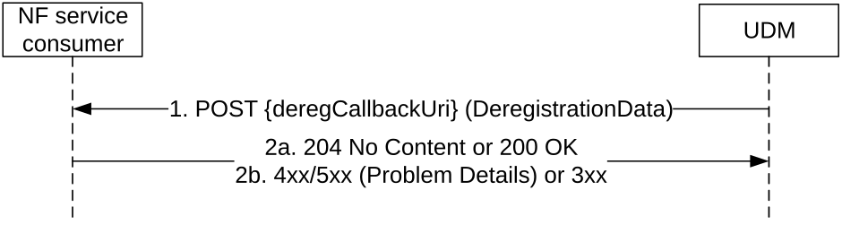

# 5.3.2.3 DeregistrationNotification

## 5.3.2.3.1 General

The following procedure using the DeregistrationNotification service operation is supported:

\- UDM initiated NF Deregistration

## 5.3.2.3.2 UDM initiated NF Deregistration

Figure 5.3.2.3.2-1 shows a scenario where the UDM notifies the registered NF about its deregistration (see also TS 23.502 \[3\] figure 4.2.2.2.2-1 step 14, TS 23.502 \[3\] figure 4.2.2.3.3-1 step 1 and TS 23.502 \[3\] figure 4.26.4.1.1-1 step 14). The request contains the deregCallbackUri URI for deregistration notification as received by the UDM during registration, and Deregistration Data.

The UDM initiates the deregistration procedure when the UE is registered to the AMF which does not support CAG feature and the CAG subscription of the UE changes and it is allowed to access the 5GS via CAG cell(s) only.

The UDM also initiates deregistration notification when UE moves to different AMF within same AMF-Set.

The UDM may also initiate deregistration notification for the disaster inbound roaming UE when a disaster condition is no longer being applicable.

Deregistration notification shall not be sent if the nfInstanceId of the AMF initiating registration is same as the old AMF already registered in UDM (e.g. when multiple PLMNs are hosted on same AMF and UE moves across PLMNs).

The UDM also initiates the deregistration procedures towards the SMF of the old PDU session when a new PDU session has been established with the same PDU session ID from a different SMF, during SM Context Transfer procedure (see clause 4.26.5.3 of TS 23.502 \[3\]) or when duplicated PDU sessions existing in the network (e.g. the AMF failed to release the old PDU session before creation of the new PDU session with the same PDU session ID).

Figure 5.3.2.3.2-1: UDM initiated NF Deregistration

1\. The UDM sends a POST request to the deregCallbackUri as provided by the NF service consumer during the registration.

If the SMF deregistration is triggered by SM Context Transfer procedure, i.e. the UDM has received a registration request with registrationReason IE set to the value "SMF_CONTEXT_TRANSFERRED" from another SMF, the UDM shall set the deregReason IE to the value "SMF_CONTEXT_TRANSFERRED".

If the SMF deregistration is due to a duplicated PDU session established via ePDG, i.e. the UDM has received a registration request from another SMF with epdgInd IE set to the value true, the UDM shall set the deregReason IE to the value "DUPLICATE_PDU_SESSION_EPDG".

If the SMF deregistration is due to duplicated PDU sessions in the network, i.e. the UDM has received a registration request from another SMF without registrationReason IE set to the value "SMF_CONTEXT_TRANSFERRED" and without epdgInd set to the value true, the UDM shall set the deregReason IE to the value "DUPLICATE_PDU_SESSION".

If the SMF deregistration is due to an UDM-triggered PDU session release with re-activation, the UDM shall set the deregReason attribute in DeregistrationData to the value "PDU_SESSION_REACTIVATION_REQUIRED".

2a. On success, the NF service consumer responds with "204 No Content" if no information is to be sent to the UDM. Otherwise, if the "DeregistrationResponseBody" feature is supported by both the UDM and the NF consumer, the NF service consumer (e.g. the SMF) responds with "200 OK" with the response body including the information to the UDM (e.g. the indication that the SMF event subscription on the SMF for the UE have been implicitly removed).

If the deregistration reason is "PDU_SESSION_REACTIVATION_REQUIRED", the SMF receiving the deregistration notification shall trigger a network initiated PDU session release procedure (see clause 4.3.4 of TS 23.502 \[3\]) with 5GSM cause "Reactivation requested" (see clause 8.3.14 of TS 24.501 \[27\]).

If the deregistration reason is "SMF_CONTEXT_TRANSFERRED" or "DUPLICATE_PDU_SESSION", the SMF receiving the deregistration notification shall release the PDU session but shall not send a SM Context Status Notification to the AMF. For a PDU session with I-SMF or V-SMF, the anchor SMF shall send a Status Notification to the I-SMF or V-SMF indicating that the PDU session is released due to duplicated PDU sessions.

If the deregistration reason is "DUPLICATE_PDU_SESSION_EPDG", the SMF receiving the deregistration notification shall release the PDU session in SMF and release the RAN resource if needed. The SMF shall also send a SM Context Status Notify for the released PDU session to the AMF. For a PDU session with I-SMF or V-SMF, the anchor SMF shall send a Status Notification to the I-SMF or V-SMF indicating that the PDU session is released due to duplication session established via an ePDG.

2b. On failure or redirection, one of the appropriate HTTP status code listed in Table 6.2.5.2-3 shall be returned. For a 4xx/5xx response, the message body may contain appropriate additional error information.
