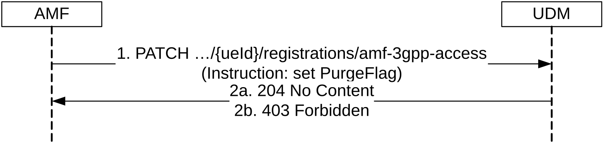
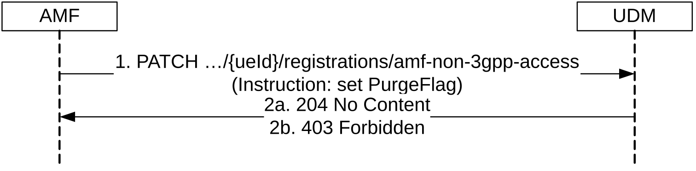
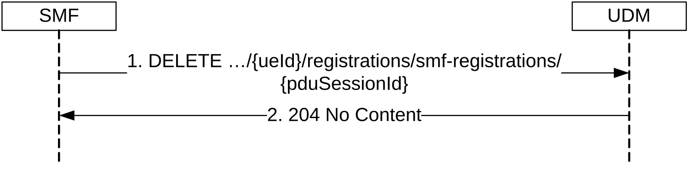
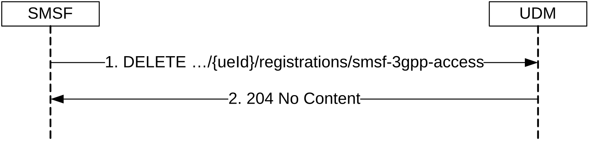
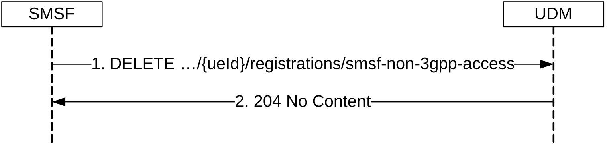
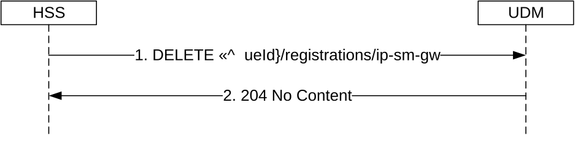
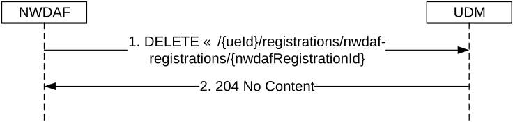

# 5.3.2.4 Deregistration

## 5.3.2.4.1 General

The following procedures using the Deregistration service operation are supported:

\- AMF deregistration for 3GPP access

\- AMF deregistration for non-3GPP access

\- SMF deregistration

\- SMSF deregistration for 3GPP access

\- SMSF deregistration for non-3GPP access

\- IP-SM-GW deregistration

\- NWDAF deregistration

## 5.3.2.4.2 AMF deregistration for 3GPP access

Figure 5.3.2.4.2-1 shows a scenario where the AMF sends a request to the UDM to deregister (purge) from the UDM for 3GPP access (see also TS 23.502 \[3\] figure 4.5.3.1-1 step 3). The request contains the UE's identity (/{ueId}) which shall be a SUPI and an instruction to set the purgeFlag within the Amf3GppAccessRegistration resource.

Figure 5.3.2.4.2-1: AMF deregistering for 3GPP access

1\. The AMF sends a PATCH request to the resource representing the UE's AMF registration for 3GPP access.

2a. The UDM shall check whether the received GUAMI matches the stored GUAMI. If so, the UDM shall set the PurgeFlag. The UDM responds with "204 No Content".

2b. Otherwise the UDM responds with "403 Forbidden".

NOTE: Based on operator policy, when AMF receives 403 Forbidden, the AMF can avoid freezing the 5G-TMSI that the UE used, under consideration that the UE has been assigned another 5G-TMSI by another AMF.

On failure, the appropriate HTTP status code indicating the error shall be returned and appropriate additional error information should be returned in the PATCH response body.

## 5.3.2.4.3 AMF deregistration for non-3GPP access

Figure 5.3.2.4.3-1 shows a scenario where the AMF sends a request to the UDM to deregister (purge) from the UDM for non-3GPP access (see also TS 23.502 \[3\] figure 4.5.3.1-1 step 3). The request contains the UE's identity (/{ueId}) which shall be a SUPI and an instruction to set the purgeFlag within the AmfNon3GppAccessRegistration resource.

Figure 5.3.2.4.3-1: AMF deregistering for non-3GPP access

1\. The AMF sends a PATCH request to the resource representing the UE's AMF registration for non-3GPP access.

2a. The UDM shall check whether the received GUAMI matches the stored GUAMI. If so, the UDM shall set the PurgeFlag. The UDM responds with "204 No Content".

2b. Otherwise the UDM responds with "403 Forbidden".

NOTE: Based on operator policy, when AMF receives 403 Forbidden, the AMF can avoid freezing the 5G-TMSI that the UE used, under consideration that the UE has been assigned another 5G-TMSI by another AMF.

On failure, the appropriate HTTP status code indicating the error shall be returned and appropriate additional error information should be returned in the PATCH response body.

## 5.3.2.4.4 SMF deregistration

Figure 5.3.2.4.4-1 shows a scenario where the SMF sends a request to the UDM to deregister an individual SMF registration (see also TS 23.502 \[3\] figure 4.3.2.2-1 step 20). The request contains the UE's identity (/{ueId}) which shall be a SUPI and the PDU Session ID (/{pduSessionId}.

Figure 5.3.2.4.4-1: SMF deregistration

1\. The SMF sends a DELETE request to the resource representing the individual SMF registration that is to be deregistered.

When the SMF deregisters the last PDU session for a UE on the UDM, the SMF should include an indication to inform the UDM if all SMF event subscriptions for the UE previously created on the SMF have been implicitly unsubscribed.

2\. The UDM responds with "204 No Content". If the SMF had requested the SDM Subscription to be created with the "implicitUnsubscribe" flag set, then UDM will terminate the SDM Subscription when the last PDU Session for that SUPI and SMF is deregistered.

If the UDM has received the indication that the SMF event subscriptions have been implicitly unsubscribed in the request, the UDM should not send requests to unsubscribe the SMF event subscriptions on the SMF for the UE.

On failure, the appropriate HTTP status code indicating the error shall be returned and appropriate additional error information should be returned in the DELETE response body.

## 5.3.2.4.5 SMSF Deregistration for 3GPP Access

Figure 5.3.2.4.5-1 shows a scenario where the SMSF sends a request to the UDM to delete the SMSF registration information for 3GPP access (see also TS 23.502 \[3\], clause 4.13.3.2). The request contains the UE's identity (/{ueId}) which shall be a SUPI.

For a UE previously requests SMS service from both 3GPP access and Non-3GPP access, if SMS service is disabled from one access type, the SMSF shall only delete the corresponding SMSF registration for that access type. If SMS service is disabled from both 3GPP access and Non-3GPP access, the SMSF shall delete the SMSF registration for both access types.

Figure 5.3.2.4.5-1: SMSF Deregistering for 3GPP Access

1\. The SMSF sends a DELETE request to the resource representing the UE's SMSF registration for 3GPP access.

2\. If successful, the UDM responds with "204 No Content".

On failure, the appropriate HTTP status code indicating the error shall be returned and appropriate additional error information should be returned in the DELETE response body.

## 5.3.2.4.6 SMSF Deregistration for Non 3GPP Access

Figure 5.3.2.4.6-1 shows a scenario where the SMSF sends a request to the UDM to delete the SMSF registration information for non 3GPP access (see also TS 23.502 \[3\], clause 4.13.3.2). The request contains the UE's identity (/{ueId}) which shall be a SUPI.

For a UE previously requests SMS service from both 3GPP access and Non-3GPP access, if SMS service is disabled from one access type, the SMSF shall only delete the corresponding SMSF registration for that access type. If SMS service is disabled from both 3GPP access and Non-3GPP access, the SMSF shall delete the SMSF registration for both access types.

Figure 5.3.2.4.6-1: SMSF Deregistering for Non 3GPP Access

1\. The SMSF sends a DELETE request to the resource representing the UE's SMSF registration for non 3GPP access.

2\. If successful, the UDM responds with "204 No Content".

On failure, the appropriate HTTP status code indicating the error shall be returned and appropriate additional error information should be returned in the DELETE response body.

## 5.3.2.4.7 IP-SM-GW deregistration

Figure 5.3.2.4.7-1 shows a scenario where the HSS sends a request to the UDM to deregister the IP-SM-GW from the UDM (see also TS 23.632 \[32\] figure 5.5.6.2-2 step 2). The request contains the UE's identity (/{ueId}) which shall be a SUPI.

Figure 5.3.2.4.7-1: IP-SM-GW deregistration

1\. The HSS sends a DELETE request to the resource representing the UE's IP-SM-GW registration.

2\. The UDM responds with "204 No Content".

On failure, the appropriate HTTP status code indicating the error shall be returned and appropriate additional error information should be returned in the DELETE response body.

## 5.3.2.4.8 NWDAF deregistration

Figure 5.3.2.4.8-1 shows a scenario where the NWDAF sends a request to the UDM to deregister the NWDAF from the UDM. The request contains the UE's identity (/{ueId}) which shall be a SUPI ,and the NWDAF's registration identity (/{nwdafRegistrationId}).

Figure 5.3.2.4.8-1: NWDAF deregistration

1\. The NWDAF sends a DELETE request to the resource representing the UE's NWDAF registration.

2\. The UDM responds with "204 No Content".

On failure, the appropriate HTTP status code indicating the error shall be returned and appropriate additional error information should be returned in the DELETE response body.
