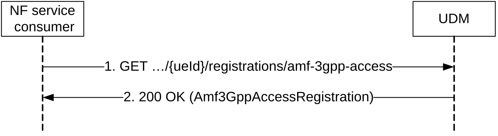
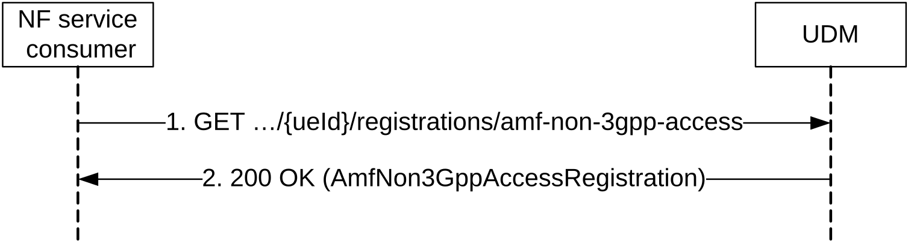
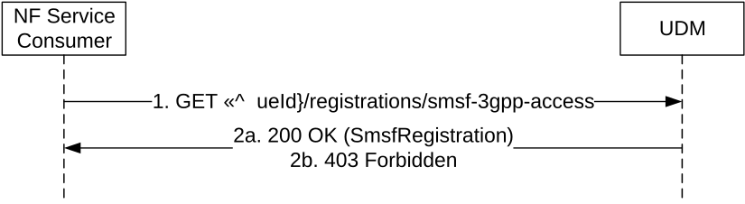
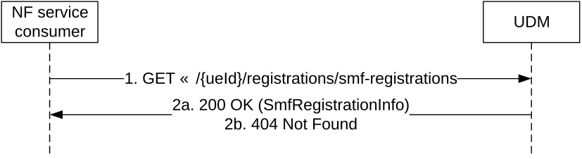
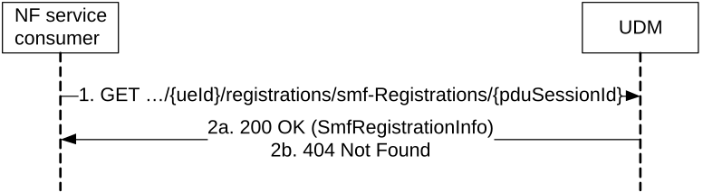
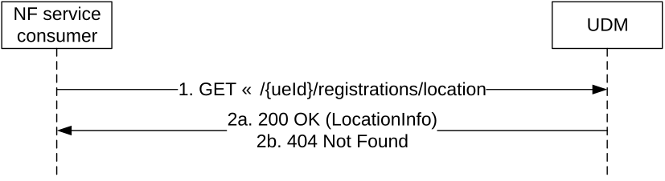
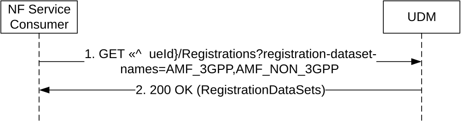
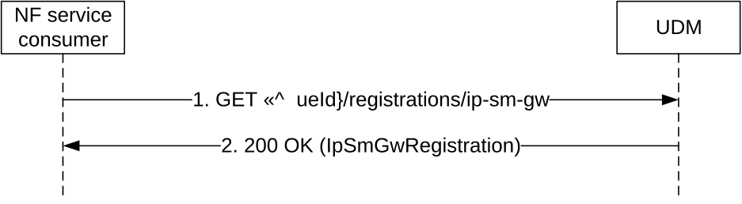
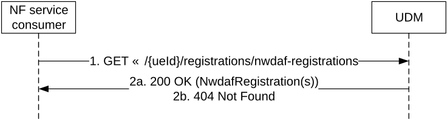

# 5.3.2.5 Get

## 5.3.2.5.1 General

The following procedures using the Get service operation are supported:

\- Amf3GppAccessRegistration Information Retrieval

\- AmfNon3GppAccessRegistration Information Retrieval

\- SmfRegistrations Information Retrieval

\- SmsfRegistration Information Retrieval for 3GPP Access

\- SmsfRegistration Information Retrieval for Non-3GPP Access

\- Location Information Retrieval

\- Retrieval Of Multiple UE Registration Data Sets

\- IP-SM-GW Registration Information Retrieval

\- NwdafRegistration Information Retrieval

## 5.3.2.5.2 Amf3GppAccessRegistration Information Retrieval

Figure 5.3.2.5.2-1 shows a scenario where the NF service consumer (e.g. NEF) sends a request to the UDM to retrieve the UE's Amf3GppAccessRegistration Information. The request contains the UE's identity (/{ueId}) which shall be a GPSI or SUPI, the type of the requested information (/registrations/amf-3gpp-access) and query parameters (supported-features).

Figure 5.3.2.5.2-1: Requesting a UE's AMF Registration Information for 3GPP Access

1\. The NF service consumer (e.g. NEF) sends a GET request to the resource representing the UE's AMF registration information for 3GPP access, with query parameters indicating the supported-features.

2\. The UDM responds with "200 OK" with the message body containing the UE's Amf3GppAccessRegistration.

On failure, the appropriate HTTP status code indicating the error shall be returned and appropriate additional error information should be returned in the GET response body.

## 5.3.2.5.3 AmfNon3GppAccessRegistration Information Retrieval

Figure 5.3.2.5.3-1 shows a scenario where the NF service consumer (e.g. NEF) sends a request to the UDM to retrieve the UE's AmfNon3GppAccessRegistration Information. The request contains the UE's identity (/{ueId}) which shall be a GPSI or SUPI, the type of the requested information (/registrations/amf-non-3gpp-access) and query parameters (supported-features).

Figure 5.3.2.5.3-1: Requesting a UE's AMF Registration Information for non-3GPP Access

1\. The NF service consumer (e.g. NEF) sends a GET request to the resource representing the UE's AMF registration information for non-3GPP access, with query parameters indicating the supported-features.

2\. The UDM responds with "200 OK" with the message body containing the UE's AmfNon3GppAccessRegistration.

On failure, the appropriate HTTP status code indicating the error shall be returned and appropriate additional error information should be returned in the GET response body.

## 5.3.2.5.4 Void

## 5.3.2.5.5 SmsfRegistration Information Retrieval for 3GPP Access

Figure 5.3.2.5.5-1 shows a scenario where the NF service consumer (e.g. NEF) sends a request to the UDM to retrieve the UE's SmsfRegistration Information. The request contains the UE's identity (/{ueId}) which shall be a GPSI, the type of the requested information (/registrations/smsf-3gpp-access) and query parameters (supported-features).

Figure 5.3.2.5.5-1: Requesting a UE's SMSF Registration Information for 3GPP Access

1\. The NF service consumer (e.g. NEF) sends a GET request to the resource representing the UE's SMSF registration information for 3GPP access, with query parameters indicating the supported-features.

2a. The UDM responds with "200 OK" with the message body containing the UE's SmsfRegistration for 3GPP access.

2b. If the UE does not have required subscription data for SMS service or SMS service is barred, HTTP status code "403 Forbidden" should be returned including additional error information in the response body (in "ProblemDetails" element).

On failure, the appropriate HTTP status code indicating the error shall be returned and appropriate additional error information should be returned in the GET response body.

## 5.3.2.5.6 SmsfRegistration Information Retrieval for Non-3GPP Access

Figure 5.3.2.5.6-1 shows a scenario where the NF service consumer (e.g. NEF) sends a request to the UDM to retrieve the UE's SmsfRegistration Information for non-3GPPP access. The request contains the UE's identity (/{ueId}) which shall be a GPSI, the type of the requested information (/registrations/smsf-non-3gpp-access) and query parameters (supported-features).

Figure 5.3.2.5.6-1: Requesting a UE's SMSF Registration Information for Non-3GPP Access

1\. The NF service consumer (e.g. NEF) sends a GET request to the resource representing the UE's SMSF registration information for non-3GPP access, with query parameters indicating the supported-features.

2a. The UDM responds with "200 OK" with the message body containing the UE's SmsfRegistration for non-3GPP access.

2b. If the UE does not have required subscription data for SMS service or SMS service is barred, HTTP status code "403 Forbidden" should be returned including additional error information in the response body (in "ProblemDetails" element).

On failure, the appropriate HTTP status code indicating the error shall be returned and appropriate additional error information should be returned in the GET response body.

## 5.3.2.5.7 SmfRegistration Information Retrieval

Figure 5.3.2.5.7-1 shows a scenario where the NF service consumer (e.g. NWDAF, SMF) sends a request to the UDM to retrieve the UE's SmfRegistration Information. NF Service Consumer (e.g. SMF) may send request to UDM to retrieve SMF registration information to ensure the uniqueness of PDU Session ID if handover between EPS and EPC/ePDG. The request contains the UE's identity (/{ueId}) which shall be a GPSI or SUPI, the type of the requested information (/registration/smf-registrations) and query parameters (single-nssai, dnn, supported-features).

Figure 5.3.2.5.7-1: Requesting a UE's SMF Registration Information

1\. The NF service consumer (e.g. NWDAF) sends a GET request to the resource representing the UE's SMF registration information, with query parameters indicating the single-nssai, dnn, supported-features.

2a. The UDM responds with "200 OK" with the message body containing the UE's SmfRegistrationInfo.

2b. If there is no valid SMF Registration data for the UE, HTTP status code "404 Not Found" shall be returned including additional error information in the response body (in the "ProblemDetails" element).

On failure, the appropriate HTTP status code indicating the error shall be returned and appropriate additional error information should be returned in the GET response body.

## 5.3.2.5.8 Individual SmfRegistration Information Retrieval

NF Service Consumer (e.g. AMF) may send request to UDM to retrieve individual SMF registration information identified by PDU Session ID.

Figure 5.3.2.5.8-1: Requesting individual SMF Registration Information

1\. The NF service consumer (e.g. AMF) sends a GET request to the resource representing the individual SMF registration information.

2a. The UDM responds with "200 OK" with the message body containing the SmfRegistration corresponding to the indicated PDU session.

2b. If there is no valid SMF Registration data for the indicated PDU session, HTTP status code "404 Not Found" shall be returned including additional error information in the response body (in the "ProblemDetails" element).

On failure, the appropriate HTTP status code indicating the error shall be returned and appropriate additional error information should be returned in the GET response body.

## 5.3.2.5.9 Location Information Retrieval

Figure 5.3.2.5.9-1 shows a scenario where the NF service consumer (e.g. (H)GMLC) sends a request to the UDM to retrieve the UE's Location Information. The request contains the UE's identity (/{ueId}), which shall be a GPSI or SUPI, and query parameters (supported-features).

Figure 5.3.2.5.9-1: Requesting a UE's Location Information

1\. The NF service consumer (e.g. (H)GMLC) sends a GET request to the resource representing the UE's Location information, with query parameters indicating the supported-features.

2a. The UDM responds with "200 OK" with the message body containing the UE's LocationInfo.

The returned LocationInfo shall include the NF instance ID of the serving AMF ID, and may include the GUAMI of the serving AMF, the VGMLC address info.

2b. If there is no valid location information data for the UE, a response with HTTP status code "404 Not Found" shall be returned to the NF service including additional error information in the response body (in the "ProblemDetails" element).

On failure, the appropriate HTTP status code indicating the error shall be returned and appropriate additional error information should be returned in the GET response body.

## 5.3.2.5.10 Retrieval Of Multiple UE Registration Data Sets

Figure 5.3.2.5.10-1 shows a scenario where the NF service consumer (e.g. HSS, NWDAF, NSSAAF) sends a request to the UDM to receive multiple UE registration data sets. In this example scenario the UE's AMF registration data sets are retrieved with a single request; see clause 6.2.6.3.6 for other data sets that can be retrieved with a single request. The request contains the resource of UE's registrations({ueId}/registrations) and query parameters identifying the requested registration data sets (in this example: ?registration-dataset-names=AMF_3GPP, AMF_NON_3GPP).

Figure 5.3.2.5.10-1: Retrieval of Multiple UE Registration Data Sets

1\. The NF Service Consumer (e.g. HSS, NWDAF) sends a GET request to the resource representing the UE registrations. Query parameters indicate the requested UE registration data sets.

2\. The UDM responds with "200 OK" with the message body containing the requested UE registration data sets. When not all requested data sets are available at the UDM, only the requested and available data sets are returned in a "200 OK" response.

On failure, the appropriate HTTP status code indicating the error shall be returned and appropriate additional error information should be returned in the GET response body.

## 5.3.2.5.11 IP-SM-GW Registration Information Retrieval

Figure 5.3.2.5.11-1 shows a scenario where the NF service consumer sends a request to the UDM to retrieve the UE's IP-SM-GW Registration Information. The request contains the UE's identity (/{ueId}) which shall be a SUPI.

Figure 5.3.2.5.11-1: Requesting a UE's IP-SM-GW Registration Information

1\. The NF service consumer sends a GET request to the resource representing the UE's IP-SM-GW registration information for 3GPP access.

2\. The UDM responds with "200 OK" with the message body containing the UE's IP-SM-GW Registration.

On failure, the appropriate HTTP status code indicating the error shall be returned and appropriate additional error information should be returned in the GET response body.

## 5.3.2.5.12 NwdafRegistration Information Retrieval

Figure 5.3.2.5.12-1 shows a scenario where the NF service consumer (e.g. NWDAF) sends a request to the UDM to retrieve the UE's NwdafRegistration Information. The request contains the UE's identity (/{ueId}), which shall be a SUPI, the type of the requested information (/registrations/nwdaf-registrations) and query parameters (analyticsIds, supported-features).

Figure 5.3.2.5.12-1: Requesting a UE's NwdafRegistration Information

1\. The NF service consumer (e.g. NWDAF) sends a GET request to the resource representing the UE's NwdafRegistration information, with query parameters indicating the analyticsIds, supported-features.

2a. The UDM responds with "200 OK" with the message body containing the UE's NwdafRegistration(s).

NOTE: if there are multiple NwdafRegsitration for the same UE, all matched NwdafRegistration(s) will be returned.

2b. If there is no valid NwdafRegistration information data for the UE, a response with HTTP status code "404 Not Found" shall be returned to the NF service including additional error information in the response body (in the "ProblemDetails" element).

On failure, the appropriate HTTP status code indicating the error shall be returned and appropriate additional error information should be returned in the GET response body.
