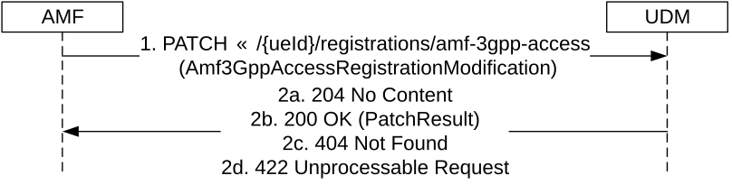
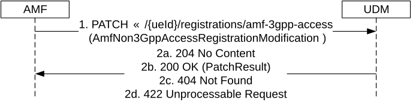
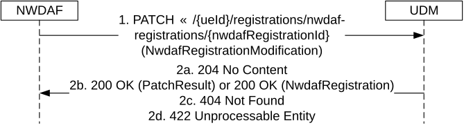
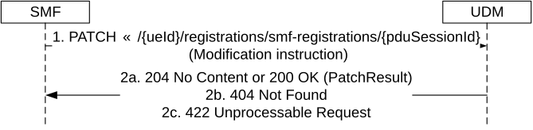
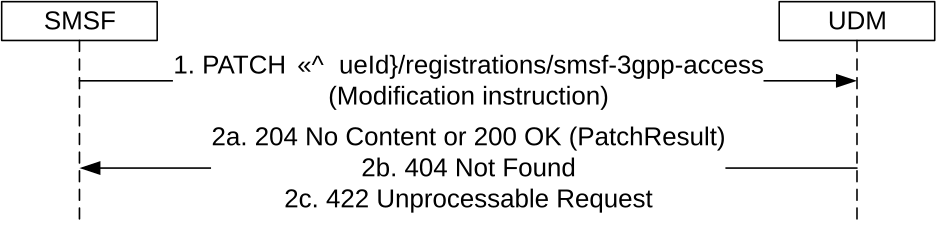
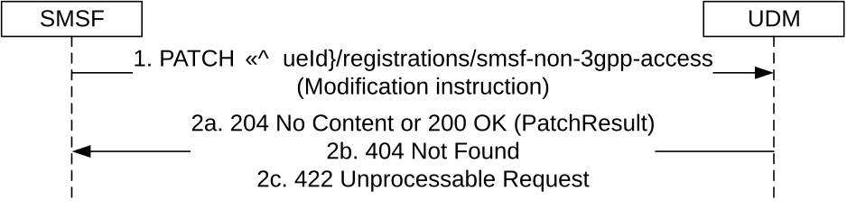

# 5.3.2.6 Update

## 5.3.2.6.1 General

The following procedures using the Update service operation are supported:

\- Update a parameter (e.g. PEI, EPS Interworking Info, etc) in the AMF registration for 3GPP access

\- Update a parameter (e.g. PEI) in the AMF registration for non-3GPP access

\- Update a parameter (e.g. analyticsId(s)) in the NWDAF registration

\- Update a parameter (e.g. PGW FQDN) in the SMF registration

## 5.3.2.6.2 Update A Parameter (e.g. PEI) in the AMF Registration For 3GPP Access

Figure 5.3.2.6.2-1 shows a scenario where the AMF sends a request to the UDM to update a parameter within the Amf3GppAccessRegistration resource. The request contains the UE's identity (/{ueId}) which shall be a SUPI and an instruction to modify a parameter (e.g. PEI).

Figure 5.3.2.6.2-1: AMF registration parameter update for 3GPP access

1\. The AMF sends a PATCH request to the UDM for the resource representing the UE's AMF registration for 3GPP access.

If the AMF needs to modify the backupAmfInfo, the AMF shall include the IE in the PATCH request. The modified backupAmfInfo is only applicable to this UE in 3GPP access.

2a. If all the modification instructions in the PATCH request have been implemented, the UDM shall respond with "204 No Content" response.

2b. If some of the modification instructions in the PATCH request have been discarded, and the NF service consumer has included in the supported-feature query parameter the "PatchReport" feature number, the UDM shall respond with "200 OK" with the response body containing PatchResult.

2c. If the resource does not exist e.g. the UE is not registered yet, HTTP status code "404 Not Found" should be returned including additional error information in the response body (in the "ProblemDetails" element).

2d. If the resource exists, but the requesting AMF is not the one currently registered for the UE, HTTP status code "422 Unprocessable Entity" should be returned including additional error information in the response body (in the "ProblemDetails" element).

On failure, the appropriate HTTP status code indicating the error shall be returned and appropriate additional error information should be returned in the PATCH response body.

## 5.3.2.6.3 Update A Parameter (e.g. PEI) in the AMF Registration For Non 3GPP Access

Figure 5.3.2.6.3-1 shows a scenario where the AMF sends a request to the UDM to update a parameter within the AmfNon3GppAccessRegistration resource. The request contains the UE's identity (/{ueId}) which shall be a SUPI and an instruction to modify a parameter (e.g. PEI).

Figure 5.3.2.6.3-1: AMF registration parameter update for non-3GPP access

1\. The AMF sends a PATCH request to the resource representing the UE's AMF registration for non-3GPP access.

If the AMF needs to modify the backupAmfInfo, the AMF shall include the IE in the PATCH request. The modified backupAmfInfo is only applicable to this UE in non-3GPP access.

2a. If all the modification instructions in the PATCH request have been implemented, the UDM shall respond with "204 No Content" response.

2b. If some of the modification instructions in the PATCH request have been discarded, and the NF service consumer has included in the supported-feature query parameter the "PatchReport" feature number, the UDM shall respond with "200 OK" with the response body containing PatchResult.

2c. If the resource does not exist e.g. the UE is not registered yet, HTTP status code "404 Not Found" should be returned including additional error information in the response body (in the "ProblemDetails" element).

2d. If the resource exists, but the requesting AMF is not the one currently registered for the UE, HTTP status code "422 Unprocessable Entity" should be returned including additional error information in the response body (in the "ProblemDetails" element).

On failure, the appropriate HTTP status code indicating the error shall be returned and appropriate additional error information should be returned in the PATCH response body.

## 5.3.2.6.4 Update A Parameter (e.g. analyticsId(s)) in the NWDAF Registration

Figure 5.3.2.6.4-1 shows a scenario where the NWDAF sends a request to the UDM to update a parameter within the NwdafRegistration resource. The request contains the UE's identity (/{ueId}) which shall be a SUPI, the NWDAF's registration identity (/{nwdafRegistrationId}) and an instruction to modify a parameter (e.g. analyticsId(s)).

Figure 5.3.2.6.4-1: NWDAF registration parameter update

1\. The NWDAF sends a PATCH request to the resource representing the UE's NWDAF registration.

2a. If all the modification instructions in the PATCH request have been implemented, the UDM shall respond with "204 No Content" response.

2b. If some of the modification instructions in the PATCH request have been discarded:

\- the UDM shall respond with "200 OK" with the response body containing PatchResult, if the NF service consumer has included in the supported-feature query parameter the "PatchReport" feature number; or

\- the UDM shall respond with "200 OK" with the response body containing NwdafRegistration, if the NF service consumer does not support the "PatchReport" feature.

2c. If the resource does not exist e.g. the UE is not registered yet, HTTP status code "404 Not Found" should be returned including additional error information in the response body (in the "ProblemDetails" element).

2d. If the resource exists, but the requesting NWDAF is not the one currently registered for the UE, HTTP status code "422 Unprocessable Entity" should be returned including additional error information in the response body (in the "ProblemDetails" element).

On failure, the appropriate HTTP status code indicating the error shall be returned and appropriate additional error information should be returned in the PATCH response body.

## 5.3.2.6.5 Update A Parameter (e.g. PGW FQDN) in the SMF Registration

Figure 5.3.2.6.5-1 shows a scenario where the SMF sends a request to the UDM to update a parameter within the SmfRegistration resource (see also clause 4.11.5.2 of TS 23.502 \[3\]). The request contains the UE's identity (/{ueId}) which shall be a SUPI and an instruction to modify a parameter (e.g. PGW FQDN).

Figure 5.3.2.6.5-1: SMF registration parameter update

1\. The SMF sends a PATCH request to the resource representing the UE's SMF registration .../{ueId}/registrations/smf-registrations/{pduSessionId}.

2a. On success, the UDM responds with "204 No Content" or "200 OK" shall be returned; in the latter case, the content of the PATCH response shall contain the PatchResult indicating that some of the modification instructions in the PATCH request have been discarded.

2b. If the resource does not exist, HTTP status code "404 Not Found" should be returned including additional error information in the response body (in the "ProblemDetails" element).

2c. If the resource exists, but the requesting SMF is not the one currently registered for the UE, HTTP status code "422 Unprocessable Entity" should be returned including additional error information in the response body (in the "ProblemDetails" element).

On failure, the appropriate HTTP status code indicating the error shall be returned and appropriate additional error information should be returned in the PATCH response body.

## 5.3.2.6.6 Update A Parameter (e.g. Memory Available) in the SMSF Registration for 3GPP Access

Figure 5.3.2.6.6-1 shows a scenario where the SMSF sends a request to the UDM to update a parameter within the Smsf3GppAccessRegistration resource. The request contains the UE's identity (/{ueId}) which shall be a SUPI and an instruction to modify a parameter (e.g. Memory Available).

Figure 5.3.2.6.6-1: SMSF registration (3GPP access) parameter update

1\. The SMSF sends a PATCH request to the resource representing the UE's SMSF registration for 3GPP access .../{ueId}/registrations/smsf-3gpp-access.

2a. On success, the UDM responds with "204 No Content" or "200 OK" shall be returned; in the latter case, the content of the PATCH response shall contain the PatchResult indicating that some of the modification instructions in the PATCH request have been discarded.

2b. If the resource does not exist, HTTP status code "404 Not Found" should be returned including additional error information in the response body (in the "ProblemDetails" element).

2c. If the resource exists, but the requesting SMSF is not the one currently registered for the UE, HTTP status code "422 Unprocessable Entity" should be returned including additional error information in the response body (in the "ProblemDetails" element).

On failure, the appropriate HTTP status code indicating the error shall be returned and appropriate additional error information should be returned in the PATCH response body.

## 5.3.2.6.7 Update A Parameter (e.g. Memory Available) in the SMSF Registration for non-3GPP Access

Figure 5.3.2.6.7-1 shows a scenario where the SMSF sends a request to the UDM to update a parameter within the SmsfNon3GppAccessRegistration resource. The request contains the UE's identity (/{ueId}) which shall be a SUPI and an instruction to modify a parameter (e.g. Memory Available).

Figure 5.3.2.6.7-1: SMSF registration (non-3GPP access) parameter update

1\. The SMSF sends a PATCH request to the resource representing the UE's SMSF registration for non-3GPP access .../{ueId}/registrations/smsf-non-3gpp-access.

2a. On success, the UDM responds with "204 No Content" or "200 OK" shall be returned; in the latter case, the content of the PATCH response shall contain the PatchResult indicating that some of the modification instructions in the PATCH request have been discarded.

2b. If the resource does not exist, HTTP status code "404 Not Found" should be returned including additional error information in the response body (in the "ProblemDetails" element).

2c. If the resource exists, but the requesting SMSF is not the one currently registered for the UE, HTTP status code "422 Unprocessable Entity" should be returned including additional error information in the response body (in the "ProblemDetails" element).

On failure, the appropriate HTTP status code indicating the error shall be returned and appropriate additional error information should be returned in the PATCH response body.
