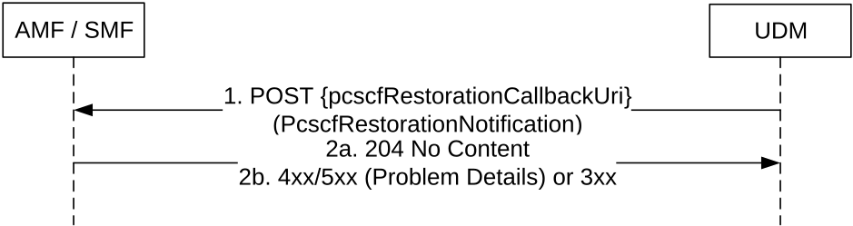

# 5.3.2.7 P-CSCF-RestorationNotification

## 5.3.2.7.1 General

The following procedure using the P-CSCF-RestorationNotification service operation is supported:

\- UDM initiated P-CSCF-Restoration

## 5.3.2.7.2 UDM initiated P-CSCF-Restoration

Figure 5.3.2.7.2-1 shows a scenario where the UDM notifies the registered AMF or SMF about the need for P-CSCF restoration. The request contains the pcscfRestorationCallbackUri URI for P-CSCF restoration as received by the UDM during registration, and P-CSCF Restoration Indication.

Figure 5.3.2.7.2-1: UDM initiated P-CSCF Restoration

1\. The UDM sends a POST request to the pcscfRestorationCallbackUri as provided by the NF service consumer during the registration.

2a. On success, the AMF or SMF responds with "204 No Content".

2b. On failure or redirection, one of the appropriate HTTP status code listed in Table 6.2.5.3-3 shall be returned. For a 4xx/5xx response, the message body may contain appropriate additional error information.
