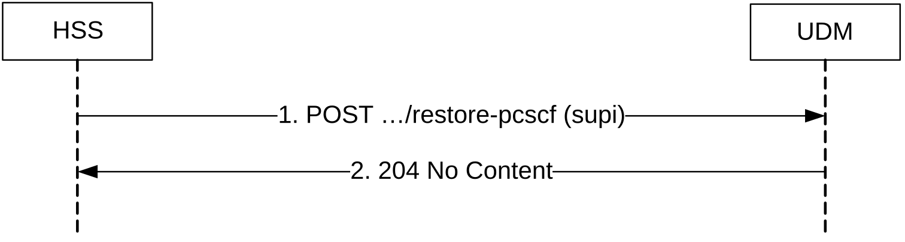

# 5.3.2.8 P-CSCF-RestorationTrigger

## 5.3.2.8.1 General

The following procedure using the P-CSCF-RestorationTrigger service operation is supported:

\- P-CSCF-RestorationTrigger

## 5.3.2.8.2 P-CSCF-RestorationTrigger

Figure 5.3.2.8.2-1 shows a scenario where the HSS sends a request to the UDM to initiate P-CSCF restoration. The request contains the UE's identity which shall be a SUPI.

Figure 5.3.2.8.2-1: P-CSCF-RestorationTrigger

1\. The HSS sends a POST request (custom method: restore-pcscf) to the UDM.

2\. The UDM responds with "204 No Content".

On failure, the appropriate HTTP status code indicating the error shall be returned and appropriate additional error information should be returned in the POST response body.
