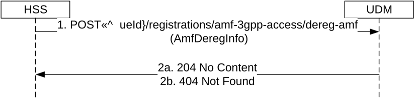

# 5.3.2.9 AMFDeregistration

## 5.3.2.9.1 General

The following procedure using the AMFDeregistration service operation is supported:

\- AMF-Deregistration

## 5.3.2.9.2 AMF-Deregistration

Figure 5.3.2.9.2-1 shows a scenario where the HSS sends a request to the UDM to deregister the registered AMF. The request contains the UE's identity which shall be an IMSI.

Figure 5.3.2.9.2-1: AMF-Deregistration

1\. The HSS sends a POST request (custom method: dereg-amf) to the resource representing the UE's registration for 3GPP access. This shall result in sending of Nudm_UECM_DeregistrationNotification to the AMF (see TS 23.632 \[32\]) and setting the purgeFlag in the Amf3GppAccessRegistration stored in the UDR.

2a. The UDM responds with "204 No Content".

2b. If the user does not exist, HTTP status code "404 Not Found" shall be returned including additional error information in the response body (in the "ProblemDetails" element).

On failure, the appropriate HTTP status code indicating the error shall be returned and appropriate additional error information should be returned in the POST response body.
