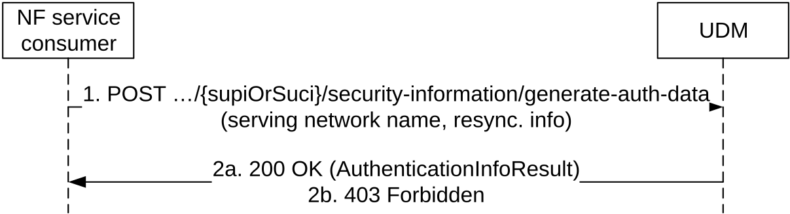
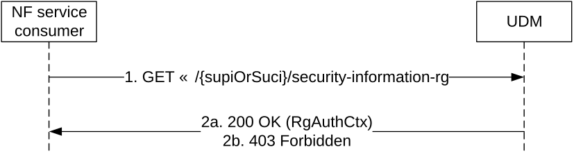
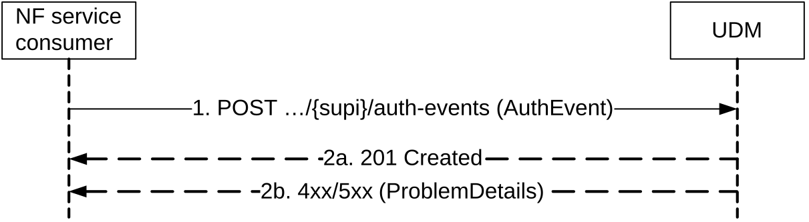
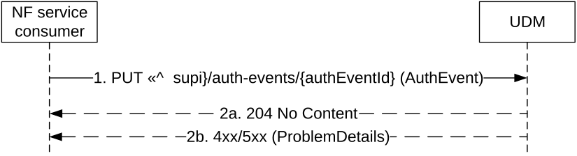
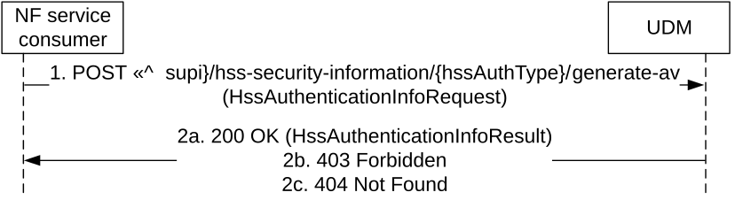
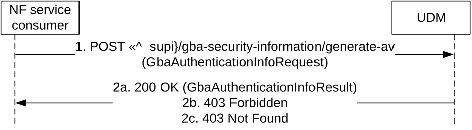
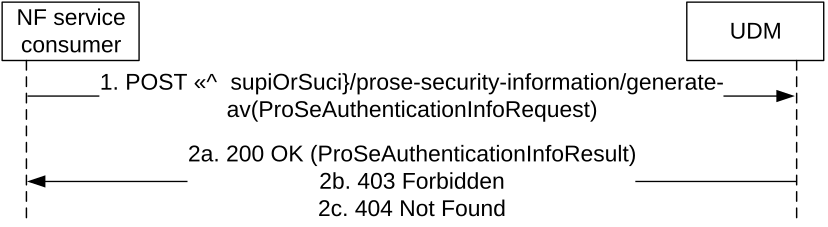

# 5.4 Nudm_UEAuthentication Service

## 5.4.1 Service Description

See TS 23.501 \[2\] table 7.2.5-1.

## 5.4.2 Service Operations

### 5.4.2.1 Introduction

For the Nudm_UEAuthentication service the following service operations are defined:

\- Get

\- GetHssAv

\- ResultConfirmation

\- GetProseAv

\- GetGbaAv

\- Notification

The Nudm_UEAuthentication service is used by the AUSF to request the UDM to select an authentication method, calculate a fresh authentication vector (AV) if required for the selected method, and provide it to the AUSF by means of the Get service operation. See TS 33.501 \[6\] clause 14.2.2 and TS 33.535 \[55\] clause 6.1. The service may also be used by the AUSF to indicate to the UDM that the user is using a N5GC device behind Cable RGs in private networks or in isolated deployment scenarios with wireline access and that therefore the applicable authentication method shall be EAP based. See TS 23.316 \[37\] clause 4.10a.

The Nudm_UEAuthentication service is also used by the HSS to request UDM to generate the authentication vector(s) for EPS or IMS domain by means of GetHssAv service operation. See TS 23.632 \[32\] clause 5.6.3.

The Nudm_UEAuthentication service is also used by the AUSF to inform the UDM about the occurrence of a successful or unsuccessful authentication by means of the ResultConfirmation service operation. SeeTS 33.501 \[6\] clause 14.2.3.

The Nudm_UEAuthentication service is also used by the AUSF to request the UDM to authenticate the FN-RG accessing to 5GC via W-AGF. See TS 23.316 \[37\] clause 7.2.1.3.

The Nudm_UEAuthentication service is also used by the NF service consumer to request the UDM to remove the UE authentication result during the Purge of subscriber data in AMF after the UE deregisters from the network or NAS SMC fails following the successful authentication in the registration procedure.

The Nudm_UEAuthentication service is also used by the AUSF to request UDM to retrieve the Authentication Vectors for 5G ProSe by means of GetProseAv service operation. See TS 33.503 \[64\] clause 7.4.

The Nudm_UEAuthentication service is also used by the GBA's BSF to request UDM to generate the GBA authentication vector by means of GetGbaAv service operation. See TS 33.220 \[61\] clause N.2.2.

### 5.4.2.2 Get

#### 5.4.2.2.1 General

The following procedure using the Get service operation is supported:

\- Authentication Information Retrieval

\- FN-RG Authentication

As part of this Authentication Information Retrieval operation, the UDM authorizes or rejects the subscriber to use the service provided by the registered NF, based on subscription data (e.g. roaming restrictions).

As part of this FN-RG Authentication operation, the UDM decides, based on the stored authentication profile of the SUPI and the authenticated indication that authentication has been completed by the W-AGF, that authentication by the home network is not required for the FN-RG.

#### 5.4.2.2.2 Authentication Information Retrieval

Figure 5.4.2.2.2-1 shows a scenario where the NF service consumer (AUSF) retrieves authentication information for the UE from the UDM (see also TS 33.501 \[6\] clause 6.1.2). The request contains the UE's identity (supi or suci), the serving network name, and may contain resynchronization info.

Figure 5.4.2.2.2-1: NF service consumer requesting authentication information

1\. The NF service consumer sends a POST request (custom method: generate-auth-data) to the resource representing the UE's security information.

2a. The UDM responds with "200 OK" with the message body containing the authentication data information.

The AUSF shall store the authentication data information for subsequent authentication processing. If the AUSF is configured to store Kausf (e.g. based on its support of SoRProtection / UPUProtection service operations / deriving AKMA key after primary authentication), the AUSF shall preserve the Kausf and related information (e.g. SUPI) after the completion of the primary authentication. If the UDM decides that the primary authentication by an AAA server in a Credentials Holder is required, the AUSF shall perform the authentication with the AAA Server. In case the UDM receives an anonymous SUCI that contains the realm part, the UDM authorizes the UE based on realm part of SUCI, and send anonymous SUPI and the indicator to indicate to the AUSF to run primary authentication with an external Credentials holder (see TS 33.501 \[6\], clause I.2.2). If the Default Credentials Server (DCS) provides UDM with the information of a Provisioning Server (PVS FQDN(s) and/or IP address(es)), the UDM provides the PVS info to the AUSF.

2b. If the operation cannot be authorized due to e.g UE does not have required subcription data, none of the CAG IDs in the CAG cell match any of the subscribed and UE-acknowledged CAG IDs in the allowed CAG list, access barring or roaming restrictions, UDM receives an anonymous SUCI that does not contain the realm part, HTTP status code "403 Forbidden" should be returned including additional error information in the response body (in "ProblemDetails" element). If the cellCagInfo is not received, the UDM shall not assume the UE is accessing from the PLMN and shall not stop the authenthcation if the UE is allowed to access 5GS via CAG cell(s) only.

On failure, the appropriate HTTP status code indicating the error shall be returned and appropriate additional error information should be returned in the POST response body.

#### 5.4.2.2.3 FN-RG Authentication

Figure 5.4.2.2.3-1 shows a scenario where the NF service consumer (AUSF) requests the UDM to authenticate the FN-RG accessing to 5GC via W-AGF. (see also TS 23.316 \[37\] clause 7.2.1.3). The request contains the UE's identity (suci), and the authenticated indication.

Figure 5.4.2.2.3-1: NF service consumer requesting authentication information for FN-RG

1\. The NF service consumer sends a GET request to the resource representing the UE's security information.

2a. The UDM responds with "200 OK" with the message body containing the authentication data information of FN-RG.

2b. If the operation cannot be authorized due to e.g. UE does not have required subcription data, HTTP status code "403 Forbidden" should be returned including additional error information in the response body (in "ProblemDetails" element).

On failure, the appropriate HTTP status code indicating the error shall be returned and appropriate additional error information should be returned in the POST response body.

### 5.4.2.3 ResultConfirmationInform

#### 5.4.2.3.1 General

The following procedure using the ResultConfirmation service operation is supported:

\- Authentication Confirmation

\- Authentication Result Removal

#### 5.4.2.3.2 Authentication Confirmation

Figure 5.4.2.3.2-1 shows a scenario where the NF service consumer (AUSF) confirms the occurence of a successful or unsuccessful authentication in a serving network to the UDM (see also TS 33.501 \[6\] clause 6.1.4.1a). The request contains the UE's identity (supi), and information about the authentication occurrence (AuthEvent).

Figure 5.4.2.3.2-1: NF service consumer confirms UE authentication

1\. The NF service consumer sends a POST request to the resource representing the UE's authentication events. The content of the POST request shall contain a representation of the individual AuthEvent resource to be created. There shall be only one individual AuthEvent per UE per Serving Network identified by the supi in URI and servingNetworkName in AuthEvent.

2a. On success, the UDM responds with "201 Created" and the "Location" header shall be present and shall contain the URI of the created resource.

2b. On failure, the appropriate HTTP status code indicating the error shall be returned and appropriate additional error information should be returned.

#### 5.4.2.3.3 Authentication Result Removal

Figure 5.4.2.3.3-1 shows a scenario where the NF service consumer requests the UDM to remove the Authentication Result. The request contains the UE's identity {supi}, the authEvent Id, and an indication to remove Authentication result.

Figure 5.4.2.3.3-1: NF service consumer removes the authentication result

1\. The NF service consumer shall send a PUT request to the UDM. The content shall contain the indication to remove authentication result.

2a. On success, "204 No Content" shall be returned. The UDM shall remove the Authentication result of the UE by completely replacing the individual AuthEvent resource.

2b. On failure, the appropriate HTTP status code indicating the error shall be returned and appropriate additional error information should be returned.

### 5.4.2.4 GetHssAv

#### 5.4.2.4.1 General

The following procedure using the GetHssAv service operation is supported:

\- HSS Authentication Vector Retrieval

#### 5.4.2.4.2 HSS Authentication Vector Retrieval

Figure 5.4.2.4.2-1 shows a scenario where the NF service consumer (HSS) retrieves authentication vector(s) for the UE from the UDM (see also TS 23.632 \[32\] clause 5.6.3). The request contains the UE's identity (SUPI), the authentication method, serving network id, and may contain resynchronization info.

Figure 5.4.2.4.2-1: NF service consumer requesting authentication vector(s)

1\. The NF service consumer sends a POST request (custom method: generate-av) to the resource representing the UE's HSS security information; the type of requested AV is included as part of the resource URI.

2a. The UDM responds with "200 OK" with the message body containing the authentication vector(s).

2b. If the operation cannot be authorized due to e.g UE does not have required subcription data, HTTP status code "403 Forbidden" should be returned including additional error information in the response body (in "ProblemDetails" element).

2c. If the user does not exist, HTTP status code "404 Not Found" shall be returned including additional error information in the response body (in the "ProblemDetails" element).

On failure, the appropriate HTTP status code indicating the error shall be returned and appropriate additional error information should be returned in the POST response body.

### 5.4.2.5 GetGbaAv

#### 5.4.2.5.1 General

The following procedure using the GetGbaAv service operation is supported:

\- GBA Authentication Vector Retrieval

#### 5.4.2.5.2 GBA Authentication Vector Retrieval

Figure 5.4.2.5.2-1 shows a scenario where the NF service consumer (GBA's BSF) retrieves authentication vector(s) for the UE from the UDM (see also TS 33.220 \[61\]). The request contains the UE's identity (SUPI), the authentication method and may contain resynchronization info.

Figure 5.4.2.5.2-1: NF service consumer requesting authentication vector(s)

1\. The NF service consumer sends a POST request (custom method: generate-av) to the resource representing the UE's GBA security information.

2a. The UDM responds with "200 OK" with the message body containing the authentication vector(s).

2b. If the operation cannot be authorized due to e.g UE does not have required subcription data, HTTP status code "403 Forbidden" should be returned including additional error information in the response body (in "ProblemDetails" element).

2c. If the user does not exist, HTTP status code "404 Not Found" shall be returned including additional error information in the response body (in the "ProblemDetails" element).

On failure, the appropriate HTTP status code indicating the error shall be returned and appropriate additional error information should be returned in the POST response body.

### 5.4.2.6 GetProseAv

#### 5.4.2.6.1 General

The following procedure using the GetProseAv service operation:

\- ProSe Authentication Vector Retrieval

#### 5.4.2.6.2 ProSe Authentication Vector Retrieval

Figure 5.4.2.6.2-1 shows a scenario where the NF service consumer (AUSF) retrieves ProSe authentication vector(s) for the 5G ProSe Remote UE or for the 5G ProSe End UE from the UDM (see also TS 33.503 \[64\] clause 7.4). The request contains the UE's identity (supi or suci), Relay Service Code, and may contain resynchronization info.

Figure 5.4.2.6.2-1: NF service consumer requesting authentication vector(s)

1\. The NF service consumer sends a POST request to the UDM.

2a. The UDM responds with "200 OK" with the message body containing the authentication vector. Exactly one ProSeAuthenticationVector should be included within the ProSeAuthenticatonInfoResult.

2b. If the operation cannot be authorized due to e.g UE does not have required subcription data, HTTP status code "403 Forbidden" should be returned including additional error information in the response body (in "ProblemDetails" element).

2c. If the user does not exist, HTTP status code "404 Not Found" shall be returned including additional error information in the response body (in the "ProblemDetails" element).

On failure, the appropriate HTTP status code indicating the error shall be returned and appropriate additional error information should be returned in the POST response body.

### 5.4.2.7 Notification

#### 5.4.2.7.1 General

The following procedures using the Notification service operation are supported:

\- UDR-initiated Data Restoration Notification

#### 5.4.2.7.2 UDR-initiated Data Restoration Notification

Figure 5.4.2.7.2-1 shows a scenario where the UDM notifies the NF Service Consumer (e.g. AUSF) about the need to restore data (e.g. confirmation of successful authentication events) due to a potential data-loss event occurred at the UDR. The request contains identities representing those UEs potentially affected by such event.

Figure 5.4.2.7.2-1: UDR-initiated Data Restoration

1\. The UDM (after receiving a notification from UDR about a potential data-loss event) sends a POST request to the dataRestorationCallbackUri; such callback URI may be provided by the NF service consumer during the confirmation of a successful authentication event, or dynamically discovered by UDM by querying the NRF for the NF Profile of the NF Service Consumer.

2a. On success, the NF Service Consumer responds with "204 No Content".

2b. On failure or redirection, one of the appropriate HTTP status codes listed in Table 6.3.5.y-3 shall be returned. For a 4xx/5xx response, the message body may contain appropriate additional error information.
